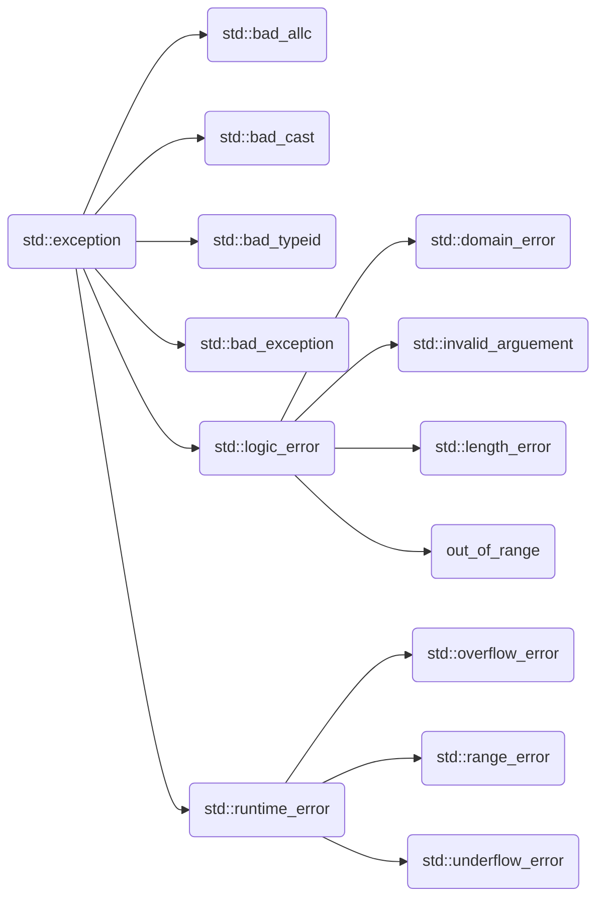
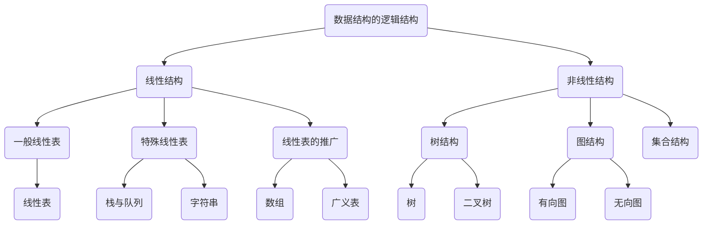

[TOC]


# C++基础知识

## 一、循环

#### 1. 猜数字

```cpp
#include <iostream>
=======
#include <iostream> // 猜数字
>>>>>>> c773150d856d087b91832de17ec0c70b79d6f595
#include <ctime>
#include <cstdlib>

// main
srand(time(0));
int randNum = getRand(1, 101);
bool isCorrect = false;
int inputNum = 0;
while (!isCorrect) {
    cout << "input a num: ";
    cin >> inputNum;
    if (inputNum == randNum) {
        cout << "you are right." << endl;
        break;
    } else if (inputNum > randNum) {
        cout << "bigger than correct num." << endl;
        continue;
    } else {
        cout << "less than correct num." << endl;
        continue;
    }
}
// getRand
int getRand(int min, int max) {
    return (rand() % (max - min + 1)) + min;
}
```

#### 2. 水仙花数

```cpp
int min = 100;
do {
    int one = min % 10;// 取得个位
    int two = min / 10 % 10;//十位
    int three = min / 100;//百位
    int temp = pow(one, 3) + pow(two, 3) + pow(three, 3);
    if (temp == min) cout << min << endl;
    min++;
} while (min > 99 && min < 1000);
```

#### 3. 敲桌子

```cpp
for (int i = 0; i < 101; i++) {
    int one = i % 10;  // 个位有7
    int two = i / 10;  // 十位有7
    int three = i % 7; // 7的倍数
    if (one == 7 || two == 7 || three == 0) {
        cout << "敲桌子" << endl;
        continue;
    }
    cout << i << endl;
}
```

#### 4. 九九乘法表

```cpp
for (int i = 1; i <= 9; i++) {
    for (int j = 1; j <= i; j++) {
        cout << j << "x" << i << "=" << i * j << "\t";
    }
    cout << endl;
}
```

## 二、数组

- 特点：数组中每个数据都是相同的数据类型，且存放在同一块连续的内存空间中

- 定义方式

  ```
  数据类型 数组名[ 数组长度 ];
  数据类型 数组名[ 数组长度 ] = {值1,值2...};
  数据类型 数组名[] = {值1,值2...};
  ```

- 数组名的用处

  > 1. 统计整个数组在内存中的长度=>`sizeof(arr)`
  >
  > 2. 获取数组在内存中的首地址=>直接输出数组名：`cout<<arr`

#### 1. 五只小猪称体重

```cpp
int main() {
    int arr[5] = {300, 350, 200, 400, 250};
    int num = arr[0];
    for (int i = 0; i < 4; i++) {
        if (arr[i] <= arr[i + 1])
            num = arr[i + 1];
    }
    cout << num;
    return 0;
}
```

#### 2. 元素逆序

```cpp
int main() {
    int arr[6] = {1, 2, 3, 4, 5, 6};
    int temp;
    int start = 0, end = sizeof(arr) / sizeof(arr[0]) - 1;
    for (int i = 0; i < sizeof(arr) / sizeof(arr[0]) / 2; i++, start++, end--) {
        temp = arr[start];
        arr[start] = arr[end];
        arr[end] = temp;
    }
    for (int i = 0; i < sizeof(arr) / sizeof(arr[0]); i++) {
        cout << arr[i];
    }
    return 0;
}
```

#### 3. 冒泡排序

最常用的排序算法，对数组内元素进行排序

1. 比较相邻的元素。如果第一个比第二个大，就交换他们两个。

2. 对每一对相邻元素做同样的工作，执行完毕后，找到第一个最大值。

3. 重复以上的步骤，每次比较次数-1，直到不需要比较

```cpp
//  1
int main() {
    int arr[9] = {4, 2, 8, 0, 5, 7, 1, 3, 9};
    for (int i = 9; i > 0; i--) {
        for (int j = 9; j > 0; j--) {
            int temp;
            if (arr[9 - j] < arr[9 - j + 1]) {
                temp = arr[9 - j];
                arr[9 - j] = arr[9 - j + 1];
                arr[9 - j + 1] = temp;
            }
        }
    }
    for (int i = 0; i < 9; i++) {
        cout << arr[i];
    }
    return 0;
}
// 2
int main() {
    int arr[9]={4, 2, 8, 0, 5, 7, 1, 3, 9};
    for(int i=0;i<9;i++){
        for(int j=0;j<9-i-1;j++){
            int temp = arr[0];
            if(arr[j]<arr[j+1]){
                temp=arr[j];
                arr[j]=arr[j+1];
                arr[j+1]=temp;
            }
        }
    }
    for(int i=0;i<9;i++){
        cout<<arr[i]<<" ";
    }
    return 0;
}
```

#### 4. 总成绩

```cpp
int main() {
    int arr[3][3] = {{100, 100, 100},
                     {90,  50,  100},
                     {60,  70,  80}};
    int zhangsan = 0, lisi = 0, wangwu = 0;
    for (int j = 0; j < 3; j++) {
        zhangsan += arr[0][j];
        lisi += arr[1][j];
        wangwu += arr[2][j];
    }
    cout << "zhangsan:" << zhangsan << endl;
    cout << "lisi:" << lisi << endl;
    cout << "wangwu:" << wangwu << endl;
    return 0;
}
```

#### 5. `vector` 动态数组

使用`vector`动态数组需要包含头文件`<vector>`，一开始vector被创建出来的时候，它是没有元素的。

随着添加元素，数组的长度会变长

- 初始化 `vector`数组

  ```cpp
  vector<T> v1;   //初始化一个空的数组
  vector<T> v1(v2);//初始化一个数组，含有v2的所有元素
  vector<T> v1 = v2;//等价于v1(v2)
  vector<T> v1(n,value);//有n个重复的元素，每个元素值=value
  vector<T> v1(n);//v1包含了n个元素，且值都为0
  vector<T> v1{a,b,c...};//直接为每个元素赋予值
  vector<T> v1 = {a,b,c...}//等价于v1{a,b,c...}
  ```

  也可以通过`insert`来初始化数组：

  ```cpp
  vector<T> v1;
  vector<T> v2 = {1,1,1,1,1,1};
  // 也可以把v2定义为数组
  v1.insert(v1.begin(),v2.begin(), v2.begin() + 3);
  //将v2[0]~v2[2]插入到v1中，v1.size()由0变为3
  ```

- 定义一个存放整形变量的数组

  ```cpp
  vector<int> array;
  int array_size = array.size(); // = 0刚开辟出来的vector数组是没有元素的
  size_t a = array.size();//typedef unsigned __int64 size_t
  ```

- 判断数组为空 `.empty()`

  ```cpp
  bool isEmpty = array.empty();//返回bool值，为1则空，为0反之 
  ```

- 向数组尾部添加元素 `.push_back(x)`

  ```cpp
  array.push_back(114514);// 将114514放入数组的最后一位
  ```
  
- 向数组中的第 i 个位置插入数据`insert(v.begin()+i,a)`

  ```cpp
  array.insert(v.begin()+i,12);//将12插入到数组的第i个位置
  ```
  
- 删除数组尾部元素`.pop_back()`

  ```cpp
  array.pop_back();
  ```

- 删除任意位置的元素`erase(v.begin()+i)`

  ```cpp
  array.erase(v.begin()+i);//删除第i个元素
  array.erase(v.begin()+i,v.begin()+j);//删除[i,j-1]区间的所有元素
  ```

- 清空数组`.clear()`

  ```cpp
  array.clear();
  ```

## 三、函数

1. 函数参数：如果函数要使用参数，则必须声明接受参数值的变量。这些变量称为函数的**形式参数**。

2. 参数调用

   > 传值调用：该方法把参数的**实际值赋值给函数的形式参数**。在这种情况下，修改函数内的形式参数对实际参数没有影响。
   >
   > 指针调用：该方法把**参数的地址赋值给形式参数**。在函数内，该地址用于访问调用中要用到的实际参数。这意味着，修改形式参数会影响实际参数。
   >
   > 引用调用：该方法把**参数的引用赋值给形式参数**。在函数内，该引用用于访问调用中要用到的实际参数。这意味着，修改形式参数会影响实际参数。

3. 参数默认值：可以为参数列表中后边的每一个参数指定默认值。当调用函数时，如果实际参数的值留空，则使用这个默认值。

   `int add(int a,int b=20);`

4. 占位参数：`int func(int a,int)`只写参数类型，不给参数名

   调用：`func(10,10)`必须补齐占位参数

   占位参数也可以有默认值`int func(int a,int =10)`

5. lambda函数与表达式

   C++11支持了匿名函数=>lambda函数（也叫lambda表达式）

   - Lambda表达式把函数看作对象。Lambda表达式可以像对象一样使用，比如可以将它们赋给变量和作为参数传递，还可以像函数一样对其求值。`[capture](parameters)->return-type{body}`

     ```cpp
     auto func = [capture] (params) opt -> ret { func_body; };
     // capture捕获列表、params参数表、opt不需要可以省略、ret返回值类型、func_body函数体
     ```

     如：`[](int x,int y){return x<y;}`

   - 如果没有返回值则可以表达为：`[capture](parameters){body}`

     如：`[]{++global_x;}`

   - 在Lambda表达式内可以访问当前作用域的变量，这是Lambda表达式的闭包（Closure）行为。C++变量传递有传值和传引用的区别。可以通过前面的[]来指定：

     ```
     []      // 沒有定义任何变量。使用未定义变量会引发错误。
     [x, &y] // x以传值方式传入（默认），y以引用方式传入。
     [&]     // 任何被使用到的外部变量都隐式地以引用方式加以引用。
     [=]     // 任何被使用到的外部变量都隐式地以传值方式加以引用。
     [&, x]  // x显式地以传值方式加以引用。其余变量以引用方式加以引用。
     [=, &z] // z显式地以引用方式加以引用。其余变量以传值方式加以引用。
     ```
     
     对于[=]或[&]的形式，lambda 表达式可以直接使用 this 指针。但是，对于[]的形式，如果要使用 this 指针，必须显式传入：`[this]() { this->someFunc(); }();`

6. 函数重载：函数名可以相同，提高复用性

   条件：

   > 1. 同一作用域
   > 2. 函数名相同
   > 3. 参数类型或者个数或者顺序不同

   ```cpp
   void func(int a){cout<<"func(int a)";}
   void func(){ cout<<"func()";}
   void func(double a){ cout<<"func(double a)";}
   void func(int a,double b){cout<<"func(int a,double b)"}
   void func(double b,int a){cout<<"func(double b,int a)"}
   ```

   注意事项：

   1. 引用作为重载条件

      ```cpp
      void func(int &a){
          cout<<"func(int &a)";
      }
      void func(const int &a){
          cout<<"func(const int &a)";
      }
      // 调用
      int a = 10;
      func(a); // 调用 func(int &a)=>int &a=10不合法
      func(10);// 调用 func(const int &a)=>const int &a = 10合法
      ```

   2. 函数重载到默认参数

      ```cpp
      void func(int a,int b=10){
          cout<<"func(int a,int b=10)";
      }
      void func(int a){
          cout<<"func(int a)";
      }
      // 调用
      func(10);//报错，二义性
      func(10,10)//正确
      ```

7. `inline`函数说明符

   `inline` 说明符的目的是提示编译器做优化，譬如函数内联，这通常要求编译方能见到函数的定义。编译器能（并且经常）就优化的目的忽略 `inline` 说明符的存在与否。

   若**编译器进行函数内联，则它会以函数体取代所有对它的调用，以避免函数调用的开销（将数据置于栈上和取得结果）**，这可能会生成更大的可执行文件，因为函数可能会被重复多次。结果同仿函数宏，只是用于该函数的标识符和宏指代可见于定义点的定义，而不指代调用点的定义。

   不管是否进行内联，内联函数都保证下列语义：

   任何拥有内部链接的函数都可以声明成 `static inline` ，没有其他限制。

   一个非 `static` 的内联函数不能定义一个非 `const `的函数局部 `static `对象，并且不能使用文件作用域的 `static `对象。

   通常与类一起使用，在编译时，编译器会**把该函数的代码副本放置在每个调用该函数的地方**。

## 四、随机数

1. 普通随机数

   ```cpp
   #include <iostream>
   #include <cmath>
   #include<ctime>
   using namespace std;
   int main() {
       srand((unsigned) time(NULL));//设置种子
       for (int i = 0; i < 9; i++) {
           cout << rand() << endl;
       }
       return 0;
   }
   ```
   
2. 指定范围随机数：可使用取余操作控制范围`rand() % (max - min + 1) + min`，生成30~100的随机数：

   ```
   #include <iostream>
   #include <cmath>
   #include<ctime>
   using namespace std;
   int main() {
       srand((unsigned) time(NULL));//设置种子
       for (int i = 0; i < 9; i++) {
           cout << rand()%(100-30+1)+30 << " ";
       }
       return 0;
   }
   ```

## 五、字符串

字符串实际上是使用 **null** 字符 **\0** 终止的一维字符数组。

#### 1. 数组初始化规则

1. 不能在定义长度可变数组时，进行初始化操作。

   如果数组具有静态存储周期，那么该数组的初始化器必须是常量表达式。

   如果数组具有静态存储周期，那么该数组的初始化器必须是常量表达式。

   如果一个数组的定义同时包含了对数组长度指定和初始化列表，那么长度是通过方括号内的表达式指定的。

5. 最后一个初始化值后面如果还有多余的逗号，则忽略此逗号。

   以下定义等价：

   ```
   int a[4] = { 1, 2 };
   int a[]  = { 1, 2, 0, 0 };
   int a[]  = { 1, 2, 0, 0,};
   int a[4] = { 1, 2, 0, 0, 5 };//溢出，一般会报错
   ```
   
6. 数组的初始化器必须与数组元素具有相同的类型。

   ```
typedef struct { unsigned long pin;
                    char name[64];
                    /* ... */
                  } Person;
   Person team[6] = { { 1000, "Mary"}, { 2000, "Harry"} };
   ```
   
   数组的其他 4 个元素会被初始化为 0，按照本例情况，为{0，""}。

7. 初始化特定元素

   借助于 C99 新增的元素指示符（element designator），可以把初始化器关联到特定的元素。

   **索引值必须是整数常量表达式**

   ```
#define size 20
   int arr[size] = {1, 2, [size/2]=0, 2};
   ```
   
   其中arr[0]初始化为1，arr[1]和arr[11]初始化为2，arr[10]初始化为0，其余元素初始化为0。

   **如果在定义数组时没有指定其长度，那么元素指示符的索引值可以是任何的非负整数值。**因此，下面的定义会创建一个有 1001 个元素的数组。

   ```
int a[ ] = { [1000] = -1 };
   ```
   
   所有的数组元素都具有初始值 0，但最后一个元素例外，它的初始值是 -1。

8. 常用字符串函数

   ```
   strcpy(s1,s2);//将s2复制给s1
   strcat(s1,s2);//连接字符串 s2 到字符串 s1 的末尾。连接字符串也可以用 + 号
   strlen(s1);//返回字符串长度
   strcmp(s1,s2);//如果 s1 和 s2 是相同的，则返回 0；如果 s1<s2 则返回值小于 0；如果 s1>s2 则返回值大于 0。
   strchr(s1,ch);//返回一个指针，指向字符串 s1 中字符 ch 的第一次出现的位置。
   strstr(s1,s2);//返回一个指针，指向字符串 s1 中字符串 s2 的第一次出现的位置。
   ```
   
9. string和cstring

   string所运用的头文件string是c++标准库头文件，包含了拟容器class std::string的声明，属于STL范畴，有许多内置函数。可以进行+等运算。

   cstring运用头文件为cstring，是C标准库头文件，string.h的C++标准库版本。包含了C风格字符串（即’\0’结尾字符串）相关的一些类型和函数的声明。例如strcmp、strchr、strstr等。为MFC中的字符串类。

   - `string` 和 `vector<char>`几乎等价，string增加了更多对字符串专门的操作，比如加法操作符，查找子串，截取子串等字符串独有的功能。
   
     ```cpp
     string s = "hello world";
     s.size() == 11;
     ```

## 六、指针

#### 1. 什么是指针

**指针**是一个变量，其值为另一个变量的地址，即，内存位置的直接地址。就像其他变量或常量一样，必须在使用指针存储其他变量地址之前，对其进行声明。`type *var_name`

```
int    *ip;    /* 一个整型的指针 */
double *dp;    /* 一个 double 型的指针 */
float  *fp;    /* 一个浮点型的指针 */
char   *ch;    /* 一个字符型的指针 */

int main (){
   int  var = 20;   // 实际变量的声明
   int  *ip = nullptr;        // 指针变量的声明
   ip = &var;       // 在指针变量中存储 var 的地址 
   cout << "Value of var variable: "<< var << endl;
   // 输出在指针变量中存储的地址
   cout << "Address stored in ip variable: "<< ip << endl;
   // 访问指针中地址的值
   cout << "Value of *ip variable: "<< *ip << endl;
   return 0;
}
/*
Value of var variable: 20
Address stored in ip variable: 0xbfc601ac
Value of *ip variable: 20
*/
```

在变量声明的时候，如果没有确切的地址可以赋值，为指针变量赋一个 `NULL` 值是一个良好的编程习惯。`NULL` 指针是一个定义在标准库中的值为零的常量。**在 C++11之后，建议赋值为`nullptr`，因为`NULL`实际上还是一个整形数，`nullptr`是C++11过后给出的空指针表示。**

```
if(ptr)     /* 如果 ptr 非空，则完成 */
if(!ptr)    /* 如果 ptr 为空，则完成 */
```

#### 2. 指针所占的内存空间

所有指针的值的实际数据类型，不管是整型、浮点型、字符型，还是其他的数据类型，都是一样的，都**是一个代表内存地址的长的十六进制数**。不同数据类型的指针之间唯一的不同是，指针所指向的变量或常量的数据类型不同。

32位操作系统下，`sizeof(int *) = 4`，而在64位操作系统下，`sizeof(int *) = 8`

#### 3. 空指针和野指针

- 空指针：指针变量指向内存空间中编号为 0 的的区域的指针。

  用途：初始化指针变量 `int * p = nullptr`

  注意：空指针所指的内存是不可访问的，0~255之间的内存是系统占用的

- 野指针：指针变量指向非法的内存空间

  示例：

  ```
  // 此处的0x1100这块内存空间并不是程序所申请的空间
  int *p = (int *)0x1100;
  cout << *p; // 此处就会出现错误 访问权限冲突 或者 没有访问权限
  return 0;
  ```
  
  程序中应该避免出现野指针。

#### 4. 常量指针和指针常量

- 常量指针：`const int *p = &a`

  **特点**：指针的指向可以修改，但是指针指向的值不能修改。

  ```
  int a = 10, b = 20;
  const int *p = &a;
  *p = 30; // *p不是一个可以修改的值
  p = &b;
  ```
  
- 指针常量：`int* const p = &a`

  **特点**：指针指向的值可以修改，但是指针的指向不能修改。

  ```
  int a = 10, b = 20;
  int * const p = &a;
  *p = 30;
  p = &b; // p不是一个可以修改的值
  ```
  
- 常量指针常量：`const int* const p = &a`

  特点：指针的指向和指针指向的值都不可以修改

  ```
  int a = 10, b = 20;
  const int *const p = &a;
  *p = 30; // *p不是一个可以修改的值
  p = &b; // p不是一个可以修改的值
  ```

#### 5. 指针使用

- 使用指针访问数组

  ```
  int main() {
      int arr[] = {1, 2, 3, 4, 5, 6, 7, 8, 9};
      int *p = arr; // 数组名相当于首地址
      cout << *p << endl;
      // 指针移动到下一个元素，具体移动多少内存单元，看操作系统位数
      p++;
      cout << *p << endl;
      return 0;
  }
  /*
  1
  2
  */
  ```

#### 6. 指针作为函数参数

```
void swap(int *p1, int *p2) {
    int temp = *p1;
    *p1 = *p2;
    *p2 = temp;
}
int main() {
    int a = 1, b = 2;
    cout << "交换前：" << a << " " << b << endl;
    int *pa = &a, *pb = &b;
    swap(*pa, *pb);
    // swap(&a,&b);可以取得相同的效果
    cout << "交换后：" << a << " " << b;
    return 0;
}
/*
交换前：1 2
交换后：2 1
*/
```

## 七、引用

引用变量是一个**别名**，也就是说，它是某个已存在变量的另一个名字。一旦把引用初始化为某个变量，就可以使用该引用名称或变量名称来指向变量。

引用很容易与指针混淆，它们之间有三个主要的不同：

> - 不存在空引用。引用必须连接到一块合法的内存。
>
> - 一旦引用被初始化为一个对象，就不能被指向到另一个对象。指针可以在任何时候指向到另一个对象。
>
> - 引用必须在创建时被初始化。指针可以在任何时间被初始化。
>

```
int main ()
{
   // 声明简单的变量
   int    i;
   double d;
 
   // 声明引用变量
   int&    r = i;
   double& s = d;
   
   i = 5;
   cout << "Value of i : " << i << endl;
   cout << "Value of i reference : " << r  << endl;
 
   d = 11.7;
   cout << "Value of d : " << d << endl;
   cout << "Value of d reference : " << s  << endl;
   
   return 0;
}
/*
Value of i : 5
Value of i reference : 5
Value of d : 11.7
Value of d reference : 11.7
*/
```

#### 1. 将引用作为参数

```
void swap(int &a,int &b);

int main() {
    int a=10,b=20;
    int &aa = a;
    int &bb = b;
    cout<<"交换前："<<a<<" "<<b<<endl;
    swap(aa,bb);
    cout<<"交换后："<<a<<" "<<b<<endl;
    return 0;
}

void swap(int &a,int &b){
    int temp = a;
    a=b;
    b=temp;
}
/*
交换前：10 20
交换后：20 10
*/
```

#### 2. 将引用作为返回值

通过使用引用来替代指针，会使 C 程序更容易阅读和维护。C 函数可以返回一个引用，方式与返回一个指针类似。当函数返回一个引用时，则返回一个指向返回值的隐式指针。这样，函数就可以放在赋值语句的左边。

```
int val[] = {1, 2, 3, 4};

int &setVal(int i) {
    int &ref = val[i];
    return ref;
}

int main() {
    cout << "改变前：";
    for (int i = 0; i < sizeof(val) / sizeof(val[0]); i++) {
        cout << val[i] << " ";
    }
    cout << endl;
    cout << "改变后：";
    setVal(1) = 99;
    setVal(3) = 999;
    for (int i = 0; i < sizeof(val) / sizeof(val[0]); i++) {
        cout << val[i] << " ";
    }
    return 0;
}
/*
改变前：1 2 3 4 
改变后：1 99 3 999
*/
```

当返回一个引用时，要注意被引用的对象**不能超出作用域**。所以返回一个对局部变量的引用是不合法的，但是，可以返回一个对静态变量的引用。

```
int& func() {
   int q;
   //! return q; // 在编译时发生错误
   static int x;
   return x;     // 安全，x 在函数作用域外依然是有效的
}
```

## 八、时间和日期

**C 标准库没有提供所谓的日期类型。**C 继承了 C 语言用于日期和时间操作的结构和函数。为了使用日期和时间相关的函数和结构，需要在 C++ 程序中引用`<ctime>` 头文件。

有四个与时间相关的类型：`**clock_t、time_t、size_t**` 和 `**tm**`。类型 `clock_t、size_t` 和` time_t` 能够把系统时间和日期表示为某种整数。结构类型` tm` 把日期和时间以 C 结构的形式保存，`tm` 结构的定义如下：

```
struct tm {
  int tm_sec;   // 秒，正常范围从 0 到 59，但允许至 61
  int tm_min;   // 分，范围从 0 到 59
  int tm_hour;  // 小时，范围从 0 到 23
  int tm_mday;  // 一月中的第几天，范围从 1 到 31
  int tm_mon;   // 月，范围从 0 到 11
  int tm_year;  // 自 1900 年起的年数
  int tm_wday;  // 一周中的第几天，范围从 0 到 6，从星期日算起
  int tm_yday;  // 一年中的第几天，范围从 0 到 365，从 1 月 1 日算起
  int tm_isdst; // 夏令时
};
```

## 九、输入输出

#### 1. 标准输出流（`cout`）

预定义的对象 **cout** 是 **iostream** 类的一个实例。cout 对象"连接"到标准输出设备，通常是显示屏。**cout** 是与流插入运算符 << 结合使用的，如下所示：

```
int main(){
   char str[] = "Hello C++";
   cout << "Value of str is : " << str << endl;
}
```

#### 2. 标准输入流（`cin`）

预定义的对象 **cin** 是 **iostream** 类的一个实例。cin 对象附属到标准输入设备，通常是键盘。**cin** 是与流提取运算符 >> 结合使用的，如下所示：

```
int main(){
   char str[50];
   cin>>str;
}
```

#### 3. 标准错误流（`cerr`）

预定义的对象 **cerr** 是 **iostream** 类的一个实例。cerr 对象附属到标准输出设备，通常也是显示屏，但是 **cerr** 对象是非缓冲的，且每个流插入到 cerr 都会立即输出。**cerr** 也是与流插入运算符 << 结合使用的，如下所示：

```
int main( ){
   char str[] = "Unable to read....";
   cerr << "Error message : " << str << endl;
}
```

#### 4. 标准日志流（`clog`）

预定义的对象 **clog** 是 **iostream** 类的一个实例。clog 对象附属到标准输出设备，通常也是显示屏，但是 **clog** 对象是缓冲的。这意味着每个流插入到 clog 都会先存储在缓冲区，直到缓冲填满或者缓冲区刷新时才会输出。**clog** 也是与流插入运算符 << 结合使用的，如下所示：

```
int main( ){
   char str[] = "Unable to read....";
   clog << "Error message : " << str << endl;
}
```

## 十、数据结构

#### 1. 定义结构

结构体变量也可以作为结构的成员。

```
struct type_name{
    member_type member_name;
    ...
}object_name;
```

- 创建结构体变量

  1. 在定义结构体的时候顺便创建

     ```
     struct Student{
         string name;
         int age;
     }s1;//此处的s1就是一个变量
     ```
     
  2. 直接创建，`struct`可省略
  
     ```
     struct Student s2;//Student s2;
     s2.name = "张三";
     s2.age = 17;
     ```
     
  3. 在创建变量的时候顺便赋初值，`struct`可省略
  
     ```
     struct Student s3 = {"张三",17};//Student s3 = {"张三",17};
     ```

#### 2. 访问结构成员

为了访问结构的成员，我们使用**成员访问运算符（.）**。成员访问运算符是结构变量名称和我们要访问的结构成员之间的一个句号。

#### 3. 结构作为函数成员

使用方式和其他参数形式一样。

```
struct Student {
    string name;
};
void printStu(Student stu) { cout << stu.name; }

int main() {
    Student stu = {"张三"};
    printStu(stu);
    return 0;
}
```

#### 4. 指向结构的指针

定义方式类似其他类型：

```
struct *st_ip;
st_ip=&st_book;//指向st_book
st_ip->book_name;//访问结构成员
```

学校正在做毕设项目，每名老师带领5个学生，总共有3名老师，需求如下: 设计学生和老师的结构体，其中在老师的结构体中，有老师姓名和一个存放5名学生的数组作为成员学生的成员有姓名、考试分数，创建数组存放3名老师，通过函数给每个老师及所带的学生赋值最终打印出老师数据以及老师所带的学生数据。

```
struct Student {
    string name;
    int score;
};

struct Teacher {
    string name;
    Student stus[5];
};

void setTea(Teacher tea[]) {
    string nameSeed = "ABCDE";
    for (int i = 0; i < 3; i++) {
        tea[i].name = "teacher_";
        tea[i].name += nameSeed[i];
        for (int j = 0; j < 5; j++) {
            tea[i].stus[j].name = "student_";
            tea[i].stus[j].name += nameSeed[j];
            tea[i].stus[j].score = i * 10;
        }
    }
}

void print(Teacher tea[]) {
    for (int i = 0; i < 3; i++) {
        cout << "老师：" << tea[i].name << " "
             << "所带学生:";
        for (int j = 0; j < 5; j++) {
            cout << "姓名：" << tea[i].stus[j].name << " "
                 << "成绩：" << tea[i].stus[j].score << " ";
        }
        cout << endl;
    }
}

int main() {
    Teacher t1, t2, t3;
    Teacher tea[3] = {t1, t2, t3};
    setTea(tea);
    print(tea);
    return 0;
}
```

#### 5. `typedef` 关键字

可以为创建的类型取一个"别名"。

```cpp
typedef struct A{
    int a;
}
```

## 总结练习 通讯录管理系统

```
#include <iostream>
#include <string>
using namespace std;

#define MAX 1000

// 联系人结构体
struct contact_person {
    string name;
    string phone;
    int sex;
    string add; // 住址
};

struct address_book {
    int size;                // 存储的联系人个数
    contact_person cps[MAX]; // 存储的联系人数组
};

void showMenu() {
    cout << "=============" << endl;
    cout << "1、添加联系人" << endl;
    cout << "2、显示联系人" << endl;
    cout << "3、删除联系人" << endl;
    cout << "4、查找联系人" << endl;
    cout << "5、修改联系人" << endl;
    cout << "6、清空联系人" << endl;
    cout << "0、退出通讯录" << endl;
    cout << "=============" << endl;
}

// 添加联系人
void addPerson(address_book *abs) {
    cout << "请依次输入联系人姓名、电话、性别、地址,用空格隔开" << endl;
    string name, phone, add;
    int sex;
    cin >> name >> phone >> sex >> add;
    abs->cps[abs->size].name = name;
    abs->cps[abs->size].phone = phone;
    abs->cps[abs->size].sex = sex;
    abs->cps[abs->size].add = add;
    abs->size++;
    cout << "添加成功" << endl;
}

// 显示联系人
void showPerson(address_book abs) {
    if (abs.size == 0) {
        cout << "暂无联系人" << endl;
        return;
    }
    for (int i = 0; i < abs.size; i++) {
        cout << abs.cps[i].name << " " << abs.cps[i].phone << " "
             << abs.cps[i].sex << " " << abs.cps[i].add << endl;
    }
}

// 删除联系人
void deletePerson(address_book *abs) {
    string name;
    cout << "请输入要删除的联系人姓名：";
    cin >> name;
    for (int i = 0; i < abs->size; i++) {
        if (abs->cps[i].name == name) {
            for (int j = 0; j < abs->size; j++) {
                abs->cps[j] = abs->cps[j + 1];
            }
            abs->size--;
            return;
        }
    }
    cout << "查无此人" << endl;
}

// 查找联系人
void selectPerson(address_book abs) {
    string name;
    cout << "请输入要查找的联系人姓名：";
    cin >> name;
    for (int i = 0; i < abs.size; i++) {
        if (abs.cps[i].name == name) {
            cout << abs.cps[i].name << " " << abs.cps[i].phone << " "
                 << abs.cps[i].sex << " " << abs.cps[i].add;
            return;
        }
    }
    cout << "查无此人" << endl;
}

// 修改联系人
void modifyPerson(address_book *abs) {
    string name;
    cout << "请输入要修改的联系人姓名：";
    cin >> name;
    for (int i = 0; i < abs->size; i++) {
        if (abs->cps[i].name == name) {
            cout << "请输入要修改的内容 姓名、电话、性别、地址,用空格隔开："
                 << endl;
            cin >> abs->cps[i].name >> abs->cps[i].phone >> abs->cps[i].sex >>
                abs->cps[i].add;
            return;
        }
    }
    cout << "查无此人" << endl;
}

// 清空联系人
void clearPerson(address_book *abs) {
    for (int i = 0; i < abs->size; i++) {
        abs->size = 0;
    }
    cout << "已清空" << endl;
}

int main() {
    // 创建通讯录结构体变量
    address_book abs;
    abs.size = 0;

    while (true) {
        showMenu();
        cout << "请输入选择：";
        int choose;
        cin >> choose;
        switch (choose) {
        case 1: // 1、添加联系人
            addPerson(&abs);
            break;
        case 2: // 2、显示联系人
            showPerson(abs);
            break;
        case 3: // 3、删除联系人
            deletePerson(&abs);
            break;
        case 4: // 4、查找联系人
            selectPerson(abs);
            break;
        case 5: // 5、修改联系人
            modifyPerson(&abs);
            break;
        case 6: // 6、清空联系人
            clearPerson(&abs);
            break;
        case 0: // 0、退出通讯录
            system("pause");
            return 0;
            break;
        }
    }
    return 0;
}
```

## 十一、程序的内存结构

内存四区域

> 代码区：存放函数体的二进制代码，由操作系统进行管理的
>
> 全局区：存放全局变量和静态变量以及常量
>
> 栈区：由编译器自动分配释放,存放函数的参数值,局部变量等
>
> 堆区：由程序员分配和释放,若程序员不释放,程序结束时由操作系统回收

内存四区域的意义：不同区域存放的数据，赋予不同的生命周期，可以更加灵活的编程。

#### 1. 程序运行前

在程序编译后，生成了exe可执行程序，未执行该程序前分为**两个区域**。

- 代码区

  存放CPU执行的机器指令

  代码区是**共享**的，共享的目的是对于频繁被执行的程序，只需要在内存中有一份代码即可

  代码区是**只读**的，使其只读的原因是防止程序意外地修改了它的指令

- 全局区

  全局变量和静态变量存放在此

  全局区还包含了常量区,字符串常量和其他常量也存放在此

  该区域的数据在**程序结束后由操作系统释放**

#### 2. 程序运行后

栈区：

由**编译器自动分配释放**，存放函数的参数值，局部变量等

**注意事项：不要返回局部变量的地址，栈区开辟的数据由编译器自动释放**

```
#include <iostream>
using namespace std;

int *func() {
    int a = 10;
    return &a;
}

int main() {
    int *p = func();
    cout << *p << endl; // 第一次可以输出正确值，因为编译器做了保留
    // 但有的编译器会直接报错
    cout << *p << endl; // 第二次就不是正确的值了
    return 0;
}
```

堆区：

由**程序员分配释放**，若程序员不释放，程序结束时由操作系统回收

在C++中主要利用**new**在堆区开辟内存，会返回所开辟内存的地址。

```
#include <iostream>
using namespace std;

int *func() {
    int *a = new int(10);
    return a;
}

int main() {
    int *p = func();
    cout << *p << endl;
    cout << p << endl;
    return 0;
}
/*
10
0x7058e0
*/
```

#### 3. new 操作符

C++中利用 new 操作符在堆区开辟数据。

堆区开辟的数据，由程序员手动开辟，手动释放，释放利用操作符 `delete`

```
new 数据类型; // 返回开辟空间的地址
int *p = new int(10);
delete p;
```

- 在堆区开辟整型数据

  ```
  int *p = new int(10);//开辟了一块地址，存储10，并将地址赋给p
  ```

- 在堆区开辟整型数组

  ```
  int *p = new int[10];//开辟一块地址，存储大小为10的数组，并将首地址赋给p
  ```

## 十二、迭代器

#### 1. `auto`关键字

`auto` 是在变量定义的时候，用别人的类型作为自己类型的一种定义变量的方式。**类型自动推断**

```cpp
int a = 1l;
auto b = a; // typeof b is int 
```

有 `const`的情况：

```cpp
const int a = 11;
auto b = a; // typeof b is const int
```

有引用的场景：

```cpp
int a = 1;
auto& b = a;//b是a的别名（也就是引用）
```

#### 2. 迭代器

专门用遍历容器内元素的工具。

```cpp
vector<int> v(10);
for(auto i = v.begin(); i !=  v.end(); ++i){
    cout << *i << endl;
}
```

- 定义一个迭代器变量

  ```cpp
  vector<int>::iterator itr;
  ```

- 迭代器遍历与下标遍历的异同

  |                        | 下标访问        | 迭代器访问                |
  | ---------------------- | --------------- | ------------------------- |
  | 访问第N个元素的形式    | `a[i]`          | `*itr`                    |
  | 访问第1个元素的形式    | `a[0]`          | `*a.begin()`              |
  | 访问最后一个元素的形式 | `a[a.size()-1]` | `*(a.begin()+a.size()-1)` |
  | 循环结束的条件         | `i < a.size()`  | `itr != a.end()`          |
  | 移下一个元素           | `++i`           | `++itr`                   |

- 逆序迭代器

  ```cpp
  vector<int> a{ 1,3,5,7,8,9 };
  //rbegin获取逆序迭代器的第一个迭代器；
  //rend获得逆序迭代器的最后一个迭代器的下一个位置（哨兵）
  for (auto itr = a.rbegin(); itr != a.rend(); ++itr){
  	cout << *itr << " ";
  }
  ```

#### 3. 范围`for`循环

```cpp
vector<int> v(10);
for (auto& item : v) {cout << item << " ";}
```

#### 4. 删除数组元素

删除所有 `erase`

```cpp
vector<int> arr{ 1,2,3,4,5,3,9,3 };
for (auto itr = arr.begin(); itr != arr.end(); ++itr){
    if (*itr == 3){
        arr.erase(itr);//delete 3 from arr
        break;
    }
}
```

删除所有`remove`

```cpp
vector<int> arr{ 1,2,3,4,5,3,9,3 };
/*remove 把需要保留的数据紧凑的保留在数组的前面，
 并返回第一个不应该再属于数组的元素的迭代器，
 供后续按照范围删除
 remove 之后数组元素排列如下：
 1, 2, 4, 5, 9, #, #, #
*/ 
auto itr = remove(arr.begin(), arr.end(), 3);
arr.erase(itr, arr.end());// 删除 { # # # }
```

删除第一个出现的：`find()`，使用此函数需要包含`<algorithm>`

```cpp
vector<int> arr{ 1,2,3,4,5,3,9,3 };
auto itr = find(arr.begin(), arr.end(), 3);//find()返回范围内第一次出现的元素的迭代器
```

弹出最后一个 `pop_back()`

```cpp
vector<int> arr{ 1,2,3,4,5,3,9,3 };
arr.pop_back();
```

## 十三、类和对象

#### 1. 类基础

1. C++面向对象三大特性：封装、继承、多态

2. 封装

   - 封装的意义

     将属性和行为作为一个整体，表现生活中的事物

     将属性和行为的权限加以限制

   ```cpp
   #include<iostream>
   using namespace std;
   
   class Circle {
   private:
   	double radius;
   
   public:
   	Circle() {radius = 0;}
   	double getCircle() {return 3.14 * 2 * radius;}
   	void setRadius(double r) {radius = r;}
   };
   
   int main() {
   	Circle c; // 实例化
   	c.setRadius(2.0); // 赋值
   	cout<< c.getCircle();
   }
   ```
   
   - 访问权限
   
     公共权限   public          类内可以访问  类外可以访问
   
     保护权限   protected    类内可以访问  类外不可以访问
   
     私有权限   private        类内可以访问  类外不可以访问

     `struct`和`class`的区别：`struct`默认权限 public，`class`默认权限 private

   - 成员属性私有化

     > 可以自己控制成员权限=>getter和setter方法
  >
     > 对于写可以检测数据有效性

3. 构造函数和析构函数

   这两个函数将会被编译器**自动调用**，完成对象**初始化和清理**工作。对象的初始化和清理工作是编译器强制要我们做的事情，因此如果我们不提供构造和析构，编译器会提供，编译器提供的构造函数和析构函数是空实现。

   - 构造函数

     ```cpp
     类名(){};
     ```

     1. 没有返回值也不用写 void
     2. 函数名与类名相同
     3. 可以有参数，可以重载
     4. 调用对象时自动调用，无需手动调用，且只会调用一次

   - 析构函数

     ```cpp
     ~类名(){}
     ```

     1. 没有返回值也不用写 void
     2. 函数名与类名相同，前面加`~`
     3. 不可以有参数，不能重载
     4. 对象在销毁前自动调用，且只会调用一次

4. 构造函数的分类及其调用

   按参数分：有参构造和无参构造

   按类型分：普通构造和拷贝构造

   ```cpp
   class Cube {
   private:
   	int a;
   public:
   	Cube() { // 无参构造
   		a = 0;
   	}
   	Cube(int aa){ // 有参构造
   		a = aa;
   	}
   	Cube(const Cube &c){// 拷贝构造
   		a = c.a;
   	}
   };
   ```

   调用方式：括号、显式、隐式转换

   ```cpp
   // 括号法
   Cube c; // 默认，调用时不要加 ()；会被认为是函数声明
   Cube c(10); // 有参
   Cube c1(c); // 拷贝
   // 显式
   Cube c = Cube(); // 默认
   Cube c = Cube(10); // 有参
   Cude c1 = Cube(c); // 拷贝
   Cube(10); // 匿名对象，当前行执行结束后，系统立即回收匿名对象
   // 隐式转换
   Cube c = 10; // Cube c = Cube(10);
   Cube c1 = c; // Cube c1 = Cube(c);
   ```

   **注意事项**：不要利用拷贝构造函数来初始化匿名对象，编译器会认为`Cube(c) == Cube c`，会出现重定义错误

5. 拷贝构造的调用时机

   - 使用一个已经创建完毕的对象来初始化一个新对象

   - 值传递的方式给函数参数传值

   - 以值方式返回局部对象

#### 2. 深拷贝与浅拷贝

- 浅拷贝：简单的赋值拷贝操作

- 深拷贝：在堆区申请新空间进行拷贝操作，在析构函数中应该释放开辟的空间。

  ```cpp
  class Cube {
  private:
  	int a;
  public:
  	Cube() { // 无参构造
  		a = 0;
  	}
  	Cube(int aa){ // 有参构造
  		a = aa;
  	}
  	Cube(const Cube &c){// 拷贝构造
  		a = c.a;
  	}
  	~Cube(){}//析构函数
  };
  
  int main() {
  	Cube c(18);
  	Cube c1(c);//浅拷贝
  	return 0;
  }
  ```

  编译器自带的拷贝构造函数为浅拷贝，浅拷贝会造成堆区重复释放

  ```cpp
  class Cube {
  public:
  	int a;
  	int* b;
  public:
  	Cube() { // 无参构造
  		a = 0;
  		b = nullptr;
  	}
  	Cube(int aa,int bb){ // 有参构造
  		a = aa;
  		b = new int(bb);
  	}
  	Cube(const Cube &c){ // 拷贝构造
  		a = c.a;
  		b = new int(*c.b); // 深拷贝
  	}
  	~Cube(){ //析构函数,将堆区开辟的数据释放
  		//有的编译器自带的拷贝构造函数为浅拷贝，浅拷贝会造成堆区重复释放
  		if (b != nullptr) {
  			delete b;
  			b = nullptr; //防止野指针
  		}
  	}
  };
  
  int main() {
  	Cube c(18,30);
  	Cube c1(c);
  }
  ```

#### 3. 成员初始化列表

`类名():属性1(值),属性2(值)...{}`

```cpp
class Cube {
public:
	int a;
	int b;
public:
	Cube():a(10),b(20) {} // 成员初始化列表
};

int main() {
	Cube c;
}
```

```cpp
class Cube {
public:
	int a;
	int b;
public:
	Cube(int a, int b):a(a), b(b) {} // 成员初始化列表
};

int main() {Cube c(11,22);}
```

#### 4. 类对象作为类成员

```cpp
class A{};
class B{
    A a; // A类的对象作为B类的成员属性，此时 a 称为对象成员
};
```

创建顺序和析构顺序：先创建成员对象，再创建本类对象，析构则以栈方式

```cpp
class A{
public:
	A() {cout << "A构造" << endl;}
	~A() {cout << "A析构" << endl;}
};

class B {
public:
	A a;
	B() {cout << "B构造" << endl;}
	~B() {cout << "B析构" << endl;}
};

int main() {B b;}
/*
A构造
B构造
B析构
A析构
*/
```

#### 5. 静态成员

1. 静态成员变量

   - 所有对象共享同一份数据
   - 在编译阶段分配内存
   - 类内声明，类外初始化

   ```cpp
   class A{
   public:
   	static int a; // 类内申明
   };
   
   int A::a = 10; // 类外初始化
   
   // 所有对象共享一份数据
   A a1;
   cout << a1.a; // 10
   A a2;
   a2.a = 20;
   cout << a1.a; // 20
   ```

   访问方式：

   - 通过对象访问

     ```cpp
     A a1;
     a1.a;
     ```

   - 通过类名访问

     ```cpp
     A::a;
     ```

2. 静态成员函数

   - 所有对象共享同一个函数
   - 静态成员函数只能访问静态成员变量，因为无法区分是哪一个对象的属性

   ```cpp
   class A{
   public:
   	static void func(){};
   };
   ```

   访问方式：

   - 通过对象访问

     ```cpp
     A a1;
     a1.func();
     ```

   - 通过类名访问

     ```cpp
     A::func();
     ```

   **注意事项**：类外访问不到静态成员变量与静态成员函数。

#### 6. C++对象模型和 `this` 指针

1. 成员函数和成员变量是分开存储的。每一个分静态成员函数只会产生一份函数实例。

2. `this`指针指向被调用的的成员函数所指向的对象。

   - `this`指针**隐含**在每一个非静态成员函数内

   - `this`指针**不需要定义**，可直接使用

   - `this`是一个指针常量，**指针的指向不可修改**

   - 用途

     > 1. 当形参和成员变量同名时，可用`this`指针来区分
     > 2. 在类的非静态成员函数中返回对象本身，可使用`return *this`

     ```cpp
     class Cube {
     public:
     	int a;
     public:
     	Cube(int a){ this->a = a; // 1}
         Cube& cubeAddA(){
             a += 10;
             return *this; // 2
         }
     };
     // main
     A a1(10);
     a1.cubeAddA().cubeAddA().cubeAddA().cubeAddA();//链式编程思想
     cout << a1.a; // 40
     ```
   
3. 空指针访问成员函数

   ```cpp
   class A{
   public:
   	int a;
   	void func1() {cout << "this is A" << endl;}
   	void func2() {cout << a << endl;}
   };
   
   //main
   A *p = nullptr;
   p->func1();//正确，没有用到成员属性，自然也就没有this->a
   p->func2();//错误，用到了成员属性a，函数体中默认有this->a，但this没有实体
   ```
   
   一般在使用指针调用成员函数时，会在成员函数内部写
   
   ```cpp
if(!this) return;//当this指针为空，则直接返回
   ```

4. `const`修饰成员函数

   常函数

   - 成员函数后加`const`后我们称为这个函数为常函数
   - 常函数内**不可以修改成员属性**
   - 成员属性声明时加关键字`mutable`后，在常函数中依然可以修改

   常对象

   - 声明对象前加const称该对象为常对象
   - 常对象**只能调用常函数**

   ```cpp
   class A{
   public:
   	int a;
       mutable int b;
   	void func1() const{ //常函数，相当于 const A *const this;修饰的是this的指向
           a += 10;//报错，常函数内不可以修改成员属性
           b += 10;//正确，因为b有mutable修饰
   	}
       void func2(){}
   };
   //main
   const A a1;
   a1.a = 100;//报错，常对象的一般属性不可修改
   a1.b = 100;//正确，a1.b有mutable修饰
   a1.func2();//错误，常对象只能调用常函数
   ```

#### 7. 友元`freind`

目的：让一个函数或者类访问另一类的私有成员。

实现

- 全局函数作友元

  ```cpp
  class A{
  public:
  	int a;
  private:
  	int b;
  	friend void friendFunc(A& a1);
  };
  
  void Func(A &a1) {
  	cout << a1.a << endl;
  	cout << a1.b << endl;//报错，因为b是A类的私有属性
  }
  
  void friendFunc(A& a1) {
  	cout << a1.b << endl;//正确，friendFunc为友元函数，可以访问A类的私有属性
  }
  ```

- 类作友元

  ```cpp
  class A{
  	friend class B;
  public:
  	int a;
  private:
  	int b;
  };
  
  class B {
  private:
  	A *a1;
  public:
  	B() {a1 = new A;}
  	void visit() {
  		cout << a1->a << endl;
  		cout << a1->b << endl; //若A中不加friend class B;就会报错
  	}
  };
  ```
  
- 成员函数作友元

  ```cpp
  // 假设 visit() 是B类的成员函数
  class A{
      friend void B::visit();//将B的成员函数声明为友元函数
      ...
  }
  ```

#### 8. 运算符重载

对已有运算符进行重新定义，赋予其新的功能，以适应不同的数据类型。

1. `+、-、<<、>>、++、--`重载

   ```cpp
   class A{
   public:
   	int a;
   	int b;
   	A(int aa, int bb) :a(aa), b(bb) {};
   	A():a(0),b(0) {};
   
   	// 重载前置 ++
   	A& operator++() {//返回引用是为了保证每一次操作的都是同一个对象
   		a++;
   		b++;
   		return *this;
   	}
   	// 重载后置 ++
   	A operator++(int) {
   		//int为占位参数，用于区分前置和后置
   		//后置++只能返回值，因为a1为局部变量，函数结束后被销毁，若返回引用，会指向非法区域
   		A a1 = *this;//暂存加前的值
   		a++;
   		b++;// 做加法
   		return a1;//返回加前对象
   	}
   };
   
   // 重载 +,-同理
   A& operator+ (A& a1, A& a2) {
   	A temp;
   	temp.a = a1.a + a2.a;
   	temp.b = a1.b + a2.b;
   	return temp;
   }
   // 重载 <<,>>同理
   ostream& operator<<(ostream& out, A a1) {
   	cout << a1.a << " " << a1.b << endl;
   	return out;
   }
   int main() {
   	A a1(1, 1), a2(2, 2);
   	A a3 = a1 + a2; 
   	A a4 = a1 - a2;  
   	cout << a3;// 3 3
   	cout << a4;// -1 -1
   	cout << ++a3; // 4 4
   	cout << a3++; // 5 5 但输出 4 4
   	cin >> a1;
   	cout << a1;
   }
   ```

2. `=`重载

   ```cpp
   class A{
   public:
   	int* a;
   	A(int a) {this->a = new int(a);}
   	~A() {
   		if (a!=nullptr) {
   			delete a;
   			a = nullptr;
   		}
   	}
   
   	// 重载 =
   	A& operator=(A& a1) { //返回引用时为了可以处理连续赋值操作
   		// 编译器提供的是浅拷贝
   		//this->a = a1.a;
   
   		// 先判断是否有属性在堆区，如果有则释放干净，再进行深拷贝
   		if (a != nullptr) {
   			delete a;
   			a = nullptr;
   		}
   		a = new int(*a1.a);//深拷贝
   		return *this;
   	}
   };
   
   int main() {
   	A a1(1), a2(2), a3(30);
   	a1 = a2; // 此处应该重载运算符，若不进行重载，则会出现堆区空间重复释放，报错
       // a1 = a2 = a3;// 此处 先a2 = a3, 再a1 = a2, 故a1 = a3;
   	cout << "a1.a = " << *a1.a << endl;
   	cout << "a2.a = " << *a2.a << endl;
   }
   ```
   
3. 重载关系运算符`>、<、>=、<=、==、!=`

   ```cpp
   class A{
   public:
   	int _x;
   	int _y;
   	A(int x,int y):_x(x),_y(y){}
   	// 重载 >, 其余同理
   	bool operator>(A a) {
   		if (_x > a._x && _y > a._y) return true;
   		return false;
   	}
   };
   
   int main() {
   	A a1(1, 2), a2(2, 3);
   	cout << (a1 > a2) << endl; // 0
   }
   ```

4. 函数调用运算符`()`重载

   重载过后的使用方式很像函数的调用，因此称为**仿函数**。

   仿函数没有固定的写法，非常灵活。

   ```cpp
   class MyPrint {
     public:
       // 重载函数调用运算符 ()
       void operator()(string str) { cout << str << endl; }
   };
   
   class MyAdd {
     public:
       // 重载函数调用运算符 ()
       int operator()(int a, int b) { return a + b; }
   };
   
   int main() {
   	MyPrint mp;
   	mp("hello world!");// 使用很像函数，打印 hello world!
   	MyAdd ma;
   	cout << ma(1, 2) << endl; // 3
       cout << MyAdd()(2, 3) << endl; //MyAdd()构造匿名函数对象，输出 5
   }
   ```

#### 9. 继承

子类拥有父类的一些特性，就可以考虑使用继承的方式，降低重复代码量。

```cpp 
class 子类名:继承方式 父类名{}
```

1. 继承方式：**只要是父类中的非静态成员，全都否会被继承，只是有些不可访问**

   - 公共继承`public`：私有成员不可访问，其余成员全继承且访问权限不改变
   - 保护继承`protected`：私有成员不可访问，其余成员全继承且访问权限全为保护`protected`
   - 私有继承`private`：私有成员不可访问，其余成员全继承且访问权限全为私有`private`

   ```cpp
   class Father {
   private:
   	int a;
   protected:
   	int b;
   public:
   	int c;
   };
   
   class son1 :private Father {
   public:
   	void func() {
   		cout << a << endl; // 报错，私有继承，子类无法访问父类私有属性
   		cout << b << endl; // 正确，继承过后，b是子类的私有属性
   		cout << c << endl; // 正确，继承过后，c是子类的私有属性
   	}
   };
   
   class son2 :protected Father {
   public:
   	void func() {
   		cout << a << endl; // 报错，保护继承，子类无法访问父类私有属性
   		cout << b << endl; // 正确，继承过后，b是子类的保护属性
   		cout << c << endl; // 正确，继承过后，c是子类的保护属性
   	}
   };
   
   class son3 :public Father {
   public:
   	void func() {
   		cout << a << endl; // 报错，公共继承，子类无法访问父类私有属性
   		cout << b << endl; // 正确，继承过后，b是子类的保护属性
   		cout << c << endl; // 正确，继承过后，c是子类的公共属性
   	}
   };
   ```

2. 继承中的构造和析构顺序

   ```cpp
   class Father {
     public:
       Father() { cout << "Father 构造" << endl; }
       ~Father() { cout << "Father 析构" << endl; }
   };
   
   class Son : private Father {
     public:
       Son() { cout << "Son 构造" << endl; }
       ~Son() { cout << "Son 析构" << endl; }
   };
   
   int main() { Son s; }
   /*
   Father 构造
   Son 构造
   Son 析构
   Father 析构
   */
   ```

3. 同名成员处理方式，静态成员和非静态成员处理方式一致

   ```cpp
   class Father {
   public:
   	int a = 100;
   };
   
   class Son :public Father {
   public:
   	int a = 200;
   };
   
   int main() {
   	Son s;
   	cout << s.a << endl;// 直接访问到的是子类自己的成员
   	cout << s.Father::a << endl;// 加上作用域后可访问到父类同名成员
   }
   ```

   **注意事项**：继承过后，子类会把父类所有的同名成员函数隐藏，要访问需加作用域。

4. 多继承

   ```cpp
   class A:public B, private C, protected D...{};
   ```

   多继承可能会导致父类同名成员函数的出现，需要加作用域区分，实际开发中**不推荐**使用。

5. 菱形继承

   - 两个派生类继承同一个基类
   - 又有某个类同时继承者两个派生类
   - 这种继承被称为菱形继承，或者钻石继承

   虚继承可以解决资源浪费的问题，`Alpaca`从`Sheep`和`Camel`继承了一个`vbptr`

   > `vbptr`：virtual base pointer 虚基类指针，指向`vbtable`虚基类表格，虚基类表格存储一个到同名变量的偏移量，通过虚基类指针指向的虚基类表格的偏移量可以访问到同一片内存，该内存存储同名变量。

   

   ```cpp
   class Animal { // 此时 Animal 为虚基类
   public:
   	int age;
   };
   class Sheep :virtual public Animal {}; // 加了virtual关键字，就是虚继承
   class Camel :virtual public Animal {};
   class Alpaca :public Sheep, public Camel {};
   
   int main() {
   	Alpaca alpaca;
   	// alpaca.age = 5; //直接访问会报错，继承了两份，分别来自Sheep、Camel
   	// 出现菱形继承时，可以通过指定作用域来消除二义性
   	alpaca.Sheep::age = 12;
   	alpaca.Camel::age = 9;
   	alpaca.age = 12; // 以上三个age均为同一份数据
   	// 但实际上只需要一份数据，会造成资源浪费
   	// 利用虚继承可以解决这个问题
   	cout << alpaca.age << endl;
   }
   ```

#### 10. 多态

多态分为两类

> 静态多态：函数重载和运算符重载属于静态多态，复用函数名
>
> 动态多态：派生类和虚函数实现运行时多态

静态多态和动态多态区别

> 静态多态的函数地址**早**绑定 -- 编译阶段确定函数地址
>
> 动态多态的函数地址**晚**绑定 -- 运行阶段确定函数地址

动态多态的实现条件

> 1. 有继承关系
> 2. 子类重写父类的虚函数

```cpp
class Animal {
public:
	virtual void speak() { // 加上 virtual,使函数地址运行的时候再绑定
		cout << "动物" << endl;
	}
};

class Dog :public Animal {
public:
	void speak() {
		cout << "小狗" << endl;
	}
};

void doSpeak(Animal& animal) {
	animal.speak();
}

int main() {
	Dog dog;
	doSpeak(dog);// 如果父类没有加vitual，那么此处的输出是“动物”
}
```

1. 虚函数

   类存储的是`vfptr`虚函数指针，指向`vftable`虚函数表格，虚函数表格存储本类虚函数的偏移地址。通过虚函数指针就可以访问需函数。当子类重写了父类的虚函数，子类的虚函数表中的虚函数指针会指向子类重写过后的虚函数。

   
   
   当出现**父类的指针或者引用指向子类对象**的时候，就会发生多态。
   
   ```cpp
   Sheep sp;
   Animal &animal = sp; // 引用指向子类
   Animal* animal2 = &sp; // 指针指向子类
   Animal* animal3 = new Animal(sp);// 使用默认拷贝构造
   Animal* animal4 = new Sheep;// 指针指向子类
   animal.speak(); // Sheep
   (*animal2).speak(); // Sheep
   (*animal3).speak(); // Animal，编译器默认使用浅拷贝
   (*animal4).speak(); // Sheep
   ```
   
   用指针指向子类，数据使用完后，应该释放堆区空间
   
   ```cpp
   delete animal2;
   delete animal3;
   delete animal4;
   ```
   
1. 纯虚函数

   在基类中定义虚函数，以便在派生类中重新定义该函数更好地适用于对象，但是您在基类中又不能对虚函数给出有意义的实现，这个时候就会用到纯虚函数。

   ```cpp
   class A {
   public:
   	virtual void speak() = 0; // = 0 告诉编译器，这个函数是纯虚函数，没有实现
   };
   ```

#### 11. 抽象类

只要类里面有一个纯虚函数，则该类为抽象类。

```cpp
class Base{
  private:
    int a;
  public:
  	virtual void func() = 0; // 纯虚函数  
};
```

上面的 `Base` 类就是一个抽象类。

1. 特点
   - 抽象类无法实例化对象
   - 抽象类的子类必须重写父类的纯虚函数，否则该子类也是抽象类

```cpp
class AbstractDrinking {
public:
	virtual void Boil() = 0; // 烧水
	virtual void Brew() = 0; // 冲泡
	virtual void PourInCup() = 0; // 倒入杯中
	virtual void PutSomething() = 0; // 加入辅料
	void makeDrink() { // 制作饮品
		Boil();
		Brew();
		PourInCup();
		PutSomething();
	}
};

// 制作咖啡
class Coffee :public AbstractDrinking {
public:
	void Boil() {cout << "烧水" << endl;}
	void Brew() {cout << "冲泡咖啡" << endl;}
	void PourInCup() {cout << "倒入杯中" << endl;}
	void PutSomething() {cout << "放入糖和牛奶" << endl;}
};

// 制作茶
class Tea :public AbstractDrinking {
public:
	void Boil() {cout << "烧水" << endl;}
	void Brew() {cout << "冲泡茶" << endl;}
	void PourInCup() {cout << "倒入杯中" << endl;}
	void PutSomething() {cout << "放入柠檬" << endl;}
};

void doWork(AbstractDrinking* ad) {
	ad->makeDrink();
    delete ad; // 释放堆区空间 
}

int main() {
	doWork(new Coffee);
	doWork(new Tea);
}
```

#### 12. 虚析构和纯虚析构

多态使用时，如果子类中有属性开辟到堆区，那么父类指针在释放时无法调用子类的析构代码。

解决：可以将父类的析构函数改成虚析构后纯虚析构。

1. 虚析构和纯虚析构的共性：
   - 可以解决父类指针释放子类对象
   - **都需要具体的函数实现**
2. 虚析构和纯虚析构的区别：
   - 如果是纯虚析构，那么该类无法实例化对象

虚析构：`virtual ~CLASS_NAME(){}`

纯虚析构：`virtual ~CLASS_NAME() = 0;` `CLASS_NAME::~CLASS_NAME(){}`

则代码可以写成：

```cpp
class AbstractBase {
public:
	...
    virtual ~AbstractBase(){} // 虚析构函数
};
```

或者

```cpp
class AbstractBase {
public:
	...
    virtual ~AbstractBase() = 0;
};

AbstractBase::~AbstractBase(){} // 纯虚析构函数既需要声明，也需要实现，因为父类可能会有数据开辟在堆区
```

```cpp
class A :public AbstractBase {
public:
    string *name;
	...
    ~A(){
        if(name != nullptr){
            delete name;
            name = nullptr;
        }
    }
};
```

## 十四、文件操作

文件的输入输出操作类似标准输入输出流

1. 创建一个`ofstream`或者`ifstream`对象来管理输入输出流
2. 将该对象与特定的文件关联起来`open()`
3. 使用`cout`或者`cin`的方式使用文件
4. 关闭文件操作，程序结束会自动关闭，也可以用`close()`函数显式关闭

| 打开方式      | 解释                         |
| :------------ | ---------------------------- |
| `ios::in`     | 为**读**文件而打开文件       |
| `ios::out`    | 为**写**文件而打开文件       |
| `ios::ate`    | 初始位置：文件位             |
| `ios::app`    | 追加方式写文件               |
| `ios::trunc`  | 如果文件存在则先删除，再创建 |
| `ios::binary` | 二进制方式                   |

文件打开方式可以配合使用，中间用`|`分割。如：`out.open("文件路径", ios::out | ios::app);`

#### 1. 输出到文件

输出到文件与从文件输入有一点不一样，如果在目标目录没有该文件的话，会创建一个文件。

1. 创建对象

   创建`ofstream`对象时，将为每个对象分配一个缓冲区。

   > 1. 先创建，后打开 `out.open("文件路径", 打开方式)`
   >
   >    ```cpp
   >    ofstream out;
   >    out.open("test.out",ios::app);
   >    ```
   >
   > 2. 创建时关联一个文件
   >
   >    ```cpp
   >    ofstream out("test.out"); // 使用构造函数
   >    ```

2. 进行操作

   ```cpp
   out << "这是一条测试语句。" << endl;
   ```

由于`ostream`是`ifstream`的基类，因此可以使用所有的`ostream`的方法，包括格式化，控制符等。

**注意事项：**默认方式打开文件对象，会将文件内容清空。

#### 2. 从文件输入

1. 创建对象

   与输出类似，创建输出流对象时，也会分配缓冲区。

   创建方式也与输出方式相同。

#### 3. 关闭流操作

当输入和输出流对象过期（如程序终止）时，到文件的连接将自动关闭。另外，也可以使用`close()`方法来显式地关闭到文件的连接

```cpp
out.close();
in.close();
```

**关闭这样的连接并不会删除流，而只是断开流到文件的连接**。然而，流管理装置仍被保留。例如，`in`对象与它管理的输入缓冲区仍然存在。可以将流重新连接到同一个文件或另一个文件。

#### 4. 二进制读写操作

1. 二进制写入文件：使用`ios::binary` ，使用`write`函数

   ```cpp
   class Person {
   public: 
       char name[50];
       int age;
   };
   
   int main() {
       fstream fos("person.txt", ios::binary | ios::out); // 创建对象并初始化
       Person p1 = { "张三", 19 }; // 创建类对象
       fos.write((const char*)&p1, sizeof(Person)); // 向文件写入数据
       fos.close(); // 关闭流操作
   }
   ```

2. 二进制读入文件，使用`read`函数

   ```cpp
   class Person {
   public: 
       char name[50];
       int age;
   };
   
   int main() {
       fstream fis("person.txt", ios::binary | ios::in); // 创建对象并初始化
       if (!fis.is_open()) {
           cout << "打开失败" << endl;
           exit(EXIT_FAILURE);
       }
       Person p1; // 创建类对象
       fis.read((char*)&p1, sizeof(Person)); // 从文件读入数据
       cout << p1.name << " " << p1.age << endl;
       fis.close(); // 关闭流操作
   }
   ```

## 十五、模板

建立通用的模具，提高代码的复用性。

特点：

- 模板不可以直接使用
- 模板的通用性并不是万能的

#### 1. 函数模板基本语法

1. 作用：建立一个通用函数，其函数返回值和形参类型不具体指定，用一个**虚拟的类型**来代表。

2. 语法：

   ```cpp
   template<typename T>
   函数定义或声明
   ```

   > `template`：声明创建模板
   >
   > `typename`：表明其后符号是一种数据类型，可以用`class`代替
   >
   > `T`：通用的数据类型，名称可以替换，通常为大写字母  

3. 使用函数模板

   - 自动类型推导：必须推导出一致的数据类型 `T` 才能使用
   - 显式指定类型（建议使用）：必须要确定出 `T` 的类型，才能使用

4. 普通函数与模板函数的区别

   - 普通函数调用时可以发生自动类型转换（隐式类型转换）
   - 函数模板调用时，如果利用自动类型推导，不会发生隐式类型转换
   - 如果利用显示指定类型的方式，可以发生隐式类型转换

   调用规则：

   - 如果函数模板和普通函数都可以实现，优先调用普通函数
   - 可以通过空模板参数列表来强制调用函数模板 `func<>()`
   - 函数模板也可以发生重载
   - 如果函数模板可以产生更好的匹配，优先调用函数模板

```cpp
template<typename Type> // 声明函数模板, template<class Type>，<>中的类型可以有多个
void swap(Type &t1, Type &t2) { // 函数
    Type temp = t1;
    t1 = t2;
    t2 = temp;
}

int main() {
    int a = 11, b = 22;
    char c = 'c';
    double x = 11.2,y = 12.1;
    swap(a, b); // 自动类型推导
    swap(a, c); // 错误。推导类型不一致，不知char还是int
    swap<double> (x, y); // 显式指定类型
    cout << a << " " << b << endl; // 22 11
    cout << x << " " << y << endl; // 12.1 11.2
}
```

```cpp
template<class T>
void func(){cout<<"func"<<endl;}

int main(){
    func(); // 错误。没有指定类型
    func<int>(); // 正确
}
```

案例：函数模板排序（选择排序）

```cpp
template<class Type>
void swap(Type &t1, Type &t2) {
    Type temp = t1;
    t1 = t2;
    t2 = temp;
}

template<class Type>
void SelectSort(Type& t,int len) {
    for (int i = 0; i < len; i++) {
        int max = i; // 指定最大值的下标
        // 如果比较的数组值比指定的大，则更新max
        for (int j = i + 1; j < len; j++) if (t[max] < t[j]) max = j;
        if (max != i) swap(t[max], t[i]); // 如果经过内层循环过后，max改变了，则交换
    }
}

template<class Type>
void PrintArray(Type t, int len) {
    for (int i = 0; i < len; i++) cout << t[i] << " ";
    cout << endl;
}

int main() {
    char name[12] = "gkjhsadfqw";
    int arr[12] = { 9,1,32,6,34,5,6,3,2,1,1,2 };

    SelectSort(arr, 12);
    SelectSort(name, 12);

    PrintArray(name, 12); // w s q k j h g f d a
    PrintArray(arr, 12); // 34 32 9 6 6 5 3 2 2 1 1 1
}
```

#### 3. 模板的局限性

模板并不是万能的，有的特定数据类型需要具体化实现方式作特殊实现

```cpp
class Person {
public:
	string m_name;
	int m_age;
	Person(string name,int age):m_name(name),m_age(age){}
};

template<class T>
bool Compare(T a, T b) {
	return a == b;
}
// 比较的是Person数据类型，需要进行模板函数的具体实现，不然自定义类型名，编译器无法进行比较
template<> bool Compare(Person p1, Person p2) { // 加template<>表示这是模板函数的重载
	return p1.m_name == p2.m_name && p1.m_age == p2.m_age;
}

int main() {
	Person p1("张三", 23);
	Person p2("李四", 24);
	Person p3(p1);
	cout << Compare(p1, p2) << endl; // 0
	cout << Compare(p1, p3) << endl; // 1
}
```

#### 4. 类模板

建立一个通用类，类中的成员数据类型可以不具体制定，用一个**虚拟的类型**来代表。

语法：

```cpp
template<typename T> // template<class T> , <>中的类型可以有多个
类
```

```cpp
template<class NAME_TYPE,classs AGE_TYPE>
class Person{
public:
    NAME_TYPE m_name;
    AGE_TYPE m_age;
};

int main(){
    Person p1("孙悟空",999); // 错误。没有自动类型推导
    Person<string,int> p1("孙悟空",999);
}
```

##### 1. 类模板与函数模板的区别

- 类模板没有自动类型推导的使用方式
- 类模板在模板参数列表中**可以有默认参数**

```cpp
template<class NAME_TYPE, class AGE_TYPE = int> // 为AGE_TYPE指定默认参数int
```

##### 2. 类模板中成员函数的创建时机

- 普通类中的成员函数—开始就可以创建
- 类模板中的成员函数在**调用时才创建**

##### 3. 类模板做函数参数

```cpp
template<class NAME_TYPE,class AGE_TYPE>
class Person {
public:
	NAME_TYPE m_name;
	AGE_TYPE m_age;
	Person(NAME_TYPE name, AGE_TYPE age):m_name(name),m_age(age){}
    void show(){cout << m_name << " " << m_age << endl;}
};
```

- 指定传入的类型  ---直接显示对象的数据类型--------最常用

  ```cpp
  void printPerson(Person<string, int>& p) { // 直接指定传入的类型为 string, int 
  	p.show();
  }
  //main
  Person<string, int> p("张三", 29);
  printPerson(p); 
  ```

- 参数模板化          ---将对象中的参数变为模板进行传递

  ```cpp
  template<class NAME_TYPE, class AGE_TYPE> // 将参数模板化成 NAME_TYPE, AGE_TYPE
  void printPerson(Person<NAME_TYPE, AGE_TYPE> p) {
  	p.show();
  }
  ```

- 整个类模板化      ---将这个对象类型模板化进行传递

  ```cpp
  template<class T>
  void printPerson(T& p) { // 将整个类模板化
  	p.show();
  }
  ```

##### 4. 类模板与继承

类模板遇到继承时，应该注意：

- 当子类继承的父类是一个类模板时，**子类在声明的时候，要指定出父类中T的类型**

- 如果不指定，编译器无法给子类分配内存

  ```cpp
  template<class T>
  class Base {
  public:
  	T m_name;
  };
  
  //class Son :public Base {}; // 错误，T类型未知，无法为子类分配空间
  class Son :public Base<string> {}; // 需要指定父类中 T 的数据类型
  ```

- 如果想灵活指定出父类中T的类型，子类也需变为类模板

  ```cpp
  template<class T>
  class Base {
  public:
  	T m_name;
  };
   
  template<class T1,class T2> // 将子类也模板化
  class Son :public Base<T2> {
  public:
  	T1 m_age;
  };
  
  // main
  Son<int, string> s(23,"张三");
  ```

##### 5. 模板类中成员函数类外实现

```cpp
template<class T1, class T2>
class Person {
public:
	T1 m_name;
	T2 m_age;
	Person(T1 name, T2 age);
	void show(); // 在类外实现
};
// 类外实现构造函数
template<class T1, class T2>
Person<T1, T2>::Person(T1 name, T2 age) :m_name(name), m_age(age) {}
// 类外实现成员函数
template<class T1, class T2>
void Person<T1, T2>::show() { cout << m_name << " " << m_age << endl; }
```

##### 6. 分文件编写

问题：如果将类模板和成员函数分文件编写，类模板中成员函数创建时机是在调用阶段，导致分文件编写时链接不到

解决：

- 解决方式 1:直接包含`.cpp`源文件（一般不推荐）

- 解决方式 2∶将声明和实现写到同一个文件中，并更改后缀名为`.hpp`，`hpp`是约定的名称，并不是强制

  ```cpp
  // person.hpp
  #pragma once // 防止本文件被多次包含
  #include<iostream>
  using namespace std;
  
  template<class T1, class T2>
  class Person {
  public:
  	T1 m_name;
  	T2 m_age;
  	Person(T1 name, T2 age);
  	void show(); // 在类外实现
  };
  
  // 类外实现构造函数
  template<class T1, class T2>
  Person<T1, T2>::Person(T1 name, T2 age) :m_name(name), m_age(age) {}
  
  // 类外实现成员函数
  template<class T1, class T2>
  void Person<T1, T2>::show() { cout << m_name << " " << m_age << endl; }
  ```

  ```cpp
  // main.cpp
  #include<iostream>
  #include<string>
  #include "person.hpp" // 包含模板类头文件
  using namespace std;
  
  int main() {	
  	Person<string, int> p("张三", 23);
  	p.show();
  }
  ```

  > 为了避免同一个头文件被包含(`include`)多次，`C/C++`中有两种宏实现方式：一种是`#ifndef`方式;另一种是`#pragma once`方式。
  >
  > ```cpp
  > //方式一：
  > #ifndef  __SOMEFILE_H__
  > #define   __SOMEFILE_H__ 
  > ... ... // 声明、定义语句
  > #endif 
  >     
  > //方式二：
  > #pragma once 
  > ... ... // 声明、定义语句
  > ```
  >
  > 特点：
  >
  > - `#ifndef`可以保证同一个文件不会被包含多次，也能保证内容完全相同的两个文件(或者代码片段)不会被不小心同时包含。在编译大型项目时，`#ifndef`会使得编译时间相对较长，因此一些编译器逐渐开始支持`#pragma once`的方式。
  >
  > - `#pragma once`一般由编译器提供保证：同一个**文件**不会被包含多次。注意这里所说的同一个"文件"是指物理上的一个文件，而不是指内容相同的两个文件。
  >
  >   无法对一个头文件中的一段代码作`#pragma once`声明，而**只能针对文件**。这种方式不支持跨平台。

##### 7. 类模板与友元

1. 全局函数类内实现 - 直接在类内声明友元即可

   ```cpp
   template<class T1,class T2>
   class Person {
   	friend void show(Person<T1, T2> p) { /*函数实现*/ }
   public:
   	/*属性和构造函数*/
   };
   // main
   Person<string, int> p("张三", 23);
   show(p); 
   ```

2. 全局函数类外实现 - 需要提前让编译器知道全局函数的存在

   ```cpp
   template<class T1, class T2>
   class Person; // 因为show()函数需要用到Person，需要让编译器先知道有Person这个类
   
   template<class T1, class T2>
   void show(Person<T1, T2> p); // 要让编译器先知道有show()这个模板函数
   
   template<class T1,class T2>
   class Person {
   	friend void show<>(Person<T1, T2> p); // 类外实现
   public:
   	...
   };
   
   template<class T1, class T2> 
   void show(Person<T1, T2> p) { /*函数实现*/ } // 也可以把实现写到前边的声明
   
   //main
   Person<string, int> p("张三", 23);
   show(p);
   ```


##### 8. 类模板案例 -- 数组类

实现一个数组类：

- 可以对内置数据类型以及自定义数据类型的数据进行存储
- 将数组中的数据存储到堆区
- 构造函数中可以传入数组的容量
- 提供对应的拷贝构造函数以及operator=防止浅拷贝问题
- 提供尾插法和尾删法对数组中的数据进行增加和删除
- 可以通过下标的方式访问数组中的元素
- 可以获取数组中当前元素个数和数组的容量

```cpp
// MyArray.hpp
#pragma once
#include<iostream>
using namespace std;

#define TRUE 1;
#define FALSE 0;

template<class T>
class MyArray {

private:
	T* pAddress;// 指向数组存在的堆区
	int m_capacity; // 数组容量
	int m_size; // 数组大小

public:
	// 有参构造函数
	MyArray(int capacity) :m_capacity(capacity), m_size(0) { // 初始化
		pAddress = new T[m_capacity]; // 开辟数组在堆区的空间
	}

	// 拷贝构造函数
	MyArray(const MyArray& array) { // 不能修改传进来的数组
		this->m_capacity = array.m_capacity;
		this->m_size = array.m_size;
		this->pAddress = new T[array.m_capacity]; // 新开辟空间，进行深拷贝

		for (int i = 0; i < array.m_size; i++)
			this->pAddress[i] = array.pAddress[i];
	}

	// 重载 = ，防止浅拷贝
	MyArray& operator= (const MyArray& a) { // 返回引用，适应连等 a=b=c,const不能修改传进数组
		if (this->pAddress != nullptr) { // 先判断调用者当前堆区是否有数据，有则释放
			delete[] this->pAddress;
			this->pAddress = nullptr;
			this->m_capacity = 0; // 其实可以不做
			this->m_size = 0; // 其实可以不做
		}

		this->m_size = a.m_size;
		this->m_capacity = a.m_capacity;
		this->pAddress = new T[a.m_capacity];

		for (int i = 0; i < this->m_size; i++) {
			this->pAddress[i] = a.pAddress[i];
		}
		return *this;
	}

	// 尾插法增加数组
	bool pushBack(T item) {
		if (this->m_size == this->m_capacity) {
			cerr << "数组容量已满。插入失败。" << endl;
			return FALSE;
		}
		// 数组还有容量，进行插入
		this->pAddress[this->m_size++] = item;
		return TRUE;//插入成功
	}

	// 尾删法
	bool remove(int n = 1) { //可选参数，默认删除一个
		if (this->m_size == 0) {
			cerr << "数组中没有元素。删除失败。" << endl;
			return FALSE;
		}

		if (this->m_size < n) {
			cerr << "要删除的元素个数大于已有元素个数。删除失败。" << endl;
			return FALSE;
		}

		// 检查无误，开始删除
		for (int i = 0; i < n; i++) this->pAddress[this->m_size--] = nullptr;
		return TRUE;
	}

	// 重载 = 使得可以用下标访问元素
	T operator[] (int i) {
		return this->pAddress[i];
	}

	// 获取数组中的元素个数
	int getSize() {
		return this->m_size;
	}

	// 获取数组容量
	int getCapacity() {
		return this->m_capacity;
	}

	// 打印数组
	void printArray() {
		if (this->m_size == 0) cout << "数组中没有元素。" << endl;

		for (int i = 0; i < this->m_size; i++) cout << pAddress[i] << " ";
		//for (auto item : pAddress) cout << item << " ";
		cout << endl;
	}

	// 清空数组
	bool clear() {
		if (this->pAddress != nullptr) {
			this->pAddress = nullptr;
			this->m_size = 0;
			clog << "数组已清空。" << endl;
			return TRUE;
		}
		return FALSE;
	}

	// 析构函数
	~MyArray() {
		if (pAddress != nullptr) {
			pAddress = nullptr;
			delete[] pAddress;
		}
	}
};
```

```cpp
// main.cpp
#include<iostream>
#include "MyArray.hpp"
using namespace std;

class Person {
public:
	Person(string name = "", int age = 0) :m_name(name), m_age(age) {}
	int m_age;
	string m_name;
};

void printPersonArray(MyArray<Person> parr) {
	for (int i = 0; i < parr.getSize(); i++) {
		cout << parr[i].m_name << " " << parr[i].m_age << endl;
	}
}

int main() {
	// 内置数据类型
	MyArray<int> arr(23);
	for (int i = 0; i < arr.getCapacity(); i++) {
		arr.pushBack(i+1);
	}
	cout << "内置数据类型打印输出：";
	arr.printArray();

	// 自定义数据类型
    MyArray<Person> parr(5);
    
	Person p1("张三", 34);
    ...

	parr.pushBack(p1);
    ...

	cout << "自定义数据类型打印输出：";
	printPersonArray(parr);
}
```

## 十六、异常

异常处理提供了一种可以使程序从执行的某点将控制流和信息转移到与执行先前经过的某点相关联的处理代码的方法（换言之，异常处理将控制权沿调用栈向上转移）。

`throw` 表达式、`dynamic_cast`、`typeid`、`new` 表达式、分配函数，以及专门用来抛出特定异常以指示特定错误状态的任何标准库函数（例如 `std::vector::at`、`std::string::substr` 等）都可以抛出异常。

为捕获异常，throw 表达式必须在 try 块或者 try 块中所调用的函数中，而且必须有与异常对象的类型相匹配的 catch 子句。在声明函数时，可以提供以下说明以限制函数能够抛出的异常类型：

> - 动态异常说明
>
> - `noexcept`说明

1. 动态异常说明

   ```cpp
   throw(类型标识列表(可选)); // c++11中弃用，c++17中移除  
   ```

   类型标识列表逗号分隔的类型标识列表，后附省略号（...）的类型标识表示包展开。

   这种说明只能在作为类型为函数类型、函数指针类型、函数引用类型、成员函数指针类型的函数、变量、非静态数据成员的声明符的，顶层函数声明符上和形参的声明符或返回类型的声明符上出现。

   ```cpp
   void f() throw(int);            // OK：函数声明
   void (*pf)() throw (int);       // OK：函数指针声明
   void g(void pfa() throw(int));  // OK：函数指针形参声明
   typedef int (*pf)() throw(int); // 错误：typedef 声明
   ```

2. `noexcept`说明

   ```cpp
   noexcept 		//与 noexcept(true) 同
   noexcept(表达式) // 表达式结果为 true 的话，则不抛出异常
   throw() 		// c++17起，c++17弃用，c++20移除
   ```

   `noexcept` 说明不是函数类型的一部分（正如同动态异常说明），而且只能在声明函数、变量、函数类型的非静态数据成员、函数指针、函数引用或成员函数指针时，以及在以上这些声明中声明类型为函数指针或函数引用的形参或返回类型时，作为 lambda 声明符或顶层函数声明符的一部分出现。它不能在 `typedef`或类型别名声明中出现。

   ```cpp
   void f() noexcept; // 函数 f() 不会抛出
   void (*fp)() noexcept(false); // fp 指向可能会抛出的函数
   void g(void pfa() noexcept);  // g 接收指向不会抛出的函数的指针
   // typedef int (*pf)() noexcept; // 错误
   ```

   `noexcept` 说明是函数类型的一部分，可以作为任何函数声明符的一部分出现。
   
   - 异常处理使编译和运行时有额外开销，省去异常处理可优化加速调用
   
   - 需保持该函数内部调用函数和定义语句均不会抛出异常的一致性
   
   配套有`noexcept`运算符，可判断函数是否使用了`noexcept`说明。
   
   ```cpp
   void f() noexcept;
   noexcept(f()); // 返回 true,因为f()有noexcept说明。
   ```

异常处理过程中发生的错误由`std::terminate`和`std::unexpected`处理。

异常的抛出用于从函数中为错误发信号，其中“错误”通常仅限于以下内容：

1. 无法满足后置条件，例如不能产生有效的返回值对象
2. 无法满足另一个必须调用的函数的前置条件
3. （对于非私有成员函数）无法（再）建立类不变量

慎用异常声明的情况：

- 对于带类型参数的函数模板，要尽量避免使用`exception specifications`，因为不同类型对于相同行为的定义不同，抛出的异常也就不同，因而函数模板很难或不可能确定它具现化的函数实体所可能抛出的异常。
- 使用回调函数(`callback`)函数时。
- 系统可能抛出的异常

#### 1. 异常处理

- throw: 当问题出现时，程序会抛出一个异常。这是通过使用 throw 关键字来完成的。
- catch: 在您想要处理问题的地方，通过异常处理程序捕获异常。catch 关键字用于捕获异常。
- try: try 块中的代码标识将被激活的特定异常。它后面通常跟着一个或多个 catch 块。

```cpp
try{
   // 保护代码
}catch( ExceptionName e1 ){
   // catch 块
}catch( ExceptionName e2 ){
   // catch 块
}catch( ExceptionName eN ){
   // catch 块
}
```

如果 try 块在不同的情境下会抛出不同的异常，这个时候可以尝试罗列多个 catch 语句，用于捕获不同类型的异常。

##### A. 抛出异常

使用 throw 语句在代码块中的任何地方抛出异常。throw 语句的操作数可以是任意的表达式，表达式的结果的类型决定了抛出的异常的类型。

```cpp
double div(double x, double y){
    if(y == 0) throw "division by zero";
    return x/y;
}
```

上面的代码会捕获一个类型为 ExceptionName 的异常。如果您想让 catch 块能够处理 try 块抛出的任何类型的异常，则必须在异常声明的括号内使用省略号 ...，如下所示：

```cpp
try{
    // 保护代码
}catch(...){
    // 处理代码
}
```

##### B. C++ 标准异常



| 异常                | 头文件      | 描述                                                         |
| :------------------ | :---------- | ------------------------------------------------------------ |
| `bad_alloc`         | `exception` | 用`new`动态分配空间失败                                      |
| `bad_cast`          | `new`       | 执行`dynamic_cast`失败                                       |
| `bad_typeid`        | `typeinfo`  | 对某个空指针`p`执行`typeid(*p)`                              |
| `bad_exception`     | `typeinfo`  | 当某个函数`fun()`因在执行过程中抛出了异常声明所不允许的异常而调用`unexpected()`函数时，若`unexpected()`函数又一次抛出了`fun()`的异常声明所不允许的异常，且`fun()`的异常声明列表中有`bad_exception`，则会有一个`bad exception`异常在`fun()`的调用点被抛出 |
| `ios_base::failure` | `ios`       | 用来表示C++的输入输出流执行过程中发生的错误                  |
| `underflow_error`   | `stdexcept` | 算术运算时向下溢出                                           |
| `overflow_error`    | `stdexcept` | 算术运算时向上溢出                                           |
| `range_error`       | `stdexcept` | 内部计算时发生作用域的错误                                   |
| `out_of_range`      | `stdexcept` | 表示一个参数值不在允许的范围之内                             |
| `length_error`      | `stdexcept` | 尝试创建一个长度超过最大允许值的对象                         |
| `invalid_argument`  | `stdexcept` | 表示向函数传入无效参数                                       |
| `domain_error`      | `stdexcept` | 执行一段程序所需要的先决条件不满足                           |

##### C. 定义新的异常

通过继承和重载 exception 类来定义新的异常。exception包含在`<exception>`中。并包含在命名空间`std`中。

```cpp
class MyException : public exception { // 继承exception类
public:
    const char *what() const throw() { return "自定义异常"; } // 重载 what() 函数来抛出异常
};

// main
try {
    throw MyException(); // 抛出异常
} catch (const char &e) {
    cerr << e << el; //处理异常
}

/** 或者
* try {
*      throw MyException();
* } catch (MyException &e){ // 接收自定义异常
*      cerr << "exception" << el;
*      cerr << e.what() << el;
* }
**/
```

通过定义异常类，抛出异常类的实体定义新的异常。

```cpp
class MyException {
  private:
    string msg;

  public:
    MyException(const string message) : msg(message) {}
    const string getMSG() { return msg; }
};

void func() { throw MyException("自定义异常"); }

// main
try {
    func();
} catch (MyException &e) {
    cerr << "捕获到异常：" << e.getMSG() << endl; // 捕获到异常：自定义异常
}
```

> exception
>
> ```cpp
> class exception {
> public:
>  exception() _GLIBCXX_USE_NOEXCEPT {}
>  virtual ~exception() _GLIBCXX_TXN_SAFE_DYN _GLIBCXX_USE_NOEXCEPT;
> 
>  /** Returns a C-style character string describing the general cause
>      *  of the current error.  */
>     virtual const char *
>     what() const _GLIBCXX_TXN_SAFE_DYN _GLIBCXX_USE_NOEXCEPT; 
> };
> ```

## 十七、名称空间

命名空间提供了一种在大项目中**避免名字冲突**的方法。在命名空间块内声明的符号被放入一个具名的作用域中，避免这些符号被误认为其他作用域中的同名符号。多个命名空间块的名字可以相同。这些块中的所有声明在该具名作用域声明。

```cpp
namespace 命名空间名{/* 声明序列 */}
inline namespace 命名空间名{/* 声明序列 */} // 内联命名空间，命名空间内的声明将他的外围命名空间可见。
namespace{/* 声明序列 */} // 无名命名空间，成员具有从声明点到翻译单元结尾的潜在作用域，并具有内部连接。
命名空间名::成员名;
using namespace 命名空间名;
using 命名空间名::成员名;
namespace 名字=有限定命名空间; // 命名空间别名定义：令 名字 成为另一命名空间的同义词：见命名空间别名。
// 嵌套命名空间定义，namespace A::B::C { ... } 等价于 namespace A { namespace B { namespace C { ... } } }。
namespace 命名空间名::成员名{/* 声明序列 */}
namespace 命名空间名::inline 成员名{/* 声明序列 */}
```

#### 1. 命名空间

一个在命名空间体内声明的命名空间成员，可以在该命名空间体外部用显式限定进行定义或再声明：

```cpp
namespace Q {
    namespace V { // V 是 Q 的成员，且完全在 Q 内定义
                  // namespace Q::V { // C++17 起可以用来替代以上几行
        class C {
            void m();
        };        // C 是 V 的成员且完全在 V 内定义，C::m 只是被声明
        void f(); // f 是 V 的成员，但只在此声明
    } // namespace V

    void V::f() { // 在 V 外对 V 的成员 f 的定义
                  // f 的外围命名空间仍是全局命名空间、Q 与 Q::V
        extern void h(); // 这声明了 ::Q::V::h
    }

    void V::C::m() {} // 在命名空间外（及类外）对 V::C::m 的定义
                      // 外围命名空间是全局命名空间、Q 与 Q::V
} // namespace Q
```

命名空间外的定义和再声明只能出现在

- 声明点后，
- 命名空间作用域中，且
- 作用域的命名空间（包括全局命名空间）包围了原命名空间。

```cpp
namespace Q {
    namespace V { // V 的原初命名空间定义
        void f(); // Q::V::f 的声明
    }

    void V::f() {} // OK
    void V::g() {} // 错误：g() 目前还不是 V 的成员

    namespace V { // V 的扩展命名空间定义
        void g(); // Q::V::g 的声明
    }
} // namespace Q

namespace R { // 不是 Q 的外围命名空间
    void Q::V::g() {} // 错误：不能在 R 内定义 Q::V::g
} // namespace R

void Q::V::g() {} // OK：全局命名空间包围 Q
```

在非局部类 X 中由友元声明所引入的名字会成为 X 的最内层外围命名空间的成员，但它们对于通常的名字查找（无限定或有限定）不可见，除非在命名空间作用域中类定义前后提供与之匹配的声明。这种名字可以通过实参依赖查找找到，其中同时考虑命名空间和类。

在确定名字是否与先前声明的名字冲突时，这种友元声明只考虑最内层的外围命名空间。

```cpp
void h(int);

namespace A {
    class X {
        friend void f(X); // A::f 是友元

        class Y {
            friend void g();    // A::g 是友元
            friend void h(int); // A::h 是友元，与 ::h 不冲突
        };
    };
    // A::f、A::g 与 A::h 在命名空间作用域不可见
    // 虽然它们是命名空间 A 的成员

    X x;
    void g() { // A::g 的定义
        f(x); // A::X::f 通过实参依赖查找找到
    }

    void f(X) {}   // A::f 的定义
    void h(int) {} // A::h 的定义
    // A::f、A::g 与 A::h 现在在命名空间作用域可见
    // 而且它们也是 A::X 与 A::X::Y 的友元
} // namespace A
```

```cpp
namespace A {
    void foo() {}
    namespace B {
        void foo() {}
        class C {
            friend void foo(); // 这里的友元声明只考虑到最内层的外围命名空间B
        };
    }
}
```

#### 2. 内联命名空间

```cpp
// C++14 中，std::literals 和它的成员命名空间是内联的
{
    using namespace std::string_literals; // 令来自 std::literals::string_literals 的 operator""s 可见
    auto str = "abc"s;
}
 
{
    // 令 std::literals::string_literals::operator""s 与 std::literals::chrono_literals::operator""s 均可见
    using namespace std::literals;
    auto str = "abc"s;
    auto min = 60s;
}
 
{
    // 令 std::literals::string_literals::operator""s 与 std::literals::chrono_literals::operator""s 均可见
    using std::operator""s;
    auto str = "abc"s;
    auto min = 60s;
}
```

#### 3. 无名命名空间

```cpp
namespace {
    int i; // 定义 ::(独有)::i
}
 
void f() {
    i++;   // 自增 ::(独有)::i
}
 
namespace A {
    namespace {
        int i;        // A::(独有)::i
        int j;        // A::(独有)::j
    }
    void g() { i++; } // A::(独有)::i++
}
 
using namespace A; // 从 A 引入所有名称到全局命名空间
void h() {
    i++;    // 错误：::(独有)::i 与 ::A::(独有)::i 均在作用域中
    A::i++; // OK：自增 A::(独有)::i
    j++;    // OK：自增 A::(独有)::j
}
```

#### 4. 命名空间别名

```cpp
namespace foo { namespace bar { namespace baz { int qux = 42; }}}
namespace fbz = foo::bar::baz; // 为命名空间baz取别名
```

## 十八、STL标准模板库

#### 1. STL基础知识

STL（Standard Template Library，标准模板库），STL广义上分为容器、算法、迭代器。容器和算法之间通过迭代器链接。

1. STL六大组件

   - **容器**（Containers）：各种数据结构，如`vector`、`list`、`deque`、`set`、`map`等，用来存放数据。

     - 序列式容器：强调值的排序，每个元素均有固定的位置。

       - `array<T,N>`（数组容器）：表示可以存储 N 个 T 类型的元素，是 C++本身提供的一种容器。此类容器一旦建立，其长度就是固定不变的，这意味着不能增加或删除元素，只能改变某个元素的值；
       - `vector<T>`（向量容器）：用来存放 T 类型的元素，是一个长度可变的序列容器，即在存储空间不足时，会自动申请更多的内存。使用此容器，在尾部增加或删除元素的效率最高（时间复杂度为 O(1) 常数阶），在其它位置插入或删除元素效率较差（时间复杂度为 O(n) 线性阶，其中 n 为容器中元素的个数）；
       - `deque<T>`（双端队列容器）：和 `vector` 非常相似，区别在于使用该容器不仅尾部插入和删除元素高效，在头部插入或删除元素也同样高效，时间复杂度都是 O(1) 常数阶，但是在容器中某一位置处插入或删除元素，时间复杂度为 O(n) 线性阶；
       - `list<T>`（链表容器）：是一个长度可变的、由 T 类型元素组成的序列，它以双向链表的形式组织元素，在这个序列的任何地方都可以高效地增加或删除元素（时间复杂度都为常数阶 O(1)），但访问容器中任意元素的速度要比前三种容器慢，这是因为 `list<T>` 必须从第一个元素或最后一个元素开始访问，需要沿着链表移动，直到到达想要的元素。
       - `forward_list<T>`（正向链表容器）：和 `list` 容器非常类似，只不过它以单链表的形式组织元素，它内部的元素只能从第一个元素开始访问，是一类比链表容器快、更节省内存的容器。

       > 其实除此之外，`stack<T>` 和 `queue<T>` 本质上也属于序列容器，只不过它们都是在 `deque` 容器的基础上改头换面而成，通常更习惯称它们为容器适配器。

     - 关联式容器：二叉树结构，各元素之间没有严格物理意义上的顺序关系。

   - **算法**（Algorithm）：各种常用的算法，如`sort`、`find`、`copy`、`for_each`等，**包含在 `<algorithm>` 头文件中**。

     - 质变算法：运算过程中会改变区间内值的算法。如拷贝，删除，添加等。
     - 非质变算法：运算过程中不会改变区间内值得算法。如查找、计数、遍历等。

   - **迭代器**（Iterators）：链接容器和算法。

     提供一种方法，使之能够依序寻访某个容器中的元素，又无需暴露容器内部的方式。每个容器都有自己的专属的迭代器，使用类似指针。

     | 种类               | 功能                                                     | 支持运算                                |
     | ------------------ | -------------------------------------------------------- | --------------------------------------- |
     | 输入迭代器         | 对数据只读访问                                           | 只读，支持++、==、! =                   |
     | 输出迭代器         | 对数据只写访问                                           | 只写，支持++                            |
     | 前向迭代器         | 读写操作，并能向前推进迭代器                             | 只读，支持++、==、! =                   |
     | **双向迭代器**     | 读写操作，并能向前和向后操作                             | 只读，支持++、--                        |
     | **随机访问迭代器** | 读写操作，可以以跳跃的方式访问任意数据，功能最强的迭代器 | 读写，支持++、--、[n]、-n、<、<=、>、>= |

   - 分配器（Allocators）：空间配置器，负责空间的配置和管理。

   - 适配器（Adapters）：修饰容器、仿函数、迭代器接口。

   - 仿函数（Functors）：行为类似函数，可作为某种策略。 

#### 2.  `vector`向量

是一种「**变长数组**」，即“自动改变数组长度的数组”。类型名可以是`int、double、char、struct`，也可以是STL容器：`vector、set、queue`。**低维是高维的地址。**并不是在原空间之后续接新空间，而是找更大的内存空间，然后将原数据拷贝新空间，释放原空间。

前文数组章已有使用。包含在 `<vector>`中

1. `vector`构造函数

   ```cpp
   vector<T> v; //采用模板实现类实现，默认构造函数
   vector(v.begin(), v.end()); //将v[begin(), end())区间中的元素拷贝给本身
   vector(n，elem); //构造函数将n个elem拷贝给本身
   vector(const vector &vec);//拷贝构造函数
   ```

2. `vector`常用函数

   - `push_back()`

   - `pop_back()` 以上两者类似栈的出栈和入栈。

   - `size()`返回数组的大小，时间复杂度为 O(1)

   - `clear()`清空数组所有元素，时间复杂度为 O(n)

   - `insert()`指定位置插入元素。

     ```cpp
     vector<int> v;
     for (int i = 0; i < 5; i++) v.push_back(i); // 0 1 2 3 4
     v.insert(v.begin() + 2, 9); // 0 1 9 2 3 4
     ```

   - `erase(pos)`删除指定位置元素，如果`pos`指向最后一个元素，那么返回`end()`迭代器

     ```cpp
     vector<int> v;
     for (int i = 0; i < 5; i++) v.push_back(i); // 0 1 2 3 4
     v.earse(v.begin() + 3); // 0 1 2 4
     ```

     也可以删除指定区间的元素；**左闭右开**，`erase(first,last)`，如果在删除元素之前`last==end()`，那么返回更新后的`end()`di迭代器，如果`[first,last]`是一个空区间，返回`last`。

     ```cpp
     v.erase(v.begin()+1, v,begin()+3);//删除 v[1]~v[3] 0 3 4
     ```
     
   - `front()`返回容器的第一个元素、`back()`返回容器的最后一个元素

   - `swap()`交换两个容器的元素。

     ```cpp
     vector<int> arr1 = {1}, arr2 = {2, 3, 4, 5, 6};
     arr1.swap(arr2);
     print(arr1); // arr1 = { 2, 3, 4, 5, 6 }
     ```

     > 非成员函数
     >
     > ```cpp
     > template< class T, std::size_t N >
     > void swap( std::array<T, N>& lhs, std::array<T, N>& rhs);
     > ```
     >
     > 也可以交换两个容器的元素。

3. `vector`常见用途

   （1）储存数据

   vector本身可以作为数组使用，而且在一些元素个数不确定的场合可以很好地节省空间。

   （2）用邻接表存储图

   使用vector实现邻接表，更为简单。

4. 访问`vector`元素

   下标访问：参考普通数组。

   迭代器访问：

   ```cpp
   for(auto item : v) cout << *item << " ";
   ```

   ```cpp
   void print(int val) {cout<<val<<" ";}
   for_each(v.begin(), v.end(), print); // print为打印函数，使用回调遍历数组，for_each包含在<algorithm>中
   ```

5. `vector`预留空间

   减少`vector`在动态扩展容量时的扩展次数。

   `reserve(int len);` 容器预留`len`个元素长度，预留位置不初始化，元素不可访问。

   ```cpp
   std::vector<int> arr;
   arr.reserve(100000); // 预留 100000 的空间
   int num = 0; // 统计开辟空间的次数
   int *p = nullptr;
   for (int i = 0; i < 100000; i++) {
       arr.push_back(i);
       if (p != &arr[0]) {
           p = &arr[0];
           num++;
       }
   }
   print(num); // 18 -> 1
   ```

#### 3. `set`集合

**内部自动有序**且**不含重复元素**的容器。包含在头文件`<set>`中。属于关联式容器。

`set`和`multiset`都是关联式容器，`multiset`允许有重复的元素。

1. 定义 `set`

   ```cpp
   set<类型名> 变量名;
   ```

   类型名可以是`int、double、char、struct`，也可以是STL容器：`vector、set、queue`。

   二维集合：
   ```cpp
   set<set<int> > ss; // C++98前>>之间要加空格
   ```

   定义`set`数组

   ```cpp
   set<int> ss[SIZE];
   ```

2. 访问`set`

   `set`只能通过迭代器(`iterator`)访问：

   ```cpp
   set<int>::iterator it; // 类型名可自行替换
   ```

   **注意：**除了`vector`和`string`之外的 STL 容器都不支持`*(it+i)`的访问方式，因此只能按照如下方式枚举：

   ```cpp
   set<int> st;
   for(set<int>::iterator it = st.begin(); it != st.end(); it++) cout << *it << " ";
   ```

3. `set`常用函数

   - `insert()` 插入元素，返回

     ```cpp
     set<int> st;
     st.insert(2);
     st.insert(1); // 自动去重，自动排序
     ```

   - `find()` 返回`set`中`value`对应的迭代器，也就是`value`的指针（地址）。

     ```cpp
     set<int>::iterator it = st.find(2);
     ```

   - `erase()`删除指定元素或指定区间的元素。参考`vector`。配合`find()`使用可以删除指定元素。

     删除单个元素，时间复杂度 O(1)。

     `erase(value)`，`value`为需要删除的元素的值。时间复杂度为 O(logN)，N为元素个数。

   - `size()`参考`vector`
   
   - `emplace()`返回一个对，由插入元素的迭代器组成，如果没有插入，则返回已经存在的元素，以及表示是否插入的`bool`（如果插入，则返回`true`，如果没有插入，则返回`false`）。
   
   - `count(key)`统计元素的个数，不过对于`set`来说，有是 1，没有就是 0。

#### 4. `array`数组

包含在`<array>`中，`array`容器的**大小是固定的**，无法动态的扩展或收缩，这也就意味着，在使用该容器的过程**无法借由增加或移除元素而改变其大小，它只允许访问或者替换存储的元素。**

1. 定义`array`数组

   ```cpp
   array<数据类型, 数组大小> 变量名;
   ```

   由于未显式指定这 10 个元素的值，因此使用这种方式创建的容器中，各个元素的值是不确定的（`array` 容器不会做默认初始化操作）。采用以下方式可以初始化为 0：

   ```cpp
   array<int, 10> arr{}; // 将数组中的元素初始化为10个int类型的 0
   ```

   也可以像普通数组一样指定值：

   ```cpp
   array<double, 10> values {0.5,1.0,1.5,2.0}; //只初始化前四个元素，其余则默认为 0
   ```

2. 访问`array`数组

   通过下标访问，使用方式和普通数组一致。

   通过迭代器访问：

   ```cpp
   array<double, 10> arr = {1.1, 2.3, 2.1};
   for (auto item : arr) cout << item << " "; // 1.1 2.3 2.1 0 0 0 0 0 0 0
   ```

   > C++ 11 标准库还新增加了 begin() 和 end() 这 2 个函数，和 `array` 容器包含的 `begin()` 和 `end()` 成员函数不同的是，标准库提供的这 2 个函数的操作对象，既可以是容器，还可以是普通数组。当操作对象是容器时，它和容器包含的  `begin()` 和 `end()` 成员函数的功能完全相同；如果操作对象是普通数组，则 `begin()` 函数返回的是指向数组第一个元素的指针，同样 `end()` 返回指向数组中最后一个元素之后一个位置的指针（注意不是最后一个元素）。

   还可以通过`get<>()`访问，`get<>()`返回一个数组元素的引用，该函数包含在`<array>`中

   ```cpp
   std::array<int, 3> arr = {1, 2, 3};
   std::get<2>(arr) = 128; // arr = { 1, 2, 128 }
   ```

3. `array`基本函数

   - `at()`返回对指定位置`pos`的元素的引用，并进行边界检查。如果`pos`不在容器的范围内，则抛出`std::out_of_range`类型的异常。

     ```cpp
     array<int, 5> arr = {1, 2, 3, 4, 5};
     // int a = arr.at(6); //越界
     int b = arr.at(3); // 4
     ```

   - `front()`返回数组第一个元素的引用。

   - `back()`返回数组最后一个元素的引用。

   - `empty()`判断数组是否为空。空则 1，非空则 0。

   - `size()`返回数组大小

   - `max_size()`返回数组容量

   - `fill(value)`将value值分配给每一个数组元素。

   - `data()`返回存储数组元素的内置数组的指针。

     ```cpp
     std::array<int, 3> arr = { 1, 2, 3 };
     std::cout << ( *data() + 2 ) << std::endl; // 3
     ```

   - `swap()`将容器中的内容与其他容器中的内容进行交换。不会导致迭代器和引用与其他容器关联。

     ```cpp
     std::array<int, 3> arr = {1, 2, 3}, arr1 = {9, 8, 7};
     arr.swap(arr1); // arr = { 9, 8, 7 }
     ```

     > 非成员函数
     >
     > ```cpp
     > template< class T, std::size_t N >
     > void swap( std::array<T, N>& lhs, std::array<T, N>& rhs);
     > ```
     >
     > 也可以实现交换两个数组中的内容。该函数包含在`<array>`中。
     >
     > ```cpp
     > std::array<int, 3> arr = {1, 2, 3}, arr1 = {9, 8, 7};
     > swap(arr, arr1); // arr = { 9, 8, 7 }
     > ```

   - `to_array()`是非成员函数，用作从内置一维数组创建`std::array<>`数组。

#### 5. `string`字符串

本质：`string`是C++风格 的字符串，而`string`本质是一个类。`string`内部封装了`char*`，管理这个字符串，是一个`char*`的容器。

1. `string`的构造函数

   ```cpp
   string(); // 创建空字符串，string str;
   string(const char* s); // 使用字符串 s 初始化字符串
   string(const string& str); // 使用 string对象初始化另一个string对象
   string(int n, char c); // 使用n个字符c初始化string对象
   ```

2. `string`赋值操作

   ```cpp
   string& operator=( const char* s);//char*类型字符串赋值给当前的字符串
   string& operator=( const string &s);//把字符串s赋给当前的字符串
   string& operator=(char c);//字符赋值给当前的字符串
   string& assign(const char *s);//把字符串s赋给当前的字符串
   string& assign(const char *s, int n);//把字符串s的前n个字符赋给当前的字符串
   string& assign(const string &s) ;//把字符串s赋给当前字符串
   string& assign(int n,char c);//用n个字符c赋给当前字符串
   ```

3. `string`字符串拼接

   ```cpp
   string& operator+=(const char* str);//重载+=操作符
   string& operator+=(const char c);//重载+=操作符
   string& operator+=(const string& str);//重载+=操作符
   string& append(const char *s);//把字符串s连接到当前字符串结尾
   string& append(const char *s, int n);//把字符串s的前n个字符连接到当前字符串结尾
   string& append(const string &s) ;//同operator+=(const string& str)
   string& append(const string &s, int pos，int n);//字符串s中从pos开始的n个字符连接到字符串结尾
   ```

4. `string`字符串查找和替换

   ```cpp
   int find(const string& str， int pos = 0) const;//查找str第一次出现位置,从pos开始查找
   int find(const char* s, int pos = 0) const;//查找s第一次出现位置,从pos开始查找
   int find(const char* s, int pos, int n) const;//从pos位置查找s的前n个字符第一次位置
   int find(const char c, int pos = 0) const;//查找字符c第一次出现位置
   int rfind(const string& str, int pos = npos) const;//查找str最后一次位置,从pos开始查找
   int rfind(const char* s, int pos = npos) const;//查找s最后一次出现位置,从pos开始查找
   int rfind(const char* s, int pos, int n) const;//从pos查找s的前n个字符最后一次位置
   int rfind(const char c, int pos = 0) const;//查找字符c最后一次出现位置
   string& replace(int pos, int n，const string& str);//替换从pos开始n个字符为字符串str
   string& replace(int pos, int n,const char* s);//替换从pos开始的n个字符为字符串s
   ```

5. `string`字符串比较

   ```cpp
   int compare(const string& str) const;
   int compare(const char* s) const;
   ```

   字符串比较是按照字符的ASCII码进行对比。**= 返回 0，> 返回 1，< 返回 -1**

6. `string`字符存取

   ```cpp
   char& operator[] (int n); // 下标取字符
   char& at(int n);
   ```

7. `string`插入和删除

   ```cpp
   string& insert(int pos, const char* s );//插入字符串
   string& insert(int pos,const string& str);//插入字符串
   string& insert(int pos, int n, char c);//在指定位置插入n个字符c
   string& erase(int pos, int n = npos);//删除从Pos开始的n个字符
   ```

8. `string`获取子串

   ```cpp
   string substr(int pos = 0, int n = npos ) const;//返回由pos开始的n个字符组成的字符串
   ```

#### 6. `deque`双端队列容器

`deque` 容器擅长在序列尾部添加或删除元素（时间复杂度为`O(1)`），而不擅长在序列中间添加或删除元素。`deque` 容器也可以根据需要修改自身的容量和大小。`deque` 容器以模板类 `deque<T>`（T 为存储元素的类型）的形式在 `<deque>` 头文件中，并位于 `std` 命名空间中。

和 `vector` 不同的是， `deque`还擅长在序列头部添加或删除元素，所耗费的。并且更重要的一点是，`deque`容器中存储元素并不能保证所有元素都存储到连续的内存空间中。当需要向序列两端频繁的添加或删除元素时，应首选 `deque` 容器。

`vector`对于头部的插入删除效率低，数据量越大，效率越低

`deque`相对而言，对头部的插入删除速度回比`vector`快，时间复杂度也为常数阶`O(1)`

`vector`访问元素时的速度会比`deque`快，这和两者内部实现有关

> `deque`内部工作原理：
>
> `deque`内部有个中控器，维护每段缓冲区中的内容，缓冲区中存放真实数据
>
> 中控器维护的是每个缓冲区的地址，使得使用`deque`时像一片连续的内存空间。
>
> 

1. 创建 `deque` 对象

   ```cpp
   // 和空 array 容器不同，空的 deque 容器在创建之后可以做添加或删除元素的操作，因此这种简单创建 deque 容器的方式比较常见。
   std::deque<int> de;
   std::deque<int> de(10); // 创建10个元素的容器对象，采用对应类型的默认值。de = {0,....,0}
   std::deque<int> de1(10, 5); // 指定初始值
   std::deque<int> de2(de1); // 拷贝构造，类型必须一致，也可以拷贝其他容器
   ```

2. `deque`赋值操作

   ```cpp
   deque& operator=(const deque &deq) ;//重载等号操作符
   assign(beg, end) ;//将[beg, end)区间中的数据拷贝赋值给本身。
   assign(n, elem);//将n个elem拷贝赋值给本身。
   ```

3. `deque`常用函数

   `size()`、`empty()`参考其余容器。

   `resize(num)`重新指定容器的大小为 `num` ，如果数组变长，则以默认值填充新位置，如果容器变短，则末尾超出容器的部分将被删除。

   `resize(num, elem)`功能参考`resize(num)`，只是以`elem`填充。

   - `deque`插入和删除：

     `push_back(elem)`向尾部添加一个数据，`push_front(elem)`向首部添加一个数据。`pop_back()`删除最后一个数据，`pop_front()`删除第一个元素。

     ```cpp
     insert(pos, elem);//在pos位置插入一个elem元素的拷贝，返回新数据的位置。
     insert(pos, n, elem) ;//在pos位置插入n个elem数据，无返回值。
     insert(pos, beg, end);//在pos位置插入[beg,end)区间的数据，无返回值。
     clear();//清空容器的所有数据
     erase(beg, end);//删除[beg,end)区间的数据，返回下一个数据的位置。
     erase(pos);//删除pos位置的数据，返回下一个数据的位置。
     ```

   - `deque`数据存取

     ```cpp
     at(int idx);//返回索引idx所指的数据
     operator[];//返回索引idx所指的数据
     front();//返回容器中第一个数据元素
     back();//返回容器中最后一个数据元素
     ```

   - `deque`排序

     ```cpp
     sort(iterator beg, iterator end); // 对beg和end区间内元素进行排序
     ```

#### 7. `stack`栈

先进后出（FILO），只有一个出口。只允许栈顶元素可以使用，不允许遍历。

1. `stack`常用方法

   `top()`返回栈顶元素的引用。

   `empty()`判断栈是否为空，空则 1，非空则 0。
   
   `size()`返回栈元素的数量。
   
   `push(elem)`向栈顶添加一个元素。
   
   `pop()`删除栈顶元素。
   
   `swap()`交换两个栈的元素。

#### 8. `queue`队列

先进先出（FIFO），两个出口。

1. `queue`常用方法

   `front()`返回队列第一个元素的引用。

   `back()`返回队列最后一个元素的引用。
   
   `empty()`判断队列是否为空，空则 1，非空则 0。
   
   `size()`返回队列中元素的数量。
   
   `push(elem)`向队尾添加一个元素。
   
   `pop()`移除队列的第一个元素。
   
   `swap()`交换两个队列的元素。

#### 9. `list`链表

是一种物理存储单元上非连续的存储结构，数据元素的逻辑顺序是通过链表中的指针链接实现的。由一系列节点组成。节点由数据域和指针域组成。STL中的链表是双向循环链表。**不支持快速随机访问。**


- 优点

  采用**动态存储分配**，不会造成内存浪费和溢出。

  链表执行插入和删除操作十分方便，修改指针即可，不需要移动大量元素。

- 缺点

  链表灵活，但是空间（指针域）和时间（遍历）额外耗费较大。

  `List`有一个重要的性质，插入操作和删除操作都不会造成原有`list`迭代器的失效，这在`vector`是不成立的。

1. 创建`list`对象

   ```cpp
   list<T> lst;//list采用采用模板类实现，对象的默认构造形式。
   list(beg,end);//构造函数将[beg, end)区间中的元素拷贝给本身。
   list(n,elem);//构造函数将n个elem拷贝给本身。
   list(const list &lst);//拷贝构造函数。
   ```

2. `list`常用函数

   `assign(beg, end)`将`[beg, end)`区间的数据拷贝到本身。

   `assign(n, elem)`将n个elem元素赋值给本身。

   `swap(lst)`将`lst`中的元素互换。

   `size()`返回容器中元素的个数。

   `empty()`判断容器是否为空。

   `resize(num)`重新指定容器的长度为`num`，若容器变长，则以默认值填充新位置。如果容器变短，则末尾超出容器长度的元素被删除。

   `resize( num，elem)`重新指定容器的长度为`num`，若容器变长，则以`elem`值填充新位置。如果容器变短，则末尾超出容器长度的元素被删除。

   `merge()`将一个列表中的元素合并到另一个列表中，列表需升序排列，如果合并的另一个列表指向`*this`，则什么都不做。合并后，被合并的容器变为空。

   ```cpp
   std::list<int> lst1 = {1, 3, 4, 8}, lst2 = {2, 3, 4, 7, 9};
   lst1.merge(lst2); // lst1={1,2,3,3,4,4,7,8,9}, lst2={}
   ```

   `splice()`将一个`list`容器中的元素或者给定范围的元素拼接到本容器中。

   ```cpp
   std::list<int> lst1 = {1, 2, 3, 4, 5}, lst2 = {10, 20, 30, 40, 50};
   auto it = lst1.begin();
   std::advance(it, 2); // 将迭代器移动
   lst1.splice(it, lst2); // 将lst2中的元素全拼接到lst1，lst2变空
   lst2.splice(lst2.begin(), lst1, it, lst1.end()); // 将lst1中从it到end()中的元素拼接到lst2中
   ```

   `remove()`、`remove_if()`删除满足特定条件的元素。

   ```cpp
   lst.remove(value); //删除lst中等于value的元素
   lst.remove_if(p); //如果p返回true，则删除
   ```

   `reverse()`反转元素。

   `unique()`去除容器中所有**连续重复**的元素。

   `erase(iterator)`去除`iterator`指向的元素。`erase_if(p)`如果p返回`true`则删除。

3. `list`插入和删除

   ```cpp
   push_back(elem);  // 在容器尾部加入一个元素
   pop_back();       // 删除容器中最后一个元素
   push_front(elem); // 在容器开头插入一个元素
   pop_front();      // 从容器开头移除第一个元素
   insert(pos, elem); // 在pos位置插elem元素的拷贝，返回新数据的位置。
   insert(pos, n, elem); // 在pos位置插入n个elem数据，无返回值。
   insert(pos, beg, end); // 在pos位置插入[beg,end)区间的数据，无返回值。
   clear();               // 移除容器的所有数据。
   erase(beg, end); // 删除[beg,end)区间的数据，返回下一个数据的位置。
   erase(pos);   // 删除pos位置的数据，返回下一个数据的位置。
   remove(elem); // 删除容器中所有与elem值匹配的元素。
   =======
   push_back(elem);//在容器尾部加入一个元素
   pop_back();//删除容器中最后一个元素
   push_front(elem);//在容器开头插入一个元素
   pop_front();//从容器开头移除第一个元素
   insert(pos,elem);//在pos位置插elem元素的拷贝，返回新数据的位置。
   insert(pos,n,elem);//在pos位置插入n个elem数据，无返回值。
   insert(pos,beg,end);//在pos位置插入[beg,end)区间的数据，无返回值。
   clear();//移除容器的所有数据。
   erase(beg,end);//删除[beg,end)区间的数据，返回下一个数据的位置。
   erase(pos);//删除pos位置的数据，返回下一个数据的位置。
   remove(elem);//删除容器中所有与elem值匹配的元素。
   ```

4. `list`数据存取

   ```cpp
   front();//返回list第一个元素的引用
   back(); //返回list最后一个元素的引用
   back();//返回list最后一个元素的引用   
   ```
5. `list`反转和排序

   ```cpp
   reserve(); 	// 反转链表
   sort(); 	// 链表排序
   reserve(); // 反转链表
   sort(); // 链表排序
   ```

6. `forward_list`

   `forward_list`底层使用单链表，存储相同个数的同类型元素，单链表耗用的内存空间更少，空间利用率更高，并且对于实现某些操作单链表的执行效率也更高。

#### 11. `map`映射

##### A. `pair`对

以键值对的形式存储数据`<first, second>`，`pair`类模板定义在`<utility>`中。

1. 定义`pair`对

   ```cpp
   std::pair<string, int> pr(); // 定义空pair
   std::pair<string, int> pr("hello", 1);
   std::pair<string, int> pr1(pr); // 拷贝构造函数
   pr.first; // 可以获得第一个元素的引用
   pr.second; // 可以获得第二个元素的引用

   `<utility>`重载了`pair`对象的`<、<=、>、>=、==、!=`，规则是，先比较`first`元素大小，相等则比较`second`元素的大小。进行比较时，两个`pair`对象的类型必须相等。

2. `pair`常用函数

   `swap()`交换两个`pair`容器的内容。

   ```cpp
   pair<int, int> pr1(1, 2), pr2(3, 4);
   pr1.swap(pr2); // pr1 = {3, 4}
   ```

   `make_pair(elem1, elem2)`将`elem1`和`elem2`组成一个`pair`。

##### B. `map`映射

作为关联式容器的一种，`map `容器存储的都是 `pair `对象，也就是用 `pair `类模板创建的键值对。其中，各个键值对的键和值可以是任意数据类型，包括 C++ 基本数据类型（`int`、`double `等）、使用结构体或类自定义的类型。

> 通常情况下，`map `容器中存储的各个键值对都选用 `string` 字符串作为键的类型。
>
> `map `容器存储多个键值对时，该容器会自动根据各键值对的键的大小，按照既定的规则进行排序。
>
> `map`查找、删除、插入具有对数复杂度。通常被实现为红黑树。

1. `map`常用函数

   `at(key)`返回对具有与`key`等效的`key`的元素的映射值的引用。如果不存在这样的元素，则抛出`std::out_of_range`类型的异常。

   ```cpp
   map<int, int> aa = {{10, 23}, {12, 34}, {13, 45}, {14, 56}};
   cout << aa.at(10) << endl; // 23
   ```

   `operator[]`返回对映射到与`key`等效的键的值的引用，如果此类键尚不存在，则执行插入。用法类似数组下标，不过`[]`内的是`key`。

   ```cpp
   std::map<std::string, int> mp = {{"hello", 1}, {"world", 2}};
   std::cout << mp["hello"] << std::endl; // 访问key为"hello"的键值对。
   mp["nihao"] = 23; // map容器内没有key为"nihao"的键值对，则添加。
   mp["nibuhao"]; // 添加key为"nibuhao"的键值对，以val类型的默认值初始化value，此处为0
   ```

   `empty()`判断容器是否为空。空则 1， 非空则 0。

   `size()`返回容器中的元素数，即 `std::distance(begin(), end()) `。

   `max_size()`返回根据系统或库实现限制的容器可保有的元素最大数量，即对于最大容器的 `std::distance(begin(), end()) `。

   `clear()`从容器擦除所有元素。此调用后 `size()` 返回零。非法化任何指代所含元素的引用、指针或迭代器。任何尾后迭代器保持有效。

   `swap(st)`交换两个集合容器。

   `count(key)`统计元素中`key`元素的个数。

   - 插入

     `insert()`如果容器尚未含有带等价键的元素，那么插入元素到容器中。返回`pair -> [iterator, is_success]`类型或`map`的迭代器。

     其中`pair`中的`iterator`指向刚插入的元素、`is_success`存储是否插入成功。如果`key`值已存在，则插入失败，返回已存在的元素的迭代器。

     ```cpp
     std::map<std::string, int> mp, mp1 = {{"hello", 1}};
     const auto [itr, is_success] = mp.insert({"ying", 3}); // itr为迭代器，is_success = true
     const auto [itr1, is_success1] = mp.insert({"ying", 4}); // is_success = false
     const auto it = mp.insert(std::map<string, int>::value_type("world",2)); // 插入value_type类型数据
     ```

   `find(key)`查找容器中的键`key`的元素，返回找到的元素的引用。

   - `erase(iterator pos)`删除指定位置的元素。

     ```cpp
     std::map<std::string, int> mp = {{"hello", 1}, {"world", 2}};
     int n = mp.erase("hello"); // 删除"hello"key的元素。mp={{"world",2}} 返回删除成功与否，此处 n = 1
     iterator it = mp.erase(mp.begin(),mp.end()); // 删除[begin(), end())区间的元素
     ```

2. `map`容器排序

   利用仿函数，可以改变`map`容器的排序规则。

   ```cpp
   class Compare {
     public:
       bool operator()(int u, int v) { return u > v; } // 降序，升序u < v
   };
   
   // main
   std::map<int, int, Compare> mp = {{5, 5}, {4, 4}, {1, 1}, {2, 2}, {3, 3}};
   // 此时 mp = {{5,5},{4,4},{3,3},{2,2},{1,1}}
   ```

#### 12. 函数对象

##### A. 函数对象概念

概念：

- 重载函数调用操作符的类，其对象常称为**函数对象**
- 函数对象使用重载的`()`时，行为类似函数调用，也叫仿函数

本质：

函教对象（仿函数）是一个类，不是一个函数。

使用：

- 函数对象在使用时，可以像普通函数那样调用，可以有参数，可以有返回值
- 函数对象超出普通函数的概念，函数对象可以有自己的状态
- 函数对象可以作为参数传递

```cpp
class Add {
  public:
    int operator()(int a, int b) {
        return a + b;
    }                  // 重载()
};
// 函数对象超出普通函数的概念，函数对象可以有自己的状态
class Print {
  public:
    int cnt; 
    Print() : cnt(0) {}
    void operator()(string s) {
        cout << s << endl;
        cnt++; // 记录调用此函数的次数
    }
};

void PrintTest(Print &p, string s) { p(s); } // 函数对象可以作为参数传递

int main() {
    Add add;
    cout << add(1, 1) << endl;

    Print p;
    string s = "hhhh";
    p(s); p(s); p(s); p(s); p(s);
    cout << p.cnt << endl; // 5
    
    PrintTest(p, s); PrintTest(p, s); PrintTest(p, s); PrintTest(p, s); PrintTest(p, s);
    cout << p.cnt << endl; // 10
}
```

##### B. 谓词

概念：

**返回`bool`类型的仿函数称为谓词**

如果`operator()`接受一个参数，那么叫做一元谓词

如果`operator()`接受两个参数，那么叫做二元谓词

##### C. 内建函数对象

STL 内部建立的函数对象。

分类：

- 算数仿函数
- 关系仿函数
- 逻辑仿函数

用法

- 这些仿函数所产生的对象，用法和一般函数完全相同
- 包含在头文件`<functional>`中

###### a. 算数仿函数

功能：实现四则运算

注意：其中，`negate`为一元仿函数

仿函数原型：

```cpp
template<class T> T plus<T> 		//加法
template<class T> T minus<T>		//减法
template<class T> T multiplies<T>	//乘法
template<class T> T divides<T>		//除法
template<class T> T modulus<T>		//取模
template<class T> T negate<T>		//取反
```

仿函数使用：

```cpp
// negate 取反
negate<int> ne;
cout << ne(10) << endl; // -10
// plus 加法，其余仿函数用法相同
plus<int> pl;
cout << pl(12, 12) << endl; // 24
```

###### b. 关系仿函数

功能：实现关系对比

仿函数原型：

```cpp
template<class T> bool equal_to<T>		//等于
template<class T> bool not_equal_to<T>	//不等于
template<class T> bool greater<T>		//大于
template<class T> bool greater_equal<T>	//大于等于
template<class T> bool less<T>			//小于
template<class T> bool less_equal<T>	//小于等于
```

仿函数使用：

```cpp
// 大于
greater<int> gre;
cout << gre(12, 10) << endl; // 1
cout << gre(10, 12) << endl; // 0
```

###### c. 逻辑仿函数

功能：进行逻辑运算

仿函数原型：

```cpp
template<class T> bool logical_and<T>	//逻辑与
template<class T> bool logical_or<T>	//逻辑或
template<class T> bool logical_not<T>	//逻辑非
```

仿函数使用：

```cpp
// 逻辑与
logical_and<int> la;
cout << la(1, 0) << endl; // 0
cout << la(1, 1) << endl; // 1
```

#### 13. STL常用算法

##### A. 遍历算法

###### a. `for_each`遍历

函数原型：`for_each(first, last, f)`，`first`遍历起始迭代器，`last`遍历终止迭代器，`f`遍历使用的方法。

```cpp
// 普通函数
void print(int val) { cout << val << ' '; }
// 仿函数
class printTest {
  public:
    void operator()(int val) { cout << val << ' '; }
};

// main
vector<int> v;
for (int i = 0; i < 12; i++) v.push_back(i);

for_each(v.begin(), v.end(), print); // 使用普通函数遍历

printTest p;
for_each(v.begin(), v.end(), p); // 使用仿函数遍历
for_each(v.begin(), v.end(), printTest());
```

###### b. `transform`转移

功能：将一个容器中的元素转移到另一个元素。机制是赋值。

函数原型：`transform(first, last, vt, f)`，`first`遍历起始迭代器，`last`遍历终止迭代器，`vt`目标容器，`f`遍历方法。返回指向最后一个变换的元素的输出迭代器。

```cpp
// 仿函数
class Copy {
  public:
    int operator()(int v) { return v + 100; }
};
vector<int> v, vt;
for (int i = 0; i < 12; i++) v.push_back(i);
vt.resize(v.size()); // 为vt预留空间
transform(v.begin(), v.end(), vt.begin(), Copy()); // vt = {0,1,2,3,4,5,6,7,8,9,10,11}
```

##### B. 查找算法

###### a. `find、find_if、find_if_not`查找

功能：查找指定元素，返回指定元素的迭代器，找不到就返回`end()`，如果查找自定义元素，则需要重载`==`运算符

函数原型：

```cpp
find(first, last, value); // 查找值为 value 的元素
find_if(first, last, predict); // 如果 predict 判断为true，返回该元素
find_if_not(first, last, predict); // 如果 predict 判断为 false，返回该元素
```

`first`遍历起始迭代器，`last`遍历终止迭代器。返回`[first, last)`中首个满足条件的迭代器，没有的话，返回`last`，`predict`返回`bool`类型的仿函数。

```cpp
// 仿函数
class predict {
  public:
    bool operator()(int a) { return a > 5; }
};

vector<int> v;
for (int i = 0; i < 12; i++) v.push_back(i);
auto it = find(v.begin(), v.end(), 6); // *it = 6
auto it = find(v.begin(), v.end(), 12); // it = end()
auto it = find_if(v.begin(), v.end(), predict()); // *it = 6
auto it = find_if_not(v.begin(), v.end(), predict()); // *it = 0
```

###### b. `adjacent_find、count、count_if`计数

功能：

`adjacent_find`在范围 `[first, last)` 中搜索两个连续的相等元素。指向首对等同元素的首个元素的迭代器。

`count`统计范围中元素的个数。

`count_if`通缉范围中满足条件的元素个数。

函数原型：

```cpp
adjacent_find(iterator beg, iterator end);
count(iterator beg, iterator end, value);
count_if(iterator beg, iterator end, p);
```

`beg`遍历起始迭代器，`end`遍历终止迭代器，`value`查找的元素。

```cpp
// 仿函数
class predict {
  public:
    bool operator()(int a) { return a < 5; }
};

// main
vector<int> v;
for (int i = 0; i < 12; i++)
    v.push_back(i);
v[6] = 5;
auto it = adjacent_find(v.begin(), v.end()); // *it = 5 , *(it++) = 5
int num = count_if(v.begin(), v.end(), predict()); // num = 5
int num = count(v.begin(), v.end(), 5); // num = 2
```

##### C. 排序算法

###### a. `sort`排序

功能：对容器内的元素进行排序。

函数原型：

```cpp
sort(iterator beg, iterator end, _Pre);
```

`beg`遍历起始迭代器，`end`遍历终止迭代器，`_Pre`判断升降序仿函数

```cpp
// 仿函数
class _Pre {
  public:
    bool operator()(int a, int b) { return a < b; } // a > b 降序
};
//也可以用函数对象

int getRand() { return rand() % 100 + 1; }

// main
srand((unsigned int)time(NULL));
vector<int> v;
for (int i = 0; i < 10; i++)
    v.push_back(getRand());
sort(v.begin(), v.end(), _Pre());
sort(v.begin(), v.end(), greater<int>());
```

###### b. `random_shuffle`洗牌

功能：洗牌，将容器中的元素随机排序。重排序给定范围 `[first, last)` 中的元素，使得这些元素的每个排列拥有相等的出现概率。

函数原型：

```cpp
random_shuffle(RandomIt first, RandomIt last);
random_shuffle(RandomIt first, RandomIt last, RandomFunc& r);
shuffle(RandomIt first, RandomIt last, URBG&& g);
```

`first`遍历起始迭代器，`last`遍历终止迭代器，`r`、`g`随机数产生方法。

```cpp
vector<int> v;
for (int i = 1; i < 11; i++)
    v.push_back(i);
random_shuffle(v.begin(), v.end()); // v = 9 2 10 3 1 6 8 4 5 7
```

###### c. `merge`合并

功能：两个容器元素合并，并存储到另—容器中，合并过后目标容器元素有序

函数原型：

```cpp
merge(iterator beg1, iterator end1, iterator beg2, iterator end2, iterator dest);
```

`beg1、end1`容器 1 开始结束迭代器，`beg2、end2`容器 2 开始结束迭代器，`dest`目标容器开始迭代器。

```cpp
vector<int> v1, v2, vt;
for (int i = 0; i < 5; i++) {
    v1.push_back(i);
    v2.push_back(i + 4);
} // v1 = {0,1,2,3,4}, v2 = {5,6,7,8,9}
vt.resize(v1.size() + v2.size()); // 为目标容器重新设置大小
merge(v1.begin(), v1.end(), v2.begin(), v2.end(), vt.begin()); // vt = {0,1,2,3,4,5,6,7,8,9}
```

###### d. `reverse`反转

功能：反转容器的元素

函数原型：

```cpp
reverse(iterator beg, iterator end);
```

`beg`遍历起始迭代器，`end`遍历终止迭代器。

```cpp
vector<int> v1;
for (int i = 0; i < 5; i++) 
    v1.push_back(i);
reverse(v1.begin(), v1.end()); // v1 = {4,3,2,1,0}
```

##### D. 拷贝和替换算法

###### a. `copy`复制

功能：容器内指定范围的元素拷贝到另一容器中

函数原型：

```cpp
copy(iterator beg, iterator end, iterator dest); // 按值查找元素，找到返回指定位置迭代器，找不到返回结束迭代器位置
```

`beg`遍历起始迭代器，`end`遍历终止迭代器。`dest`目标容器起始迭代器。

```cpp
vector<int> v1, vt;
for (int i = 0; i < 5; i++)
    v1.push_back(i);
vt.resize(v1.size()); // 为目标容器重新设置大小
copy(v1.begin(), v1.end(), vt.begin()); // vt = {0,1,2,3,4}
```

###### b. `replace、replace_if`替换

功能：将容器内指定范围的旧元素修改为新元素。`replace_if`替换满足条件的元素。

函数原型：

```cpp
replace(iterator beg, iterator end, oldvalue, newvalue); 
replace(iterator beg, iterator end, predict, newvalue);
```

`beg`遍历起始迭代器，`end`遍历终止迭代器，`oldvalue`待替换的元素，`newvalue`用以替换的元素，`predict`为判断条件。

```cpp
vector<int> v1;
for (int i = 0; i < 5; i++)
    v1.push_back(i);
v1.push_back(2);
v1.push_back(2);

replace(v1.begin(), v1.end(), 2, 99); // 0 1 99 3 4 99 99
replace_if(v1.begin(), v1.end(), [](int x) { return x < 3; }, 99); // 99 99 3 4 99 99
// 也可以用仿函数和函数对象作为判断条件
```

###### c. `swap`交换

功能：交换两个容器的元素。

函数原型：

```cpp
swap(container c1, container c2);
```

```cpp
void initArray(vector<int> &v, int min, int max) {
    for (int i = min; i <= max; i++)
        v.push_back(i);
}
// main
vector<int> v1, v2;
initArray(v1, 1, 5);
initArray(v2, 6, 10);

swap(v1, v2);
print(v1); // 6 7 8 9 10 
print(v2); // 1 2 3 4 5
```

##### E. 算术生成算法

注意：算术生成算法属于小型算法，使用时应该包含头文件`<numeric>`

###### a. `accumulate`求和

功能：计算容器中的累计的元素总和。返回计算后的结果。

函数原型：

```cpp
accumulate(iterator beg, iterator end, init);
```

`init`为和的初始值。

```cpp
void initArray(vector<int> &v, int min, int max) {
    for (int i = min; i <= max; i++)  v.push_back(i);
}
// main
vector<int> v1, v2;
initArray(v1, 1, 5);
cout << accumulate(v1.begin(), v1.end(), 0) << endl; // 15 
```

###### b. `fill`填充

功能：向容器中填充元素。需要容器有大小。

函数原型：

```cpp
fill(iterator beg, iterator end, value);
```

`value`用以填充的元素。

```cpp
vector<int> v;
v.resize(5);
fill(v.begin(), v.end(), -1);
print(v); // -1 -1 -1 -1 -1
```

##### F. 集合算法

###### a. `set_intersection`交集

功能：求两个容器中的元素的交集，返回目标的最后元素的迭代器。

函数原型：

```cpp
set_intersection(iterator beg1, iterator end1, iterator beg2, iterator end2, iterator dest);
```

```cpp
vector<int> v1, v2, vt;
initArray(v1, 1, 5); initArray(v2, 2, 7);
vt.resize(v1.size() > v2.size() ? v1.size() : v2.size());
auto itEnd = set_intersection(v1.begin(), v1.end(), v2.begin(), v2.end(), vt.begin());
for (auto i = vt.begin(); i != itEnd; i++) cout << *i << ' '; cout << endl; // 2 3 4 5
```

###### b. `set_union`并集

功能：求两个容器中的元素的并集，返回目标的最后元素的迭代器。

函数原型：

```cpp
set_union(iterator beg1, iterator end1, iterator beg2, iterator end2, iterator dest);
```

```cpp
vector<int> v1, v2, vt;
initArray(v1, 1, 5); initArray(v2, 2, 7);
vt.resize(v1.size() + v2.size());
auto itEnd = set_union(v1.begin(), v1.end(), v2.begin(), v2.end(), vt.begin());
for (auto i = vt.begin(); i != itEnd; i++) cout << *i << ' '; cout << el; // 1 2 3 4 5 6 7
```

###### c. `set_difference`差集

功能：求两个容器中的元素的差集，返回目标的最后元素的迭代器。

函数原型：

```cpp
set_difference(iterator beg1, iterator end1, iterator beg2, iterator end2, iterator dest);
```

```cpp
vector<int> v1, v2, vt;
initArray(v1, 1, 5); initArray(v2, 2, 7);
vt.resize(v1.size());
auto itEnd = set_difference(v1.begin(), v1.end(), v2.begin(), v2.end(), vt.begin());
for (auto i = vt.begin(); i != itEnd; i++) cout << *i << ' '; cout << el; // 1
```

# 数据结构与算法

## 一、绪论

#### 1. 数据、数据元素、数据项和数据对象

1. 数据：是客观事物的符号表示，是所有能输入到计算机中并被计算机程序处理的符号的总称。
2. 数据元素：是数据的基本单位，在计算机中通常作为一个整体进行考虑和处理。
3. 数据项：是组成元素的、有独立含义的、不可分割的最小单位。
4. 数据对象：是性质相同的数据元素的集合，是数据的一个子集。

#### 2. 数据结构

数据结构是相互之间存在一种或多种特定关系的数据元素的集合。

##### A. 逻辑结构

狭义的数据结构。数据的逻辑结构有两个要素：数据元素、关系。

四类基本的逻辑结构关系：

- 集合机构：元素属于同一集合，此外再无关系。
- 线性结构：元素之间存在一对一的关系。
- 树结构：元素之间存在一对多的关系。
- 图结构和网状结构：数据元素之间存在多对多的关系。

> 其中，集合结构、树结构和图结构都属于非线性结构。


##### B. 存储结构

数据对象在计算机中的存储表示称为数据的存储结构，也称为物理结构。

数据元素在计算机中的两种存储结构：顺序存储、链式存储结构。

#### 3. 算法和算法分析

算法是为了解决某类问题而规定的一个**有限长**的操作序列。

算法的特性：有穷性、确定性、可行性、输入、输出

评价算法优劣的基本标准：正确性、可读性、健壮性、高效性。

##### A. 算法的时间复杂度

一条语句的重复执行次数称作语句频度。

```cpp
for (int i = 1; i <= n; i++)                       // 频度 n+1
    for (int j = 1; j <= n; j++) {                 // 频度 n*(n+1)
        c[i][j] = 0;                               // 频度 n^2
        for (int k = 1; k <= n; k++)               // 频度 n^2*(n+1)
            c[i][j] = c[i][j] + a[i][k] * b[k][j]; // n^3
    }
```

上方程序的$f(n)$
$$
f(n)=2n^3+3n^2+2n+1
$$
当$n$趋向无穷大时，有
$$
\lim\limits_{n\rightarrow\infty}f(n)/n^3=\lim\limits_{n\rightarrow\infty}(2n^3+3n^2+2n+1)/n^3=2
$$
$f(n)$和$n^3$之比是一个不等于0的常数，$f(n)$和$n^3$是同阶的。$T(n)=O(f(n))=O(n^3)$。

表示随问题规模 $n$ 的增大，算法的执行时间增长率和$f(n)$增长率相同，称作算法的渐进时间复杂度，简称时间复杂度。

###### a. 算法时间复杂度分析举例

若$f(n)=a_m n^m+a_(m-1)n^{m-1}+...+a_1 n+a_0$是一个 $m$ 次多项式，则$T(n)=O(n^m)$。计算算法时间复杂度时，忽略所有低次幂和最高次幂的洗漱。

1. 常量阶示例

   ```cpp
   { x++; s=0; }
   for(i=0; i<10000; i++){ x++; s=0; }
   ```

   两条语句频度均为 1，算法执行时间与 n 无关的常数，算法的时间复杂度为 $T(n)=O(1)$，称为常量阶。

2. 线性阶示例

   ```cpp
   for(i=0;i<n;i++){ x++; s=0; }
   ```

   循环体内两条语句的频度均为 $f(n)=n$，所以算法的时间复杂度为 $T(n)=O(n)$，称为线性阶。

3. 平方阶示例

   ```cpp
   x=0; y=0;
   for(k=0;k<n;k++) x++;
   for(i=0;i<n;i++)
       for(j=0;j<n;j++) 
           y++; // #
   ```

   循环体中只需考虑循环体内语句的执行次数，以上程序段中频段最大的语句是 `#` 标号处的语句。频度为 $f(n)=n^2$，所以该算法时间复杂度 $T(n)=O(n^2)$，称为平方阶。

   多数情况下，当有若干循环语句时，算法的时间复杂度是由最深层循环内的基本语句的频度。

4. 立方阶示例

   ```cpp
   x=1;
   for(i=0;i<n;i++)
       for(j=0;j<n;j++)
           for(k=0;k<n;k++)
               x++; // #
   ```

   循环体中只需考虑循环体内语句的执行次数，以上程序段中频段最大的语句是 `#` 标号处的语句。频度为 $f(n)=n^3$，所以该算法时间复杂度 $T(n)=O(n^3)$，称为立方阶。

5. 对数阶示例

   ```cpp
   for(i=0;i<n;i=i*2){ x++; s=0; }
   ```

   $2^{f(n)} \leqslant n, f(n) \leqslant \log_2n$，所以算法的时间复杂度为 $T(n)=O(\log_2n)$，称为对数阶。

###### b. 最好、最坏和平均复杂度

算法在最好情况下的时间复杂度称为**最好时间复杂度**，算法计算量可能达到的最小值。

算法在最坏情况下的时间复杂度称为**最坏时间复杂度**，算法计算量可能达到的最大值。

算法在所有可能情况下，按照输入实例以等概率出现时，算法计算量的加权平均值称为**平均复杂度**。

##### B. 算法的空间复杂度

空间复杂度 $S(n)=O(f(n))$。

一个程序在机器上执行时，除了需要寄存本身所用的指令、常数、变量和输入数据外，还需要一些对数据进行操作的辅助存储空间。

例：

```cpp
// 算法一
for(i=0;i<n/2;i++){
    t=s[i];
    a[i]=a[n-i-1];
    a[n-i-1]=t;
}
// 算法二
for(i=0;i<n;i++)
    b[i]=a[n-i-1];
for(i=0;i<n;i++)
    a[i]=b[i];
```

算法一仅需要另外借助一个变量`t`，与问题规模`n`大小无关，所以其空间复杂度为 O(1)。

算法二需要另外借助一个大小为`n`的辅助数组`b`，所以其空间复杂度为 O(n)。

## 二、线性表

#### 1. 线性表的定义和特点

定义：由$n(n \geqslant 0 )$个数据特性相同的元素构成的有限序列称为**线性表**。线性表中的元素个数$n(n\geqslant 0)$定义为线性表的长度，$n=0$时称为**空表**。

非空线性表或线性结构，其特点是：

1. 存在唯一一个被称作”第一个“的数据元素；
2. 存在唯一一个被称为”最后一个“的数据元素；
3. 除第一个之外，结构中的每个数据元素均只有一个前驱；
4. 除最后一个之外，结构中的每个数据元素均只有一个后继。

#### 2. 线性表的顺序表示和实现

线性表的顺序表示指的是用一组地址**连续存储单元**依次存储线性表的数据元素，这种表示也称为线性表的顺序存储结构或顺序映像。其特点是，逻辑上相邻的数据元素，其物理次序也是相邻的。

$顺序存储=>顺序映像、线性表=>逻辑结构、顺序表=>存储结构$

线性表的顺序存储结构是一种**随机存取**的存储结构。

> 优点：存储密度大，可随机存取表中的任一元素。
>
> 缺点：在插入或删除某一元素时，需要移动大量元素，浪费存储空间。

```cpp
#define MAXSIZE 100
typedef struct{
    ElemType *elem; // 存储空间的基地址
    int length;     // 当前长度
}SqlList; // 顺序表的结构类型为 SqList
```

##### 顺序表中基本操作的实现

###### A. 初始化

算法步骤：

1. 为顺序表 L 动态分配一个预定义的大小的数组空间，是 elem 指向这段空间的基地址。
2. 将表的当前长度设为 0。

```cpp
Status InitList(SqList &L){ // 构造一个空的顺序表L
    L.elem=new ElemType[MAXSIZE]; // 为顺序表分配一个大小为 MAXSIZE 的数组空间
    if(!L.elem) exit(OVERFLOW); // 存储分配失败退出
    L.length=0; // 空表长度为 0
    return OK;
}
```

动态分配线性表的存储区域可以有效地利用系统的资源，当不需要该线性表时，可以私用销毁操作及时释放占用的存储空间。

###### B. 取值

顺序存储结构具有随机存取的特点，可以直接通过数组下标定位得到。

算法步骤：

1. 判断指定的位置序号 i 是否合理$1\leqslant i \leqslant L.length$，若不合理，则返回 `ERROR`。
2. 若 i 值合理，则将第 i 个数据元素 `L.elem[i-1]`赋给参数 e，通过 e 返回第 i 个数据元素传值。

```cpp
Status GetElem(SqList L, int i, ElemType &e){
    if(i<1||i>L.length) return ERROR; // 判断 i 值是否合理，不合理则返回 ERROR
    e = L.elem[i-1]; // elem[i-1]单元存储第i个数据元素
    return OK;
}
```

算法的时间复杂度为 O(1)

###### C. 按值查找

算法步骤：

1. 从第一个元素起，依次和 e 相比较，若找到与 e 相等的元素 `L.elem[i]`, 则查找成功，返回该元素的序号 i+1（数组下标从 0 开始）
2. 若查遍整个顺序表都没有找到，则查找失败， 返回 0

```cpp
int LocatElem(SqList L, ElemType e){
    // 在顺序表中查找值为 e 的元素，返回其序号
    for(i=0;i<L.length;i++)
        if(L.elem[i]==e) return i+1; // 查找成功，返回序号i+1
    return 0; // 查找失败则返回 0
}
```

平均查找长度 
$$
ASL=\sum_{i=1}^{n}pi Ci
$$

> $pi$ 是查找第 i 个元素的概率，$Ci$ 是表中关键字与给定值相等的第 i 个记录时，已经进行比较的关键字个数

算法的时间开销主要花费在数据的比较上，算法的平均时间复杂度为 O(n)。

###### D. 插入

算法步骤：

1. 判断插入位置 i 是否合法（i 值是否合法是 $1 \leqslant i\leqslant n+1$），若不合法则返回 ERROR。
2. 判断顺序表的存储空间是否已满，若满则返回 ERROR。
3. 将第 n 个至第 i 个位置的元素依次向后移动一个位置，空出第 i 个位置（i = n + 1 时无需移动）。
4. 将要插入的新元素 e 放入第 i 个位置。

```cpp
Status ListInsert(SqList &L, int i, ElemType e){
    if((i<1)||(i>L.length+1)) return ERROR; // i 值不合法
    if(L.length==MAXSIZE) return ERROR; // 顺序表已满
    for(j=L.length-1;j>=i-1;j--)
        L.elem[j+1]=L.elem[j]; // 将要插入位置往后的元素后移
    L.elem[i-1]=e; // 插入
    ++L.length; // 长度加 1
    return OK;
}
```

$$
E_{ins}=\sum_{i=1}^{n+1}pi(n-i+1)
$$

> $pi$ 是在第 i 个元素之前插入一个元素的概率， $E_{ins}$为在长度为 n 的线性表中插入一个元素时苏旭移动元素次数的期望值（平均次数），则有

算法的空间开销主要在元素移动上。算法的平均时间复杂度为 O(n)。

###### E. 删除

1. 判断删除位置 i 是否合法（合法值为 $1 \leqslant i \leqslant n$），若不合法则返回 ERROR。
2. 将第 i+1 个至第 n 个的元素依次向前移动一个位置（i = n时无需移动）。
3. 表长减 1。

```cpp
Status ListDelete(SqList &L, int i){
    if((i<1)||(i>L.length)) return ERROR; // i 值不合法
    for(j=i;j<L.length-1;j++)
        L.elem[j-1]=L.elem[j]; // 被删除位置后的元素前移
    --L.lenegth; // 长度减 1
    return OK;
}
```

$$
E_{del}=\sum_{i=1}^{n}pi(n-1)
$$

> $pi$ 是删除第 i 个元素的概率，$E_{del}$ 为在长度为 n 的线性表中删除一个元素时所需移动元素次数的期望值（平均次数）。

算法的时间开销主要在元素移动上，算法的时间复杂度 O(n)。

#### 4. 线性表的链式表示和实现

线性表链式才能出结构的特点是：用一种任意的存储单元存储线性表的数据元素（这组存储单元可以是连续的，也可以是不连续的）。

> 优点：
>
> 1. 数据元素可以自由扩充
> 2. 插入、删除等操作不必移动元素，仅需改变指针指向
>
> 缺点：
>
> 1. 存储密度小
> 2. 存储效率不高（顺序存储）

$节点=数据域+指针域$

```cpp
typedef struct LNode{
    ElemType data; // 数据域
    struct Lnode *next; // 指针域
}LNode,*LinkList; // LinkList 指向结构体 LNode 的指针类型
```

一般情况下，为了处理方便，在单链表的第一个结点之前附设一个节点，称之为头节点。

> 1. 首元结点：链表中存储第一个数据元素的结点。
> 2. 头结点：首元结点前附设的一个结点，其指针域指向首元结点。头结点的数据域可以不存储信息，也可以存储一些附加信息，如链表长度等。
> 3. 头指针：指向链表中第一个结点的指针。若链表有头结点，在头指针所指结点为头结点；若没有则指向首元结点。

增加头结点的作用：

1. 便于首元结点的处理
2. 便于空表和非空表的统一处理

单链表是非随机存取的存储结构，要取得元素必须从头指针开始，也成为顺序存取的存取结构。

##### 单链表基本操作的实现

###### A. 初始化

算法步骤：

1. 生成新结点作为头结点，用头指针 L 指向头结点。
2. 头结点指针域置空。

```cpp
Status InitList(LinkList &L){
    L=new LNode; // 生成新结点作为头结点，用头指针L指向头结点
    L->next=nullptr; // 指针域置空
    return OK;
}
```

###### B. 取值

算法步骤：

1. 用指针 p 指向首元结点，用 j 做计数器初值赋为 1。
2. 从首元结点开始依次顺着链域 next 向下访问，只要指向当前结点的指针 p 不为空（nullptr），并且欸有达到序号 i 的结点，则循环执行以下操作：
   - p 指向下一个结点
   - 计数器 j 相应加 1
3. 退出循环时，如果指针 p 为空，或者计数器 j 大于 i ，说明指定的序号 i 值不合法（ i 大于表长 n 或 i 小于等于 0)，取值失败返回ERROR；否则取值成功，此时 j=i 时，p 所指的结点就是要找的第 i 个结点，用参数 e 保存当前结点的数据域，返回OK。

```cpp
Status GetEle(LinkList L, int i, ElemType &e){
    p=L->next;j=1; // 初始化，p 指向首元结点，j 初值赋 1
    while(p&&j<i){ // 顺链域向后扫描，知道 p 为空或 p 指向第 i 个元素
        p=p->next; // p 指向下一个结点
        ++j;
    }
    if(!p||j>i) return ERROR;
    e=p->data;
    return OK;
}
```

平均时间复杂度为 O(n)。

###### C. 查找

算法步骤：

1. 用指针 p 指向首元结点。
2. 从首元结点开始依次顺着链域 next 向下查找，只要指向当前结点的指针 p 不为空，并且 p 所指结点的数据域不等于给定值 e，则循环执行：p 指向下一个结点。
3. 返回 p。若查找成功，p 此时即为结点的地址值，若查找失败，p 为 nullptr。

```cpp
LNode *LocateElem(LinkList L, ElemType e){
    p=L->next;
    while(p && p->data!=e) p=p->next;
    return p;
}
```

算法时间复杂度为 O(n)。

###### D. 插入

后接，前连

算法步骤：

1. 查找结点 $a_{i-1}$ 并由指针 p 指向该结点。
2. 生成一个新结点 *s。
3. 将新结点 *s 的数据域置为 e。
4. 将新结点 *s 的指针域指向结点 $a_i$。
5. 将结点 *p 的指针域指向新结点 *s。

```cpp
Status ListInsert(LinkList &L, int i, ElemType e){
    P=L;j=0;
    while(p && (j<i-1)){
        p=p->next;
        ++j;
    }
    if(!p||j>i-1) return ERROR;
    s=new LNode;
    s->data=e;
    s->next=p->next;
    p->next=s;
    return OK;
}
```

算法时间复杂度为 O(n)。

###### E. 删除

算法步骤：

1. 查找结点 $a_{i-1}$ 并有指针 p 指向改结点。
2. 临时保存待删除节点 $a_i$ 的地址在 q 中，以备释放。
3. 将节点 *p 的指针域指向 $a_i$ 的直接后继结点。
4. 释放结点 $a_i$ 的空间。

```cpp
Status ListDelete(LinkList &L, int i){
    p=L;j=0;
    while((p->next)&&(j<i-1)){
        p=p->next;
        ++j;
    }
    if(!(p->next)||(j>i-1)) return ERROR;
    q=p->next;
    p->next=q->next;
    delete q;
    return OK;
}
```

算法的时间复杂度为 O(n)。

###### F. 创建单链表

**前插法：**

算法步骤：

1. 创建一个只有头结点的空链表。
2. 根据待创建链表包括的元素个数 n，循环 n 次执行以下操作
   - 生成一个新结点 *p；
   - 输入元素赋值给新结点 *p 的数据域；
   - 将新结点 *p 插入到头结点之后。

```cpp
void CreateList_H(LinkList &L, int n){
    L=new LNode;
    L->next=nullptr;
    for(i=0;i<n;++i){
        p=new LNode;
        cin>>p->data;
        p->next=L->next;
        L->next=p;
    }
}
```

算法的时间复杂度为 O(n)。

**后插法：**

算法步骤：

1. 创建一个只有头结点的空链表。
2. 尾指针 r 初始化，指向头结点。
3. 根据创建链表包括元素个数 n，循环 n 次执行以下操作：
   - 生成一个新结点 *p
   - 输入元素值赋给新节点 *p 的数据域
   - 将新结点 *p 插入到尾结点 *r 之后
   - 尾指针 r 指向新的尾结点 *p

```cpp
void CreateList_R(LinkList &L, int n){
    L=new LNode;
    L->next=nullptr;
    r=L;
    for(i=0;i<n;++i){
        p=new LNode;
        cin>>p->data;
        p->next=nullptr;
        r->next=p;
        r=p;
    }
}
```

算法的时间复杂度为 O(n)。

##### 循环链表

表中的最后一个结点的指针域指向头结点，形成一个环。判断当前指针 p 是否指向尾结点的终止条件：

单链表：`p!=NULL`或`p->next!=nullptr`

循环链表：`p!=L`或`p->next!=L`

合并两个循环链表：

```cpp
p=B->next->next; // 保存B链表的首元结点的指针
B->next=A->next; // 将B链表指针域指向A链表的首元节点
A->next=p; // 将B链表的首元结点指针域赋值给A->next
```

该算法的时间复杂度为 O(1)。

##### 双向链表

在单链表中，查找直接后继结点执行时间 O(1)，查找直接前驱的执行时间为 O(n)。双向链表可以克服这种困难。

```CPP
typedef struct DuLNode{
    ElemType data;
    struct DuLNode *prior;
    struct DuLNode *next;
}DuLNode,*DuLinkList;
```

###### A. 双向链表的插入


```cpp
Status ListInsert_DuL(DuLinkList &L, int i, ElemType e){
    if(!(p=GetElem_DuL(L,i))) return ERROR;
    s=new DuLNode;
    s->data=e;
    s->prior=p->prior; // 2.20①
    p->prior-next=s; // 2.20②
    s->next=p; // 2.20③
    p->prior=s; // 2.20④
    return OK;
}
```

###### B. 双向链表的删除

```cpp
Status ListDelete_DuL(DuLinkList &L, int i){
    if(!(p=GetElem_DuL(L,i))) return ERROR;
    p->prior->next=p->next; // 2.21①
    p->next->prior=p->prior; // 2.21②
    delete p;
    return OK;
}
```

#### 5. 顺序表和链表的比较

1. 空间性能的比较

   存储空间的分配：

   顺序表的存储空间必须预先分配，元素个数扩充受一定限制，易造成存储空间浪费或空间溢出。而链表不需要为其预先分配空间，只要内存空间允许，链表中的元素个数就没有限制。

   存储密度的大小
   $$
   存储密度=\frac{数据元素本身占用的存储空间}{结点结构占用的存储量}
   $$

2. 时间性能的比较

   存取元素的效率

   若线性表的主要操作是元素位置紧密相关的这类取值操作，很少做插入或删除时，应采用顺序表作为存储结构。

   插入和删除操作的效率

   频繁进行插入删除的操作，应该使用链表作为存储结构。

#### 6. 线性表的应用

##### A. 顺序有序表的合并

```cpp
void MergeList_Sq(SqList LA, SqList LB, SqList &LC) {
    LC.length = LA.length + LB.length; // 新表的长度为待合并的两表长度之和
    LC.elem = new ElemType[LC.length]; // 为合并后的新表分配一个数组空间
    pc = LC.elem; // 指针 pc 指向新表的第一个元素
    pa = LA.elem;
    pb = LB.elem; // pa、pb 初值分别指向两个表的第一个元素。
    pa_last = LA.elem + LA.length - 1; // pa_last 指向最后一个元素
    pb_last = LB.elem + LB.length - 1; // pb_last 指向最后一个元素
    while ((pa <= pa_last) && (pb <= pb_last)) { // LA、LB均为达到末尾
        if (*pa <= *pb)
            *pc++ = *pa++; // 依次摘取两表中值较小的结点插入到LC的最后
        else
            *pc++ = *pb++;
    }
    while (pa <= pa_last)
        *pc++ = *pa++; // LB已达到表尾，依次将LA剩余元素插入LC的最后
    while (pb <= pb_last)
        *pc++ = *pb++; // LA已达到表尾，依次将LB剩余元素插入LC的最后
}
```

##### B. 链式有序表的合并

```cpp
void MergeList_L(LinkList &LA, LinkList &LB, LinkList &LC) {
    pa = LA->next;
    pb = LB->next; 		// pa、pb的初值分别指向两个表的第一个结点
    LC = LA;       		// 用LA的头结点作为LC的头结点
    pc = LC;       		// pc 的初值指向LC的头结点
    while (pa && pb) { 	// LA、LB均未到达表尾，依次摘取两表值较小的结点插入到LC最后
        if (pa->data <= pb->data) {
            pc->next = pa; // 将pa所指结点链接到pc所指结点之后
            pc = pa;       // pc->pa
            pa = pa->next; // pa指向下一结点
        } else {           // 摘取pb所指结点
            pc->next = pb; // 将pb所指结点链接到pc所指结点之后
            pc = pb;       // pc->pb
            pb = pb->next; // pb指向下一结点
        }
    }
    pc->next = pa ? pa : pb; // 将非空的剩余段插入到pc所指结点之后
    delete LB;               // 释放LB的头结点
}
```

## 三、串、广义表

串的模式匹配

#### 1. 串

##### A. BF算法

算法步骤：

1. 分别利用技术指针 i 和 j 指示主串 S 和模式 T 中当前正待比较的字符位置，i 初值为 pos，j 初值为 1.
2. 如果两个串均未比较到串尾，即 i 和 j 均分别小于等于 S 和 T 的长度时，则循环执行：
   - `S.ch[i]`和`T.ch[j]`比较，若相等，则 i 和 j 分别指示串中下个位置，继续比较后续字符
   - 若不等，指针后退重新开始匹配，从主串的下一个字符（$i=i-j+1$）起再重新和模式的第一个字符（j=1）比较。
3. 如果$j>T.length$，说明模式 T 中的每个字符依次和主串 S 中的一个连续字符序列相等，则匹配成功，返回和模式 T 中的第一个字符相等的字符在主串 S 中的序号（$i-T.length$）；否则匹配失败。

```cpp
int Index_BF(SString S, SString T, int pos){
    i=pos; j=1;
    while(i<=S.length && j<=T.length){
        if(S.ch[i]==T.ch[j]){ // 继续比较后继字符
            i++;
            j++;
        }else{ // 指针后退重新开始匹配
            i=i-j+2;
            j=1;
        }
    }
    if(j>T.length) return i-T.length;
    else return 0;
}
```

最好情况下的平均时间复杂度 O(n+m)。最坏情况下的平均时间复杂度 O(n*m)。

##### B. KMP算法

$next[j]$函数的定义：
$$
next[j]=
\begin{cases}
0 \space \space j=1 \space (t_1与s_i比较不等时，下一步进行t_1与s_{i+1}的比较)\\
Max\{k|1<k<j且有“t_1t_2...t_{k-1}”=“t_{j-k+1}t_{j-k+2}...t_{j-1}”\}\\
1 \space \space k=1 \space (不存在相同子串，下一步进行t_1与s_i的比较)
\end{cases}
$$
例子：
```cpp
int Index_KMP(SString S, SString T, int pos){
    i=pos; j=1;
    while(i<=S.length && j<=T.length){
        if(j==0 || S.ch[i]==T.ch[j]){ // 继续比较后继字符
            i++;
            j++;
        }
        else j=next[j]; // 模式串向右移动
    }
    if(j>T.length) return i-T.length;
    else return 0;
}
```

$$
\begin{array}{c|lll}
{j}&{1}&{2}&{3}&{4}&{5}&{6}&{7}&{8}\\
\hline
{模式串}&{a}&{b}&{a}&{a}&{b}&{c}&{a}&{c}\\
{next[j]}&{0}&{1}&{1}&{2}&{2}&{3}&{1}&{2}\\
\end{array}
$$

计算 next 函数值

```cpp
void get_next(SString T, int next[]){
    i=1; next[1]=0; j=0;
    while(i<T.length){
        if(j==0||T.ch[i]==T.ch[j]){
            i++;
            j++;
            next[i]=j;
        }
        else j=next[j];
    }
}
```

$$
\begin{array}
{c|lll}
{j}&{1}&{2}&{3}&{4}&{5}\\
\hline
{模式串}&{a}&{a}&{a}&{a}&{b}\\
{next[j]}&{0}&{1}&{2}&{3}&{4}\\
{P_{next[j]}}&{-}&{a}&{a}&{a}&{a}\\
{=?}&{-}&{=}&{=}&{=}&{\neq}\\
{nextval[j]}&{0}&{0}&{0}&{0}&{4}\\
\end{array}
$$

计算 next 函数修正值

```cpp
void get_nextval(SString T, int nextval[]){
    i=1; nextval[1]=0; j=0;
    while(i<T.length){
        if(j==0||T.ch[i]==T.ch[j]){
            i++;
            j++;
            if(T.ch[i]!=T.ch[j]) nextval[i]=j;
            else nextval[i]=nextval[j];
        }
        else j=nextval[j];
    }
}
```

## 四、树和二叉树

#### 1. 树的定义和结构

树（tree）是 n（n $\geqslant$ 0）个结点的有限集，它或为空树（n=0）；或为非空树，对于非空树 T：

1. 有且仅有一个称之为根的结点；
2. 除根节点以外的其余结点可分为m（m>0）个互不相交的有限集T~1~、T~2~、...、T~m~，其中每一个集合本身又是一棵树，并且称为根的子树。


##### A. 树的重要术语

1. 结点的度：结点拥有的子树数称为结点的度。
2. 树的度：树的度是树内各结点度的最大值。
3. 树的深度：树中结点的最大层次称为树的深度或高度。
4. 有序树和无序树：如果将树中结点的各子树堪称从左至右是有次序的（即不能互换），则称该树为有序树，否则称为无序树。在有序树中最左边的子树的根称为第一个孩子，最右边的称为最后一个孩子。
5. 森林：是m（m$\geqslant$0）棵互不相交的树的集合。

#### 2. 二叉树的定义

二叉树是n（n$\geqslant$0）个结点所构成的集合，它或为空树（n=0）；或为非空树，对于非空树T：

1. 有且仅有一个称之为根的结点；
2. 除根结点以外的其余结点分为两个互不相交的子集T~1~和T~2~，分别称为T的左子树和右子树，且T~1~和T~2~本身又都是二叉树。

二叉树与树一样具有递归性质，二叉树与树的区别主要有以下两点：

1. 二叉树每个结点至多只有两棵子树（即二叉树中不存在度大于2的结点）；
2. 二叉树的子树有左右之分，其次序不能任意颠倒。


#### 3. 二叉树的性质和存储结构

##### A. 二叉树的性质

1. 性质1：在二叉树的第 i 层上至多有 2^i-1^个结点（i$\geqslant$1）。

2. 性质2：深度为k的二叉树至多有2^k^-1个结点（k$\geqslant$1）。

3. 性质3：对任何一棵二叉树T，如果其终端结点数为n~0~，度为2的结点数为n~2~，则n~0~=n~2~+1。

   满二叉树：深度为k且含有2^k^-1个结点的二叉树。

   

4. 性质4：具有n个结点的完全二叉树的深度为$\lfloor\log_2n\rfloor+1$。

5. 性质5：如果对一个有n个结点的完全二叉树（其深度为$\lfloor\log_2n\rfloor+1$）的结点按层序编号（从第1层到第$\lfloor\log_2n\rfloor+1$层，每层从左到右），则对任一结点i（1$\leqslant$i$\leqslant$n），有

   - 如果$i=1$，则结点i是二叉树的根，无双亲；如果i>1，则其双亲$PARENT(i)$是结点$\lfloor i/2\rfloor$。
   - 如果$2i>n$，则结点i无左孩子（结点i为叶子节点）；否则左孩子$LCHILD(i)$是结点$2i$。
   - 如果$2i+1>n$，则结点i无右孩子；否则其右孩子$RCHILD(i)$是结点$2i+1$。

   

##### B. 二叉树的存储结构

1. 顺序存储结构

   ```cpp
   #define MAXSIZE 100
   typedef TElemType SqBiTree[MAXSIZE]; // 0 号单元存储根结点
   SqBiTree bt;
   ```

   仅适用于完全二叉树。

2. 链式存储结构

   ```cpp
   typedef struct BiTNode{
       TElemType data;
       struct BiTNode *lchild, *rchild;
   }BiTNode, *BiTree;
   ```

#### 4. 遍历二叉树和线索二叉树

##### A. 遍历二叉树

遍历二叉树的常用方式有 $DLR、LDR、LRD、DRL、RDL、RLD$六种方式，规定先左后右，则分为先（根）序遍历，中（根）序遍历，后（根）序遍历。

###### a. 中序遍历的递归算法

```cpp
void InOrderTraverse(BiTree T) {
    if (T) {                        // 若二叉树非空
        InOrderTraverse(T->lchild); // 中序遍历左子树
        cout << T->data;            // 访问根结点
        InOrderTraverse(T->rchild); // 中序遍历右子树
    }
}
```

###### b. 中序遍历的非递归算法

算法步骤：

1. 初始化为一个空栈S，指针p指向根结点。
2. 申请一个结点空间q，用来存放栈顶弹出的元素。
3. 当p非空或者栈S非空时，循环执行以下操作：
   - 如果p非空，则将p进栈，p指向该结点的左孩子；
   - 如果p为空，则弹出栈顶元素并访问，将p指向该节点的右孩子。

```cpp
void InOrderTraverse(BiTree T) {
    stack<BiTree> s;
    p = T;
    q = new BiTNode;
    while (p || !s.empty()) {
        if (p) {             // p 非空
            s.push(p);      // 根指针退栈
            p = p->lchild;   // 跟指针进栈，遍历左子树
        } else {             // p 为空
            s.pop();       // 退栈
            cout << q->data; // 访问根结点
            p = q->rchild;   // 遍历右子树
        }
    } 						 // while
}
```

##### B. 二叉树遍历算法的应用

###### a. 创建二叉树的存储结构——二叉链表

算法步骤：

1. 扫描字符序列，读入字符ch。
2. 如果ch是一个"#"字符，则表明该二叉树为空树，即T为NULL；否则执行以下操作：
   - 申请一个结点空间T；
   - 将ch赋给T->data；
   - 递归创建T的左子树；
   - 递归创建T的右子树。

```cpp
void CreateBiTree(BiTree &T) {
    cin >> ch;
    if (ch == '#')
        T = NULL;                // 递归结束，建空树
    else {                       // 递归创建二叉树
        T = new BiTNode;         // 生成根结点
        T->data = ch;            // 根结点数据域置为ch
        CreateBiTree(T->lchild); // 递归创建左子树
        CreateBiTree(T->rchild); // 递归创建右子树
    }                            // else
}
```

###### b. 复制二叉树

算法步骤：
如果是空树，递归结束，否则执行以下操作：

- 申请一个新结点空间，复制根结点；
- 递归复制左子树；
- 递归复制右子树。

```cpp
void Copy(BiTree T, BiTree &NewT) {
    if (T == nullptr) {                   // 如果是空树，结束递归
        NewT = nullptr;
        return;
    } else {
        NewT = new BiTNode;
        NewT->data = T->data;          // 复制根结点
        Copy(T->lchild, NewT->lchild); // 递归复制左子树
        Copy(T->rchild, NewT->rchild); // 递归复制右子树
    }                                  // else
}
```

###### c. 计算二叉树的深度

算法步骤：

如果是空树，递归结束，深度为0，否则执行以下操作：

- 递归计算左子树的深度为m；
- 递归结束右子树的深度为n；
- 如果m大于n，二叉树的深度为m+1，否则为n+1。

```cpp
int Depth(BiTree T) {
    if (T == nullptr)
        return 0;                         // 如果是空树，递归结束，深度为0
    else {
        m = Depth(T->lchild);             // 递归计算左子树的深度为m
        n = Depth(T->rchild);             // 递归结束右子树的深度为n
        return m > n ? (m + 1) : (n + 1); // 二叉树的深度为m与n的较大者加1
    }
}
```

###### d. 统计二叉树中结点的个数

```cpp
int NodeCount(BiTree T){
    if(T == nullptr) return 0; // 空树结点为0
    else return NodeCount(T->lchild)+NodeCount(T->rchild)+1; // 否则为左右子树结点和加1
}
```

#### 5. 线索二叉树

```
| lchild | LTag | data | RTag | rchild |
```

$$
LTag=
\begin{cases}
0&&lchild域指示结点的左孩子\\
1&&lchild域指示结点的前驱
\end{cases}\\
RTag=
\begin{cases}
0&&rchild域指示结点的右孩子\\
1&&rchild域指示结点的前驱
\end{cases}
$$

##### A. 线索二叉树的存储结构

```cpp
typedef struct BiThrNode{
    TElemType data;
    struct BiThrNode *lchild, *rchild; // 左右孩子指针
    int LTag, RTag; // 左右标志
}NiThrNode, *BiThrTree;
```

以这种结构构成的二叉链表作为二叉树的存储结构，叫做**线索链表**，指向结点前驱和后继的指针，叫做**线索**。加上线索的二叉树称之为**线索二叉树**。对二叉树以某种次序遍历使其变为线索二叉树的过程叫做**线索化**。

##### B. 构造线索二叉树

以结点p为根的子树中序线索化

算法步骤：

1. 如果p非空，左子树递归线索化。
2. 如果p的左孩子为空，则给p加上左线索，将其LTag置为1，让p的左孩子指针指向pre（前驱）；否则将p的LTag置为0。
3. 如果pre的右孩子为空，则给pre加上右线索，将其RTag置为1，让pre的右孩子指针指向p（后继）；否则将pre的RTag置为0。
4. 将pre指向刚访问过的结点p，即pre=p。
5. 右子树递归线索化。

```cpp
void InThreading(BiThrTree p) {
    if (p) {
        InThreading(p->lchild); // 左子树递归线索化
        if (!p->lchild) {       // p的左孩子非空
            p->LTag = 1;        // 给p加上线索
            p->lchild = pre;    // p的左孩子指针指向pre（前驱）
        }                       // if
        else
            p->LTag = 0;
        if (!pre->rchild) {     // pre加上右线索
            pre->RTag = 1;      // pre的右孩子指针指向p（后继）
            pre->rchild = p;
        } // if
        else
            pre->RTag = 0;
        pre = p;                // 保持pre指向p的前驱
        InThreading(p->rchild); // 右子树递归线索化
    }
}
```

带头结点的二叉树中序线索化

```cpp
void InOrderThreading(BiThrTree &Thrt, BiThrTree T) {
    Thrt = new BiThrNode;       // 建头结点
    Thrt->LTag = 0;             // 头结点有左孩子、若树非空，则其左孩子为树根
    Thrt->RTag = 1;             // 头结点的右孩子指针为右线索
    Thrt->rchild = Thrt;        // 初始化时右指针指向自己
    if (!T)
        Thrt->lchild = Thrt;    // 若树为空，则左指针也指向自己
    else {
        Thrt->lchild = T;
        pre = Thrt;             // 头结点的左孩子指向根，pre初值指向头结点
        InThreading(T);
        pre->rchild = Thrt;
        pre->RTag = 1;
        Thrt->rchild = pre;     // 头结点的右线索指向pre
    }
}
```

#### 6. 树和森林

##### A. 树的存储结构

1. 双亲表示法

   

2. 孩子表示法

   孩子表示法的两种结点：

   ```cpp
   | data | child1 | ... | childd |
   | data | degree | child1 | ... | childd |
   ```

   

3. 孩子兄弟法

   ```cpp
   | firstchild | data | nextsibling |
   ```

   ```cpp
   typedef struct CSNode {
       ElemType data;
       struct CSNode *firstchild, *nextsibling;
   }CSNode, *CSTree;
   ```

##### B. 森林与二叉树的转换


步骤：① 加线，② 抹线，③ 旋转

1. 森林转换成二叉树
   如果 $F= { T_1, T_2,...,T_m}$ 是森林，则可按如下规则转换成一棵 二叉树 $B= (root, LB, RB)$。

   - 若 F 为空，即 m=0，则B为空树;
   - 若 F 非空，即 m≠0 ,则B的根 root 即为森林中第一棵树的根 ROOT(T~1~)； B 的左子树 LB 是从Ti中根结点的子树森林 $F_1={T_{11},T_{12},..,T_{1m}}$ 转换而成的二叉树；其右子树 RB 是从森林 $F'={T_2, T_3,..., T_m}$ 转换而成的二叉树。

2. 二叉树转换成森林

   如果$B=(root，LB，RB)$是一棵二叉树，则可按如下规则转换成森林 $F={T_1,T_2，…，T_m}$：

   - 若B为空，则F为空，
   - 若B非空，则F中第一棵树T~1~的根 ROOT(T~1~）即为二叉树B的根root；T~1~中根结点的子树森林F，是由B的左子树LB转换而成的森林；F中除工之外其余树组成的森林$F={T_2，T_3，，T_m}$是由B的右子树RB转换而成的森林。

##### C. 树和森林的遍历

森林的遍历：访问森林中的第一棵树，然后按照遍历树的方式进行遍历。

#### 7. 哈夫曼树及其应用

哈夫曼树又称为最优树。是一类带权路径长度最短的树。

##### A. 哈夫曼树的基本概念

1. 路径：从树中一个结点到另一个结点之间分支构成这两个结点之间的路径。
2. 路径长度：路径上分支数目。
3. 树的路径长度：从树根到每一结点的路径长度之和。
4. 权：赋予某个实体的一个量，是对实体的某个或某些属性的数值化描述。
5. 结点的带权路径长度：从该结点到树根之间的路径长度与结点上权的乘积。
6. 树的带权路径长度：书中所有叶子结点的带权路径长度之和。$WPL=\sum_{k=1}^{n}w_kl_k$


##### B. 哈夫曼树的构造

哈夫曼树的存储结构：

```cpp
| wieght | paarent | lchild | rchild |
```

```cpp
typedef struct{
    int weight; // 权重
    int parent, lchild, rchild; // 双亲、左孩子、右孩子下标
}HTNode, *HuffmanTree;
```

###### a. 构造哈夫曼树

```cpp
void CreateHuffmanTree(HuffmanTree &HT, int n) {
    if (n <= 1)
        return;
    m = 2 * n - 1;
    HT = new HTNode[m + 1];
    for (i = 1; i <= m; i++) {
        HT[i].parent = 0;
        HT[i].lchild = 0;
        HT[i].rchild = 0;
    }
    for (i = 1; i <= n; i++)
        cin >> HT[i].weight;
    /*- - - - - - - 初始化结束 - - - - - - -*/
    for (i = n + 1; i <= m; i++) { // 通过n-1次的选择、删除、合并来创建哈夫曼树
        Select(HT, i - 1, s1, s2);
        HT[s1].parent = i;
        HT[s2].parent = i;
        HT[i].lchild = s1;
        HT[i].rchild = s2;
        HT[i].wieght = HT[s1].weight + HT[s2].weight;
    }
}
```

##### C. 哈夫曼编码

性质：

1. 哈夫曼编码是前缀码。
2. 哈夫曼编码是最优前缀码。

哈夫曼编码表的存储表示

```cpp
typedef char **HuffmanCode; // 动态分配数组存储哈夫曼编码表
```

算法步骤：

1. 分配存储 n 个字符编码的编码空间 HC，长度为 n+1；分配临时存储每个字符编码的动态数组空间 cd，cd[n-1]置为'\0'。
2. 逐个求解 n 个字符的编码，循环 n 次，执行以下操作：
   - 设置变量 start 用于记录编码在 cd 中存放的位置，start 初始时指向最后，即编码结束符位置 n-1
   - 设置变量 c 用于记录从叶子结点向上回溯至根结点所经过的结点下标，c 初始时为当前待编码字符的下标 i，f 用来记录 i 的双亲结点的下标
   - 从叶子结点向上回溯至根结点，求得字符 i 的编码，当 f 没有达到根结点时，循环执行以下操作：
     - 回溯一次 start 向前指一个位置，即 --start
     - 若结点 c 是 f 的左孩子，则生成代码 0，否则生成代码 1，生成的代码 0 或1保存在 cd[start] 中
     - 继续向上回溯，改变 c 和 f 的值
   - 根据数组 cd 的字符串长度为第 i 个字符编码分配空间 HC[i]，然后将数组 cd 中的编码复制到 HC[i] 中
3. 释放临时空间 cd。

```cpp
void CreateHuffmanCode(HuffmanTree HT, HuffmanCode &HC, int n) {
    HC = new char *[n + 1]; // 分配存储 n 个字符编码的编码空间
    cd = new char[n]; // 分配临时存储每个字符编码的动态数组空间
    cd[n - 1] = '\0';          // 编码结束'\0'
    for (i = 1; i <= n; i++) { // 逐个求哈夫曼编码
        start = n - 1; // start开始时指向最后，即编码结束的位置
        c = 1;
        f = HT[i].parent; // f指向结点c的双亲结点
        while (f != 0) {  // 从叶子结点向上回溯，直到根结点
            --start;      // 回溯一个start向前指一个位置
            if (HT.[f].lchild == c)
                cd[start] = '0'; // 结点 c 是 f 的左孩子，则生成代码 0
            else
                dc[start] = '1'; // 结点 c 是 f 的右孩子，则生成代码 1
            c = f;
            f = HT[f].parent;        // 继续向上回溯
        }                            // 求出第i个字符的编码
        HC[i] = new char[n - start]; // 为第i个字符编码分配空间
        strcpy(HC[i], &cd[start]); // 将求得的编码从临时空间cd复制到HC的当前行中
    }                              // for
    delete cd;                     // 释放临时空间
}
```

## 五、图

#### 1. 图的基本概念

设 $A,B$ 为两集合，称：
$$
\{\{a,b\}|a\in A \wedge b\in B\}
$$
为 $A,B$ 的无序集，记作 $A\&B$ ，可将无序对 $\{a,b\}$ 记作 $(a,b)$。

- 空图：顶点集为空的图。

- n 阶图：有 n 个顶点的图。

- 零图：没有一条边的图。一阶零图称为平凡图。

- 孤立点：无边关联的顶点。

- 环：若一条边所关联的两个顶点重合，则称此边为环。

- 相邻：若一条边 e 以 u、v 为端点，则 u、v 相邻。若两条边有共同端点，则两边相邻。

- 度：在无向图中，顶点 v 作为边的端点的次数之和为 v 的度数，简称度，记作 d(v)。

  在有向图中,称顶点 v 作为边的始点的次数之和为 v 的出度,记作 $d^+(v)$;称v作为边的终点的次数之和为 v 的入度，记作 $d^-(v)$；称 v 作为边的端点的次数之和为 v 的度数，简称度，记作 d(v).。然，$d(v)=d^+(v)+d^-(v)$。

##### A. 握手定理

设图 $G=<V,E>$ 为无向图或有向图，$V=\{v_1,v_2,...,v_n\}$，边数 $|E|=m$，则：
$$
\sum_{i=1}^nd(v_i)=2m
$$

> 证明每一条边有2个端点，所有顶点的度数之和等于它们作为端点的次数之和，因此恰好等于边数的2倍。

推论：任何图中，度数为奇数的顶点个数是偶数。

- 重数：在无向图中，关联一对顶点的无向边如果多于1条，称这些边为平行边。平行边的条数称为重数。
- 平行边：在有向图中，如果有多于1条的边的始点与终点相同。则称这些边为有向平行边，简称平行边。
- 多重图：含平行边的图。
- 简单图：既不含平行边也不含环的图。

设 $G=<V,E>$ 为 n 阶无向简单图，若 $G$ 中任何顶点都与其余的 n-1 个顶点相邻，则称 $G$ 为 n 阶无向完全图，记作 $K_n$。

设 $G=<V,E>$ 为 n 阶有向简单图，若对于任意的顶点 $u,v\in V(u\neq v)$，既有有向边 $(u,v)$，又有 $(v,u)$，则称 $D$ 是 n 阶有向完全图。（点与点之间有边，且有来有回。)


上图中，a 为 K~4~，b 为 K~5~，c 为 3 阶有向完全图。

- 同构：设两个无向图 $G=<V_1,E_1),G_2=<V_2,E_2>$，如果存在双射函数 $f: V_1→
  V_2$ ，使得对于任意的 $e=(u,v)∈E $ 当且仅当 $e'=(f(u),f(v))∈E_2$，并且 e 与 e' 的重数相同，则称 G~1~ 与 G~2~ 是同构的，记作 $G_i≌G_r$。

  

  a 与 b 同构，顶点之间的对应关系为 $a\leftrightarrow v_1,b\leftrightarrow v_2,c\leftrightarrow v_3,d \leftrightarrow v_4,e\leftrightarrow v_5$。

  c 与 d 同构，c 称为**彼得森图**。

#### 2. 通路、回路和图的连通性

简单通路：若图的所有边互不相同。若起点等于终点时，称为**简单回路**。

> 有重复边的通路称为复杂通路，有重复边的回路称为复杂回路。

初级通路、路径：除了 $v_0、v_l$ 外所有顶点互不相同，所有边也互不相同，则称此通路为初级通路或路径。当 $v_0=v_l$ 时，称此初级通路为初级回路或圈。

**定理**：在一个 n 阶图中，若从顶点 u 到 v (u≠v) 存在通路，则从 u 到 v 存在长度小于等于 n-1 的通路。

推论：在一个 n 阶图中，若从顶点 u 到 v (u≠v) 存在通路，则从 u 到 v 存在长度小于等于 n-1 的初级通路.

> 回路相同。

**定义**：在一个无向图 G 中，若从顶点 u 到 v 存在通路(当然从 u 到 u 也存在通路)，则称 u 与 v 是连通的。规定任何顶点与自身总是连通的。

若无向图 G 是平凡图或 G 中任意两顶点都是连通的，则称 G 是连通图；否则，称 G 是非连通图。

- 弱连通图：简称连通图，设 D 是一个有向图，如果略去 D 中各有向边的方向后所得无向图时连通图。
- 单向连通图：若 D 中任意两顶点至少一个可达另一个，则称 D 是单项连通图。若任意两顶点之间互相可达，则为强连通。

**定义**：在一个无向图中，如果删除某个顶点，这个图就不再连通（任意两点之间无法相互到达），那么这个顶点就是这个图的割点。

> $K_n$无点割集，n 阶零图无割集。

#### 3. 图的矩阵表示

##### A. 无向图的关联矩阵

 

一个顶点占一行，一条边占一列。

无向图的关联矩阵具有如下性质：

1. 每一列恰好有两个 1 或一个 2，这是因为每条边关联两个顶点（环关联的两个顶点重合）。

2. 第 i 行元素之和为 v~i~ 的度数，$\sum_{j=1}^m=d(v_i)$。

3. 所有元素之和等于 2m ，（握手定理）
   $$
   \sum_{j=1}^m\sum_{i=1}^nm_{ij}=\sum_{i=1}^m\sum_{j=1}^nm_{ij}=\sum_{i=1}^nd(v_i)=2m
   $$

4. v~i~为孤立点当且仅当第 i 行全为 0，如上述矩阵第4行。

5. e~j~ 与 e~k~ 为平行边当且仅当第 j 列与第 k 列相同。如上图的第2列和第3列。

##### B. 有向图的关联矩阵

这里要求有向图D中没有环．设无环有向图 $D=<V,E>$，$V=\{v_1,v_2,...,v_n \}$，$E=\{e_1,e_2,...,e_m \}$，令
$$
m_{ij}=
\begin{cases}
1,&&v_i为e_j的始点\\
0,&&v_i与e_j不关联\\
-1,&&v_i为e_j的终点
\end{cases}
$$
 

有向图的关联矩阵具有如下性质：

1. 每一列恰好有一个1和一个-1。
2. 第 i 行 1 的个数等于 d^+^ (v~i~)，-1 的个数等于d^-^ (v~i~)。M(D)中所有1的个数等于所有 -1 的个数，都等于 m。

##### C. 有向图的邻接矩阵

设有向图 $D=<V,E>$，$V={v_1,v_2,...,v_n}$，$|E|=m$. 令 $a_{ij}^{(1)}$ 为 v ~i~邻接到 v~j~ 的边的条数，称 $(a_{ij}^{(1)})_{n×m}$ 为D的邻接矩阵，记作 A(D)。


有向图的邻接矩阵具有如下性质：

1. 第 i 行元素之和等于 $d^+(v_i)$，$\sum_{j=1}^n a_{ij}^{(1)}=d^+(v_i)$。
2. 第 j 行元素之和等于 $d^-(v_j)$，$\sum_{i=1}^n a_{ij}^{(1)}=d^-(v_j)$。
3. 所有元素之和等于边数，$\sum_{i=1}^n\sum_{j=1}^na_{ij}^{(1)}=m$。

存储结构：

```cpp
#define MVNum 100        // 最大顶点数
typedef char VerTexType; // 顶点类型
typedef int ArcType;     // 权值类型

typedef struct {
    VerTexType vexs[MVNum];     // 顶点表
    ArcType arcs[MVNum][MVNum]; // 邻接矩阵
    int vex_num, arc_num;       // 当前点数，边数
}AMGraph;
```

邻接矩阵创建无向网

```cpp
Status CreateUDN(AMGraph &G) {
    cin >> G.vex_num >> G.arc_num;
    for (i = 0; i < G.vex_num; i++)
        cin >> G.vexs[i];
    for (i = 0; i < G.vex_num; i++) // 初始化邻接矩阵
        for (int j = 0; j < G.arc_num; j++)
            G.arcs[i][j] = INT_MAX;

    for (k = 0; k < G.arc_num; k++) { // 构造临界矩阵
        cin >> v1 >> v2 >> w;
        i = LocateVex(G, v1);
        j = LocateVex(G, v2); // 确定v1,v2在G中的位置，即顶点数组的下标
        G.arcs[i][j] = w;            // 将边<v1,v2>的权值置为w
        G.arcs[j][i] = G.arcs[i][j]; // 将<v1,v2>的对称边<v2,v1>权值置为w
    }                                // for
    return OK; // true
}
```

算法的时间复杂度为 O(n^2^)。

邻接表：


存储结构：

```cpp
#define MVNum 100            // 最大顶点数
typedef struct ArcNode {     // 边结点
    int adjvex;              // 该边所指向的顶点的位置
    struct ArcNode *nextarc; // 指向下一条边的指针
    OtherInfo info;          // 和边相关的信息
} ArcNode;
typedef struct VNode { // 顶点信息
    VerTexType data;
    ArcNode *firstarc;   // 指向第- - 条依附该项点的边的指针
} VNode, AdjList[MVNum]; // AdjList表示邻接表类型
typedef struct {
    AdjList vertices;   // 邻接表
    int vexnum, arcnum; // 图的当前顶点数和边数
} ALGraph;
```

邻接表构造无向图：

```cpp
Status CreateUDG(ALGraph &G) {   // 采用邻接表表示法，创建无向图G
    cin >> G.vex//num >> G.arcnum; // 输人总顶点数，总边数
    for (i = 0; i < G.vexnum; ++i) {   // 输人各点，构造表头结点表
        cin >> G.vertices[i].data;     // 输人顶点值
        G.vertices[i].firstarc = NULL; // 初始化表头结点的指针域为NULL
    }                                  // for
    
    for (k = 0; k < G.arcnum; ++k) {   // 输人各边，构造邻接表
        cin >> v1 >> v2;               // 输人一条边依附的两个顶点
        i = LocateVex(G, v1);
        j = LocateVex(G, v2); // 确定v1和v2在G中位置，即顶点在G. vertices中的序号
        p1 = new ArcNode; // 生成一个新的边结点*p1
        pl->adjvex = j;   // 邻接点序号为j
        p1->nextarc = G.vertices[i].firstarc;
        G.vertices[i].firstarc = pl; // 将新结点*p1插人顶点VI的边表头部
        p2 = new ArcNode; // 生成另一个对称的新的边结点*p2
        p2->adjvex = i;   // 邻接点序号为i
        p2->nextarc = G.vertices[j].firstarc;
        G.vertices[j].firstarc = p2; // 将新结点*p2插人顶点Vvj的边表头部
    }                                // for
    return OK;
}
```

算法时间复杂度为 O(n+e)。

十字链表：


十字链表的存储结构：

```cpp
#define MAX_VERTEX_NUM 20
typedef struct ArcBox {
    int tailvext, headvex; // 该弧的尾和头顶点的位置
    struct ArcBox *hlink, *tlink; // 分别为弧头相同和弧尾相同的弧的链域
    InfoType *info;               // 该弧相关信息的指针
} ArcBox;

typedef struct VexNode {
    VertexType data;
    ArcBox *firstin, *firstout; // 分别指向该项点第一.条入弧和出弧
} VexNode;

typedef struct {
    VexNode xlist[MAX_VERTEX_NUM]; // 表头向量
    int vexnnm, arcnum;            // 有向图的当前顶点数和弧数
} OLGraph;
```

##### D. 有向图的可达矩阵

点与点之间可达为 1，反之为 0。


#### 4. 最短路径、关键路径和着色

<span name="ShortestPath">:anchor:最短路径</span> 

##### A. 最短路径问题  

- 最短路径：两顶点之间权最小的通路。
- 距离：两顶点之间最短路径的权。

最短路径问题：给定简单带权图，求两点间的的最短路径及距离。

###### a. Dijkstra 算法

求给定点到每一点之间的最短路径。

:anchor:[**Dijkstra算法详解 通俗易懂 - 知乎**](https://zhuanlan.zhihu.com/p/338414118)

例子：


算法步骤：

1. 初始化:
   - 将源点v0加到S中，即S[v0] = true；
   - 将vo到各个终点的最短路径长度初始化为权值，即D[i] = Garcs\[vo\][vi]， (vi∈V- S)；
   - 如果v0和顶点vi之间有弧，则将vi的前驱置为v0，即Path[i]=v0，否则Path[i]=-1。
2. 循环n-1次，执行以下操作:
   - 选择下一条最短路径的终点 以k，使得: D[k] = Min{D[i] | vi∈V- S}
   - 将v加到S中，即S[vi]= true；
   - 根据条件更新从v0出发到集合V-S上任一顶点的最短路径的长度，若条件
3. D[k] + Garcs [k\][i]<D[i] 成立，则更新D[i] = D[k] + Garcs[k][]，同时更改V;的前驱为vk； Path [i]=k。

```cpp
void ShortestPath_DIJ(AMGraph G, int v0) {
    n = G.vex_num;            // n为G中顶点个数
    for (v = 0; v < n; v++) { // 顶点初始化
        S[v] = false;         // S初始为空集
        D[v] = G.arcs[v0][v]; // 将v0到各个终点的最短路径长度初始化为弧上的权值
        if (D[v] < INT_MAX)   // 如果v0和v之间有弧，则将v的前驱置为v0
            Path[v] = v0;
        else 				  // 如果v0和v之间无弧，则将v的前驱置为-1
            Path[v] = -1;
    }             			  // for
    S[v0] = true; 			  // 将v0加入S
    D[v0] = 0;    			  // 源点到源点距离为0
    /* - - - - - 初始化结束 - - - - - */
    for (i = 0; i < n; i++) { // 计算其余n-1个点
        min_ = INT_MAX;
        for (w = 0; w < n; w++)
            if (!S[w] && D[w] < min_) { // 选择一条当前的最短路径，终点为v
                v = w;
                min_ = D[w];
            }
        S[v] = true; 					// 将v加入S
        for (w = 0; w < n; w++) 		// 更新从vo出发到集合V-s上所有顶点的最短路径长度
            if (!S[w] && (D[v] + G.arcs[v][w] < D[w])) {
                D[w] = D[v] + G.arcs[v][w]; // 更新D[w]
                Path[w] = v;                // 更改w的前驱为v
            }                               // if
    }                                       // for
}
```

> - 一维数组 S[i]：记录从源点v0到终点vi是否已被确定最短路径长度，true 表示确定，false表示尚未确定。
>
> - 一维数组 Path[i]：记录从源点vo到终点vi的当前最短路径上vi的直接前驱顶点序号。其初值为：
>
>   如果从v0到vi有弧，则Path[i]为vo；否则为-1。
>
> - 一维数组D[i]：记录从源点v0到终点vi的当前最短路径长度。其初值为：
>
>   如果从v0到vi有弧，则D[i]为弧上的权值；否则为$\infty$。

###### b. Floyd 算法

求两两点之间的最短路径。

:anchor:[**Floyd算法详解 通俗易懂 - 知乎**](https://zhuanlan.zhihu.com/p/339542626)

例子：


算法步骤：

将 vi 到 vj 的最短路径长度初始化， 即D[i\][j] = G.arcs[i]，然后进行n次比较和更新。

1. 在vi和vj间加入顶点v0， 比较 (vi, vj) 和 (vi, v0, vj) 的路径长度，取其中较短者作为vi到vj的中间顶点序号不大于0的最短路径。
2. 在vi和vj间加入顶点v1，得到 (vi,…, vj) 和 (v1,…, vj)， 其中 (vi,…,v1) 是vi到vj的且 中间顶点的序号不大于 0 的最短路径， (v1,…, vj）是vi到 vj的且中间顶点的序号不大于 0 的最短路径，这两条路径已在上一步中求出。 比较 (vi,…, v1, …, vj) 与上一步求出的vi到vj的中间顶点序号不大于 0 的最短路径，取其中较短者作为vi到vj的中间顶点序号不大于 1 的最短路径。
3. 依次类推，在vi和vj间加入顶点vk, 若 (vi,..., vk) 和 (vk,…, vj) 分别是从vi到vk和从vk到vj的中间顶点的序号不大于k-1的最短路径， 则将(vi,…, vk, …, vj）和已经得到的从vi到vj且中间顶点序号不大于k-1的最短路径相比较， 其长度较短者便是从vi到vj的中间顶点的序号不大于k的最短路径。这样， 经过n次比较后， 最后求得的必是从vi到vj的最短路径。按此方法， 可以同时求得各对顶点间的最短路径。

```cpp
void ShortestPath_Floyd(AMGraph G){
    for(i=0;i<G.vex_num;i++) // 各对结点之间初始已知路径及距离
        for(j=0;j<G.vex_num;j++){
            D[i][j]=G.arcs[i][j];
            if(D[i][j]<INT_MAX) Path[i][j]=i; // 如果i和j之间有弧，则将j的前驱置为i
            else Path[i][j]=-1; // 如果i和j之间无弧，则将j的前驱置为-1
        } // for
    for(k=0;k<G.vex_num;k++)
        for(i=0;i<G.vex_num;i++)
            for(j=0;j<G.vex_num;j++)
                if(D[i][k]+D[k][j]<D[i][j]){ // 从i经k到j的一条路径更短
                    D[i][j]=D[i][k]+D[k][j]; // 更新D[i][j]
                    Path[i][j]=Path[k][j]; // 更改j的前驱为k
                } //if
}
```

算法时间复杂度为O(n^3^)。

##### B. 关键路径问题

<span name="TopoLogicalSort">:anchor:拓扑排序</span>

###### a. 拓扑排序

用顶点表示活动，用弧表示活动间的优先关 系的有向图称为顶点表示活动的网，简称**AOV-网**。

**拓扑排序**就是将AOV-网中所有顶点排成一个线性序列，该序列满足：若在AOV-网中由顶点vi到顶点vj有一条路径，则在该线性序列中的顶点vi必定在顶点vj之前。

**拓扑排序的过程**：

1. 在有向图中选一个无前驱的顶点且输出它。
2. 从图中删除该顶点和所有以它为尾的弧。
3. 重复 1 和 2，直至不存在无前驱的顶点。
4. 若此时输出的顶点数小于有向图中的顶点数，则说明有向图中存在环，否则输出的顶点序列即为一个拓扑序列。


算法步骤：

1. 求出各顶点的入度存入数组 indegree[i] 中， 并将入度为0的顶点入栈。
2. 只要栈不空， 则重复以下操作：
   - 将栈顶顶点 vi 出栈并保存在拓扑序列数组 topo 中；
   - 对顶点vi的每个邻接点vk的入度减 1, 如果vk的入度变为0, 则将vk入栈。
3. 如果输出顶点个数少于AOV-网的顶点个数，则网中存在有向环，无法进行拓扑排序，否则拓扑排序成功。

```cpp
Status TopologcalSort(ALGraph G, int topo[]) {
    FindInDegree(G, indegree); // 求出各顶点的入度存入数组indegree中
    stack<int> s;              // 栈初始化为空
    for (i = 0; i < G.vex_num; i++)
        if (!indegree[i])
            s.push(i);              // 入度为0者进栈
    m = 0;                          // 对输出顶点计数，初始为0
    while (s.empty()) {             // 栈S非空
        s.pop();                    // 将栈顶顶点vi出栈
        topo[m] = i;                // 将vi保存在拓扑序列数组topo中
        m++;                        // 对输出顶点计数
        p = G.vertices[i].firstarc; // p指向vi的第一个邻接点
        while (p != nullptr) {
            k = p->adjvex; // vk为vi的邻接点
            indegree[k]--; // vi的每个邻接点的入度减1
            if (indgree[k] == 0)
                s.push(k);  // 若入度减为0，则入栈
            p = p->nextarc; // p指向顶点vi下一个邻接结点
        }                   // while
    }                       // while
    if (m < G.vex_num)
        return ERROR; // 图有回路
    else
        return OK;
}
```

时间复杂度为 O(n+e)。

<span name="SecretPath">:anchor:关键路径</span>

###### b. 关键路径

:anchor:[**关键路径（AOE）网 通俗易懂 - 知乎**](https://zhuanlan.zhihu.com/p/340950042)

图中从始点到终点的最长路径的长度。图中从始点到终点的最长路径称作**关键路径**。关键路径上的活动称作**关键活动**。

活动的最早发生时间和最晚发生时间**相等**的路径就是关键路径。

例子：


项目网络图应该满足：

1. 有一个始点和一个终点。始点的入度为0，表示项目开始；终点的出度为0，表示项目结束。
2. 任意两点之间只能有一条边。例如，活动C的紧前活动是A和B，不能画成图5-16(a)的样子，而必须引人一个虚活动(图中的虚线箭头)画成图5-16(b)的样子，虚活动的完成时间是0。在图5-15中顶点2到3的箭头是虚活动。
3. 没有回路。
4. 每一条边的始点的编号小于终点的编号。

算法步骤：

1. 调用拓扑排序算法， 使拓扑序列保存在 topo 中。

2. 将每个事件的最早发生时间 `ve[i]` 初始化为0，`ve[i] = 0`。

3. 根据 topo 中的值，按从前向后的拓扑次序，依次求每个事件的最早发生时间，循环几次，执行以下操作：

   - 取得拓扑序列中的顶点序号 k，`k = topo[i]`；

   - 用指针 p 依次指向 k 的每个邻接顶点，取得每个邻接顶点的序号 j = p->adjvex, 依次 更新顶点j 的最早发生时间 ve[j]

     `if (ve[j] < ve[k] + p->weight)  ve[j] = ve[k] + p->weight;`

4. 将每个事件的最迟发生时间 `vl[i]` 初始化为汇点的最早发生时间，`vl[i] = ve[n-1]`。

5. 根据 topo 中的值，按从后向前的逆拓扑次序，依次求每个事件的最迟发生时间，循环 n 次，执行以下操作：

   - 取得拓扑序列中的顶点序号 k， `k = topo[i]`；

   - 用指针 p 依次指向 k 的每个邻接顶点，取得每个邻接顶点的序号`j = p->adjvex`，依次根据 k 的邻接点，更新 k 的最迟发生时间 `vl[k]`。

     `if (vl[k] > vl[j] - p->weight)  vl[k] = vl[k] - p->weight;`

6. 判断某一活动是否为关键活动，循环 n 次，执行以下操作：对于每个顶点 i，用指针 p 依次指向 i 的每个邻接顶点，取得每个邻接顶点的序号 `j = p->adjvex,` 分别计算活动的最早和最迟开始时间 e 和 I。

   `e = ve[i];  l = vl[j] - p->weight; `

   若如果 e 和 l 相等，则`<vi,vj>`为关键活动，则输出`<vi,vj>`

> 拓扑排序 $\Longrightarrow$ 求最早发生时间 $\Longrightarrow$ 求最晚发生时间 $\Longrightarrow$ 判断是否为关键路径

```cpp
Status CriticalPath(ALGraph G) { // G为邻接表存储的有向网，输出G的各项关键活动
    if (!TopologicalOrder(G, topo))
        return ERROR;       // 调用拓扑排序算法
    n = G.vexnum;           // n顶点个数
    for (i = 0; i < n; i++) // 给每个事件的最早发生时间置初值0
        ve[i] = 0;
    /* - - - - - 求最早开始时间 - - - - - */
    for (i = 0; i < n; i++) {
        k = topo[i];                // 取得拓扑序列中的顶点序号k
        p = G.vertices[k].firstarc; // p指向k的第一个邻接点
        while (p != nullptr) { // 依次更新k的所有邻接点的最早发生时间
            j = p->adjvex;                 // j为邻接顶点的序号
            if (ve[j] < ve[k] + p->weight) // 更新顶点j的最早发生时间ve[j]
                ve[j] = ve[k] + p->weight;
            p = p->nextarc; // p指向k的下一个邻接点
        }
    }
    for (i = 0; i < n; i++) // 置每个事件最迟发生时间为ve[n-1]
        vl[i] = ve[n - 1];
    /* - - - - - 求最晚开始时间 - - - - - */
    for (i = n - 1; i >= 0; i--) {
        k = topo[i];             // 取得拓扑序列中的顶点序号k
        p = G.vertices.firstarc; // p指向k的第一个邻接点
        while (p != nullptr) { // 根据k的邻接点，更新k的最迟发生时间
            j == p->adjvex; // j为邻接顶点的最迟发生时间
            if (vl[k] > vl[j] - p->weight) // 更新顶点k的下一个邻接顶点
                vl[k] = vl[k] - p->weight;
            p = p->nextarc; // p指向k的下一个邻接顶点
        }                   // while
    }                       // for

    /* - - - - - 判断每一活动是否为关键活动 - - - - - */
    for (i = 0; i < n; i++) {
        p = G.vertices[i].firstarc; // p指向j的第一个邻接顶点
        while (p != nullptr) {
            j = p->adjvex;         // j为i的邻接顶点的序号
            e = ve[i];             // 计算活动<vi,vj>的最早开始时间
            l = vl[j] - p->weight; // 计算活动<vi,vj>的最迟开始时间
            if (e == l)            // 若为关键活动，则输出<vi,vj>
                cout << G.vertices[i].data << G.vertices[j].data;
            p = p->nextarc; // p指向k的下一个邻接顶点
        }                   // while
    }                       // for
}
```

算法时间复杂度为 O(n+e)。

##### * C. 着色问题

设无向图 G 无环，对 G 的每个顶点涂一种颜色，使相邻的顶点涂不同的颜色，称为图 G 的一种点着色，简称着色。若能用 k 种颜色给 G 的顶点着色，则称 G 是 **k-可着色**的。


长度为偶数的圈要用 2 种颜色，长度为奇数的圈要用 3 种颜色。

奇阶轮图要用 3 种颜色，偶阶轮图要用 4 种颜色。

#### 5. 特殊的图

去看[离散数学](离散数学.pdf)。

#### 6. 遍历图

##### A. 深度优先 -- DFS

###### a. 深度优先的过程

DFS 类似树的先序遍历，是树的先序遍历的推广。对于一个连通图，深度优先搜索遍历的过程如下。

1. 从图中某个顶点v出发， 访问v。
2. 找出刚访问过的顶点的第一个未被访问的邻接点，访问该顶点。以该顶点为新顶点，重复此步骤，直至刚访问过的顶点没有未被访问的邻接点为止。
3. 返回前一个访问过的且仍有未被访问的邻接点的顶点，找出该顶点的下一个未被访问的邻接点， 访问该顶点。
4. 重复步骤 (2) 和(3)，直至图中所有顶点都被访问过，搜索结束。

###### b. 算法步骤

1. 从图中某个顶点v出发，访问v，并置visited[v]的值为true。
2. 依次检查 v 的所有邻接点 w，如果 visited[w]的值为 false，再从 w 出发进行递归遍历，直到图中所有顶点都被访问过。

遍历连通图：

```cpp
bool visited[MVNum]; 	  // 访问标志数组，其初值为 false
void DFS(Graph G, int v){ // 从第v个顶点出发递归地深度优先遍历G
    cout<<v;
    visited[v]=true; 	  // 访问第v个顶点，并置访问并置访问标志数组相应分量值为true
    // 依次检查v的所有邻接点w，FirstAdjVex(G,v)表示v的第一个邻接点
    // NextAdjVex(G,v,w)表示v相对于w的下一个邻接点，w>=表示存在邻接点
    for(w=FirstAdjVex(G,v);w>=0;w=NextAdjVex(G,v,w))
        if(!visited[w]) DFS(G,w); // 对v的尚未访问的临界顶点w递归调用 DFS
}
```

遍历非连通图：

```cpp
void DFSTraverse(Graph G){
    for(v=0;v<G.vex_num;v++) visited[v]=false; // 访问标志数组初始化
    for(v=0;v<G.vex_num;v++)
        if(!visited[v]) DFS(G,v); // 对尚未访问的顶点调用DFS
}
```

采用邻接矩阵时，时间复杂度为 O(n^2^)。

采用邻接矩阵表示图的深度优先搜索遍历：

```cpp
void DFS_AM(AMGraph G, int v){
    cout<<v;
    visited[v]=true; // 访问第v个顶点，并置访问标志数组相应分量值为true
    for(w=0;w<G.vex_num;w++)
        // G.arcs[v][w]！=0 表示w是v的邻接点，如果w未访问，则递归调用DFS
        if((G.arcs[v][w]!=0) && (!visited[w])) DFS(G,w);
}
```

采用邻接表表示图的深度优先搜索遍历：

```cpp
void DFS_AL(ALGraph G, int v){
    cout<<v;
    visited[v]=true; 		  // 访问第v个顶点，并置访问标志数组相应分量值为true
    p=G.vertices[v].firstarc; // p指向v的边链表的第一个结点
    while(p!=nullptr){ 		  // 边结点非空
        w=p->adjvex; 		  // 表示w是v的邻接点
        if(!visited[w]) DFS(G,w); // 如果w未访问，则递归调用DFS
        p=p->nextarc; 			  // p指向下一个边结点
    }							  //while
}
```

采用邻接表时，时间复杂度为 O(n+e)。

##### B. 广度优先

###### a. 广度优先过程 -- BFS

BFS 遍历类似于树的按层次遍历的过程。

1. 从图中某个顶点v出发，访问v。
2. 依次访问v的各个未曾访问过的邻接点。
3. 分别从这些邻接点出发依次访问它们的邻接点，并使<先被访问的顶点的邻接点>先千<后被访问的顶点的邻接点>被访问。重复步骤(3)，直至图中所有已被访问的顶点的邻接点都被访问到。

###### b. 算法步骤

1. 从图中某个顶点 v 出发，访问 v，并置 visited[v] 的值为 true，然后将 v 进队。
2. 只要队列不空，则重复下述操作：
   - 队头顶点 u 出队；
   - 依次检查 u 的所有邻接点 w，如果 visited[w]的值为 false，则访问 w，并置 visited[w]的值为 true，然后将 w 进队。

```cpp
void BFS(Graph G, int v){
    cout<<v;
    visited[v]=true;   // 访问第v个顶点，并置访问标志数组相应分量值为true
    queue<bool> q;     // 辅助队列q初始化，置空
    q.push(v); 	       // v 进队
    while(!q.empty()){ // 队列非空
        u=q.front();   // 对头元素出队并置为u
        q.pop();
        for(w=FirstAdjVex(G,u);w>=0;w=NextAdjVex(G,u,w))
            // 依次检查u的所有邻接点w，FirstAdjVex(G,u)表示u的第一个邻接点
            // NextAdjVex(G,u,w)表示u相对于w的下一个邻接点，w>=0表示存在邻接点
            if(!visited[w]){ // w为u的尚未访问的邻接点
                cout<<w;
                visited[w]=true; // 访问w，并置访问标志数组相应分量值为true
                q.push(w); 		 // w进队
            }// if
    } 		 // while
}
```

当用邻接矩阵存储时，时间复杂度为O(n^2^ )；用邻接表存储时，时间复杂度为O(n+ e)。

#### 7. 图的应用

##### A. 最小生成树

在一个连通网的所有生成树中，各边的代价之和最小的那棵生成树称 为该连通网的最小代价生成树，简称为**最小生成树**。

###### a. 普利姆算法


**加点法**

```cpp
struct {
    VerTexType adjvex; // 最小边在 U 中的那个顶点
    ArcType lowcost;   // 最小边上的权值
}closedge[MVNum];
```

算法步骤：

1. 首先将初始顶点 u 加入 U 中，对其余的每一个顶点 vj，将 `closedge[j]` 均初始化为到 u 的边信息。
2. 循环 n-1 次，做如下处理：
   - 从各组边 `closedge` 中选出最小边 `closedge[k]`，输出此边；
   - 将 k 加入 U 中；
   - 更新剩余的每组最小边信息 `closedge[i]`，对于 V-U 中的边，新增加了一条从 k 到 j 的边，如果新边的权值比 `closedge[i].lowcost` 小，则将 `closedge[j].lowcost` 更新为新边的权值。

```cpp
void MiniSpanTree_Prim(AMGraph G, VerTexType u){
    k=LocateVex(G,u); // k为顶点u的下标
    for(j=0;j<G.vex_num;j++)
        if(j!=k) closedge[j]={u,G.arcs[k][j]};
    closedge[k].lowcost=0;
    for(i=1;i<G.vex_num;i++){
        k=Min(closedge);
        u0=closedge[k].adjvex;
        v0=G.vexs[k];
        cout<<u0<<v0;
        closedge[k].lowcost=0;
        for(j=0;j<G.vex_num;j++)
            if(G.arcs[k][j]<closedge[j].lowcost)
                closedge[j]={G.vexs[k],G.arcs[k][j]};
    }//for
    
}
```

算法的时间复杂度 O(n^2^)。

###### b. 克鲁斯卡尔算法


**加边法**

```cpp
struct {
    VerTexType Head; // 边始点
    VerTexType Tail; // 边终点
    ArcType lowcost; // 边权值
}Edge[arc_num];

int Vexset[MVNum];
```

算法步骤：

1. 将数组Edge中的元素按权值从小到大排序。
2. 依次查看数组Edge中的边，循环执行以下操作：
   - 依次从排好序的数组Edge中选出一条边 (U1,U2)；
   - 在Vexset中分别查找 v1 和 v2 所在的连通分量 vs1 和 vs2，进行判断：
     - 如果 vs1 和 vs2 不等，表明所选的两个顶点分属不同的连通分量，输出此边，并合并 vs1 和 vs2 两个连通分量；
     - 如果 vs1 和 vs2 相等，表明所选的两个顶点属于同一个连通分量，舍去此边而选择下 一条权值最小的边。

```cpp
void MiniSpanTree_Kruskal(AMGraph G){
    Sort(Edge); // 由小到大
    for(i=0;i<G.vex_num;i++) // 表示各顶点自成一个连通分量
        Vexset[i]=i;
    for(i=0;i<G.vex_num;i++){ 
        v1=LOcateVex(G,Edge[i].Head);
        v2=LocateVex(G,Edge[i].Tail);
        vs1=Vexset[v1]; // 获取Edge[i]的始点所在的连通分量vs1
        vs2=Vexset[v2]; // 获取Edge[i]的始点所在的连通分量vs2
        if(vs1!=vs2){   // 边的两个顶点属于不同连通分量
            cout<<Edge[i].Head<<Edge[i].Tail;
            for(j=0;j<G.vex_num;j++) // 使vs1、vs2两个分量统一集合编号
                if(Vexset[j]==vs2) Vexset[j]=vs1;
        }//if
    }//for
}
```

算法的时间复杂度 O($e\log_2e$)。

##### B. 最短路径

:anchor:[点击这里](#ShortestPath)

##### C. 拓扑排序

:anchor:[点击这里](#TopoLogicalSort)

##### D. 关键路径

:anchor:[点击这里](#SecretPath)

## 六、查找

#### 1. 线性表的查找

##### A. 顺序查找

顺序查找的查找过程为：从表的一端开始，依次将记录的关键字和给定值进行比较，若某个记录的关键字和给定值相等，则查找成功；反之，若扫描整个表后，仍未找到关键字和给定值相等的记录，则查找失败。

数据元素类型：

```cpp
typedef struct{
    KeyType key; // 关键字域
    InfoType otherinfo; // 其他域
}ElemType;
```

###### a. 顺序查找

```cpp
int Search_Seq(SSTable ST, KeyType key){
    for(i=ST.length;i>=1;i--)
        if(ST.R[i].key==key) return i; // 从后往前
    return 0;
}
```

###### b. 带监视哨的顺序查找

```cpp
int Search_Seq(SSTable ST, KeyType key){
    ST.R[0].key=key; // "哨兵"
    for(i=ST.length;ST.R[i].key!=key;i--); // 从后往前
    return i;
}
```

算法时间复杂度为 O(n)。

##### B. 折半查找

算法步骤：

1. 置查找区间初值，low为-1，high为表长。
2. 当 low<=high 时，循环执行以下操作：
   - mid 取值为 low 和 high 的中间值。
   - 将给定值 key 与中间位置记录的关键字进行比较，若相等则查找成功，返回中间位置 mid。
   - 若不相等则利用中间位置记录将表对分成前、后两个子表 。如果 key 比中间位置记录的关键字小，则 high 取为 mid-1 , 否则 low取为mid+1。
3. 循环结束，说明查找区间为空，则查找失败，返回0。

```cpp
int Search_Bin(SSTable ST, KeyType key){
    low=1;
    high=ST.length;
    while(low<=high){
        mid=(low+high)/2;
        if(key==ST.R.[mid].key) return mid;   // 找到待查元素
        else if(key<ST.R[mid].key) high=mid-1;// 查前一子表
        else low=mid+1; // 查后一子表
    }
    return 0; // 不存在待查元素
}
```

时间复杂度 O($\log_2n$)。

##### C. 分块查找

分块查找又称索引顺序查找，这是一种性能介于顺序查找和折半查找之间的一种查找方法。


因此，分块查找过程需分两步进行。先确定待查记录所在的块（子表），然后在块中顺序查找。**块内无序，块间有序。**

```cpp
typedef struct {
    int key;   // 最大关键字
    int start; // 块开始下标
    int end;   // 块结束下标
} Node;
```

算法步骤：

1. 先进行顺序查找或者折半查找，找到块。
2. 在块内进行顺序查找。

```cpp
int BlockingSearch(int key, int a[]) { // 折半查找
    int low = 1, high = table.len, mid;
    while (low <= high) {
        mid = (low + high) / 2;          // 找到中间位置
        if (key <= table.idx[mid].key) { // 顺序查找
            if (key <= table.idx[mid - 1].key) high = mid - 1;
            else {
                for (int i = table.idx[mid].start; i <= table.idx[mid].end; i++)
                    if (key == a[i]) return (i + 1); // 从1开始算起
                return 0;
            }
        } else low = mid + 1; // 如果小于查找的记录则重新定位mid指针
    }
    return 0;
}
```

#### 2. 树表的查找

##### A. 二叉排序树

二叉排序树或者是一棵空树，或者是具有下列性质的二叉树：

1. 若它的左子树不空，则左子树上所有结点的值均小于它的根结点的值； 
2. 若它的右子树不空，则右子树上所有结点的值均大于它的根结点的值； 
3. 它的左、右子树也分别为二叉排序树。

二叉排序树是递归定义的。 由定义可以得出二叉排序树的一个重要性质：中序遍历一棵二叉树时可以得到一个结点值递增的有序序列。


> $3，12，24，37，45，53，61，78，90，100$
>
> $CAO， CHEN，DING，DU，LI，MA，WANG，XIA，ZHAO$

二叉排序树的二叉链表存储表示：

```cpp
typedef struct{
    KeyType key; // 关键字
    InfoType otherinfo;
}ElemType;

typedef struct BSTNode{
    ElemType data; 					 // 每个结点的数据域包括关键字项和其他数据项
    struct BSTNode *lchild, *rchild; // 左右孩子指针
}BSTNode, *BSTree;
```

###### a. 二叉排序树的查找

算法步骤：

1. 若二叉排序树为空， 则查找失败，返回空指针。
2. 若二叉排序树非空， 将给定值 key 与根结点的关键字 `T->data.key` 进行比较：
   - 若 key 等于 `T->data.key`，则查找成功，返回根结点地址；
   - 若 key 小于 `T->data.key`，则递归查找左子树；
   - 若 key 大于 `T->data.key`，则递归查找右子树。

```cpp
BSTree SearchBST(BSTree T, KeyType key){
    if(!T || key==T->data.key) return T; // 查找结束
    else if(key<T->data.key) return SearchBST(T->lchild, key); // 继续查找左子树
    else return SearchBST(T->rchild, key); // 继续查找右子树
}
```

时间复杂度 O($\log_2n$)。

###### b. 二叉排序树的插入

算法步骤：

1. 若二叉排序树为空，则待插入结点 `*S` 作为根结点插入到空树中。
2. 若二叉排序树非空，则将 key 与根结点的关键字 `T->data.key` 进行比较：
   - 若 key 小于 `T->data.key`，则将 `*S` 插入左子树；
   - 若 key 大于 `T->data.key`，则将 `*S` 插入右子树。

```cpp
void InsertBST(BSTree &T, ElemType e){
    if(!T){ // 找到插入位置
        S=new BSTNode; // 生成新结点 *S
        S->data=e;
        S->lchild=S->rchild=nullptr; // 初始化数据域，左右孩子
        T=S; // 把新结点*S链接到已找到的插入位置
    }
    else if(e.key<T->data.key) InsertBST(T->lchild, e); // 将*S插入左子树
    else if(e.key>T->data.key) InsertBST(T->rchild, e); // 将*S插入右子树
}
```

时间复杂度 O($\log_2n$)。

###### c. 二叉排序树的创建

二叉排序树的创建是从空的二叉排序树开始的，每输入一 个结点，经过查找操作，将新结点插入到当前二叉排序树的合适位置。


算法步骤：

1. 将二叉排序树 T 初始化为空树。
2. 读入一个关键字为 key 的结点。
3. 如果读入的关键字 key 不是输入结束标志，则循环执行以下操作：
   - 将此结点插入二叉排序树 T 中；
   - 读入一个关键字为 key 的结点。

```cpp
void CreateBST(BSTree &T){
    T=nullptr; // 初始化为空树
    cin>>e;
    while(e.key!=ENDFLAG){ // ENDFLAG为自定义常量，作为输入结束标志
        InsertBST(T, e); // 将此结点插入二叉排序树 T 中
        cin>>e;
    }
}
```

###### d. 二叉排序树的删除


```cpp
void DeleteBST(BSTree &T, KeyType key) {
    p = T;
    f = nullptr; // 初始化
    /*------------下面的while循环从根开始查找关键字等于key的结点*p---------------*/
    while (p) {
        if (p->data.key == key) break; // 找到关键字等于key的结点*p，结束循环
        f = p;     // *f为*p的双亲结点
        if (p->data.key > key) p = p->lchild; // 在*p的左子树中继续查找
        else p = p->rchild; // 在*p的右子树中继续查找
    }                      // while
    if (!p) return; // 找不到被删结点则返回
    /*----考虑3种情况实现p所指子树内部的处理：*p左右子树均不空、无右子树、无左子树----*/
    if ((p->lchild) && (p->rchild)) { // 被删结点*p左右子树均不为空
        q = p;
        s = p->lchild; // 在*p的左子树中继续查找其前驱结点，即最右下结点
        while (s->rchild) {
            q = s;
            s = s->rchild; // 向右到尽头
        }
        p->data = s->data; // s指向被删结点的"前驱"
        if (q != p) q->rchild = s->lchild; // 重接 *q 的右子树
        else q->lchild = s->lchild; // 重接 *q 的右子树
        delete s;
        return;
    } else if (!p->rchild) { // 被删结点*p无右子树，只需重接其左子树
        q = p;
        p = p->lchild;
    } else if (!p->lchild) { // 被删结点*p无左子树，只需重接其右子树
        q = p;
        p = p->rchild;
    }
    /*------------------将p所指的子树挂接到其双亲结点*f相应的位置-----------------*/
    if (!f) T = p; // 被删结点为根结点
    else if (q == f->lchild) f->lchild = p; // 挂接*f的左子树位置
    else f->rchild = p; // 挂接*f的右子树位置
    delete q;
}
```

时间复杂度为 O($\log_2n$)。

:anchor:[**平衡二叉树（AVL） - 知乎**](https://zhuanlan.zhihu.com/p/56066942)

#### 3. 平衡二叉树

**平衡二叉树**或者是空树，或者是具有如下特征的二叉排序树： 

1. 左子树和右子树的深度之差的绝对值不超过1；
2. 左子树和右子树也是平衡二叉树。

- 平衡因子：定义为该结点左子树和右子树的深度之差，则平衡二叉树上所有结点的平衡因子只可能是 -1、0 和 1。

##### A. 平衡树的生成过程：


一般情况下，假设最小不平衡子树的根结点为 A，则失去平衡后进行调整的规律可归纳为下列4种情况。

```cpp
typedef struct AVLNode *Tree;
typedef int ElementType;

struct AVLNode {
    int depth; // 深度，这里计算每个结点的深度，通过深度的比较可得出是否平衡
    Tree parent;     // 该结点的父节点
    ElementType val; // 结点值
    Tree lchild; // 左子树
    Tree rchild; // 右子树
    AVLNode(int val = 0) {
        parent = nullptr;
        depth = 0;
        lchild = rchild = nullptr;
        this->val = val;
    }
};
```

1. LL型：在被破坏节点的左边的左边插入而导致失衡。

    

   解决方案：以被破坏节点为基础进行右旋。

   ```cpp
   // LL型调整函数
   // 返回:新父节点
   Tree LL_rotate(Tree node) { // node为离操作结点最近的失衡的结点
       Tree parent = nullptr, son;
       parent = node->parent; // 获取失衡结点的父节点
       son = node->lchild;    // 获取失衡结点的左孩子
       if (son->rchild != nullptr)
           son->rchild->parent = node; // 设置son结点右孩子的父指针
       node->lchild = son->rchild; // 失衡结点的左孩子变更为son的右孩子
       update_depth(node);         // 更新失衡结点的高度信息
       son->rchild = node;         // 失衡结点变成son的右孩子
       son->parent = parent; // 设置son的父结点为原失衡结点的父结点
       if (parent != nullptr) // 如果失衡结点不是根结点，则开始更新父节点
           if (parent->lchild == node)
               parent->lchild = son; // 如果父节点的左孩子是失衡结点，指向现在更新后的新孩子son
           else
               parent->rchild = son; // 父节点的右孩子是失衡结点
       node->parent = son;           // 设置失衡结点的父亲
       update_depth(son);            // 更新son结点的高度信息
       return son;
   }
   ```

   右旋：

    

2. RR型：在被破坏节点的右边的右边插入而导致失衡。

    

   解决方案：以被破坏节点为基础进行左旋。

   ```cpp
   // RR型调整函数
   // 返回新父节点
   Tree RR_rotate(Tree node) { // node为离操作结点最近的失衡的结点
       Tree parent = nullptr, son;
       parent = node->parent; // 获取失衡结点的父节点
       son = node->rchild;    // 获取失衡结点的右孩子
       if (son->lchild != nullptr)
           son->lchild->parent = node; // 设置son结点左孩子的父指针
       node->rchild = son->lchild; // 失衡结点的右孩子变更为son的左孩子
       update_depth(node);         // 更新失衡结点的高度信息
       son->lchild = node;         // 失衡结点变成son的左孩子
       son->parent = parent; // 设置son的父结点为原失衡结点的父结点
       if (parent != nullptr) // 如果失衡结点不是根结点，则开始更新父节点
           if (parent->lchild == node)
               parent->lchild = son; // 如果父节点的左孩子是失衡结点，指向现在更新后的新孩子son
           else
               parent->rchild = son; // 父节点的右孩子是失衡结点
       node->parent = son;           // 设置失衡结点的父亲
       update_depth(son);            // 更新son结点的高度信息
       return son;
   }
   ```

   右旋：

    

3. LR型：在被破坏节点的左边的右边插入而导致失衡。

    

   解决方案：以被破坏节点 L（左）节点为基础先进行一次 L（左）旋，再以被破坏节点为基础进行右旋。

   ```cpp
   // LR型，先左旋转，再右旋转
   // 返回：新父节点
   Tree LR_rotate(Tree node) {
       RR_rotate(node->lchild);
       return LL_rotate(node);
   }
   ```

4. RL型：在被破坏节点的右边的左边插入而导致失衡。

    

   解决方案：以被破坏节点 R（右）节点为基础先进行一次 R（右）旋，再以被破坏节点为基础进行左旋。
   
   ```cpp
   // RL型，先右旋转，再左旋转
   // 返回:新父节点
   Tree RL_rotate(Tree node) {
       LL_rotate(node->rchild);
       return RR_rotate(node);
   }
   ```

上述辅助代码：

```cpp
// 更新当前深度
void update_depth(Tree node) {
    if (node == nullptr)
        return;
    else {
        int depth_Lchild = get_balance(node->lchild); // 左孩子深度
        int depth_Rchild = get_balance(node->rchild); // 右孩子深度
        node->depth = max(depth_Lchild, depth_Rchild) + 1;
    }
}

// 获取当前结点的深度
int get_balance(Tree node) { return node == nullptr ? 0 : node->depth; }

// 返回当前平衡因子
int is_balance(Tree node) {
    return node == nullptr ? 0 : (get_balance(node->lchild) - get_balance(node->rchild));
}
```


## 七、排序
